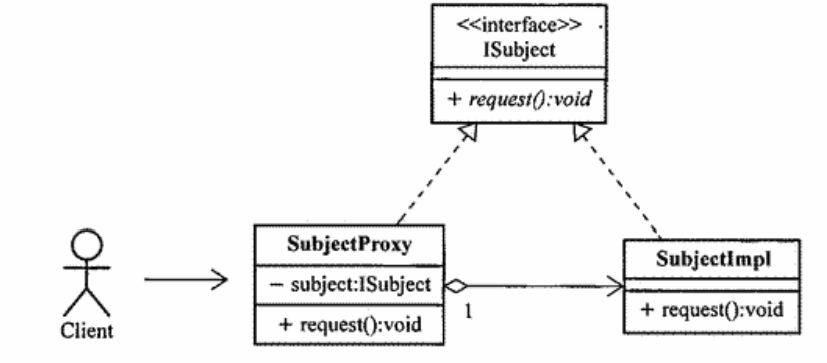

# 代理模式  
目标：一次彻底搞定代理模式，这次一定  
房地产中介，明星经纪人等等，都是生活中的代理，代理介于访问者与被访问者之间，隔离这两者之间的直接交互，访问者访问代理就等于在访问被访问者，代理几乎全权拥有被代理人的职能。  

在编程的世界，代理的实现思路如下  
  

其中，ISubject是被访问资源的抽象接口；ISubjectImpl是接口的实现类，对应的是代理对象，被访问者（房主，明星本人）；SubjectProxy是代理实现类（实现接口ISubject），持有一个ISubject实例SubjectImpl，表示的就是被代理的对象；Client就是访问者的抽象角色，请求SubjectImpl实例，但是不是直接请求SubjectImpl而是通过代理SubjectProxy。  
这里面SubjectProxy的作用不仅仅是转发请求，关键是在于可以在转发请求之前或者之后做一些额外的处理（甚至不让访问实际的被访问者）。

