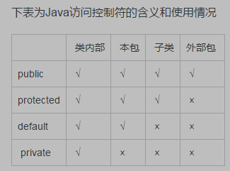

封装：如何区分变动的事物和不变的事物  
为了使得代码更加可读，移动，更易维护，需要不断重构，但是同时也希望一些代码保持原来的状态。类库就是一个重要的使用场景，类库需要不断完善，但是对于使用类库的客户而言，不能受改动的影响。  
  
# 包：package（名称一律小写）配合 import 使用
包内包含一组类，被单独组织在一个单独的命名空间下。  
避免相同类名的类冲突。  

一个.java文件是一个编译单元，每个编译单元中只能有一个public类，并且类名要求与文件名一直，如果这个编译单元中还有其他类，是无法在包外进行访问。  
.java文件编译后，会生成一组.class文件，jar文档生成器可以打包为一个.jar文件，java解释器负责查找、加载、解释这些文件。  
类库的源文件都会含有一个public类，可能有多个非public类，用package将他们集中在一起。  

package的一种组织.class文件方式，就是利用操作系统的文件结构的层次性进行组织。一般包名是域名的反顺序。然后结合CLASSPATH进行类加载等操作。  

访问修饰符：public，protected 和 private 位于定义的类名，属性名和方法名之前，只能控制它所修饰的对象。（如果不提供访问修饰符，就意味着"包访问权限"，friendly）

包访问权限：一个包下的类可以相互访问。  
public：接口访问权限，声明的成员对于所有人都是可见的。  
private：除了包含该成员的类，其他人都无法访问。  
protected: 继承访问权限，只要是继承这个类的类都可以访问这个成员（包内，包外都可以），并且包内的类可以访问被protected修饰的成员。  
总的来说，可以总结为如下图  

