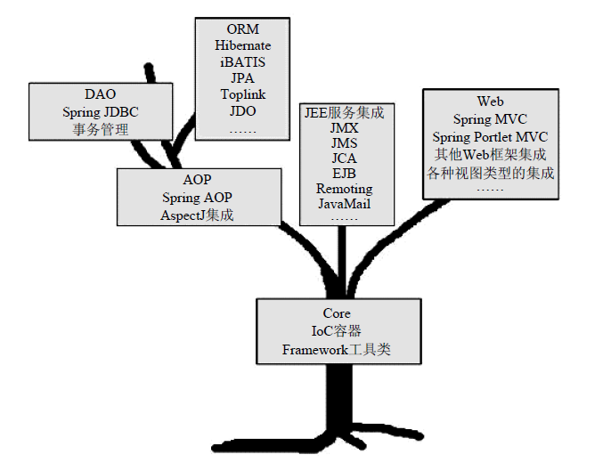

java有三个版本（SE,EE,ME）  
其中j2ee是企业版，支持集群，分布式计算等这些看上去高大上的功能，但是由于体系庞大，不利于快速开发，就像中世纪的重装骑兵，spring就是为了替代他在其他需要快速开发的环境中作战的轻装骑兵。  
为什么EJB是重装骑兵：需要有支持EJB容器的服务器，成本高；开发，测试，部署不便；分布式计算场景才是最适合的，可是被滥用；。。。。。。  
Spring是一种敏捷、轻量级的开发方案，并不是要替代EJB，而是给出EJB之外的另一种方案而已，甚至于二者可以是互补的；帮助我们简化基于POJO的Java应用程序开发。  

Spring框架基于POJO（Plain Old Java Object，简单Java对象）, 为构筑应用的POJO提供了各种服务，进而创造了一套适宜用POJO进行轻量级开发的环境。  

Spring框架构建在Core核心模块之上,为我们提供一个IoC容器（IoC Container）实现，用于帮助我们以依赖注入的方式管理对象之间的依赖关系。AOP模块提供了一个轻便但功能强大的AOP框架，让我们可以以AOP的形式增强各POJO的能力，进而补足OOP/OOSD之缺憾。

Spring家族成员全部构建于Spring框架基础之上，[spring家族成员](https://docs.spring.io/spring-framework/docs/4.3.27.RELEASE/spring-framework-reference/htmlsingle/#overview-modules)

