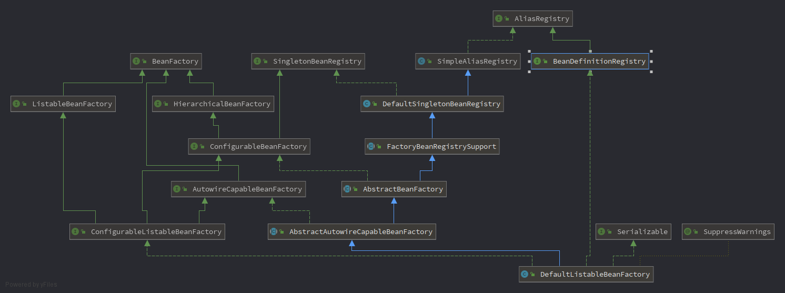
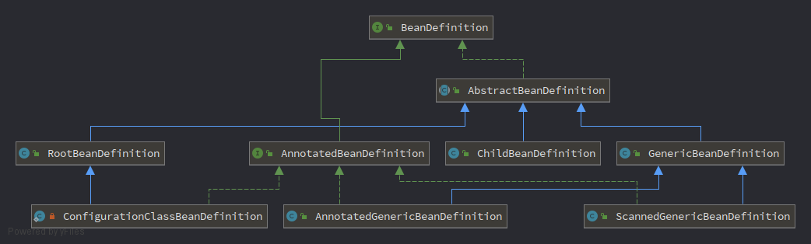
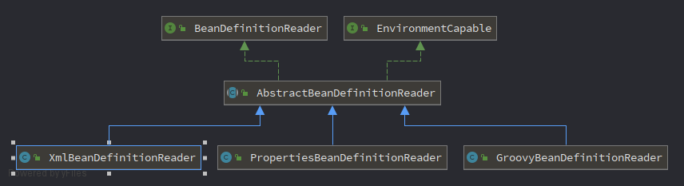

BeanFactory   
生产Bean的工厂,将应用所需的所有业务对象交给BeanFactory之后，剩下要做的，就是直接从BeanFactory取得最终组装完成并且可用的对象。  

在有这个工厂之前，我们是这样干的  
```java
FXNewsProvider newsProvider = new FXNewsProvider();//自己new一个要用到的对象
newsProvider.getAndPersistNews();//使用
```  
有了这个工厂之后  
先要给这个工厂原材料（业务对象类）和图纸（xml，元数据）
```xml
<!-- 图纸 -->
<beans>
    <bean id="djNewsProvider" class="..FXNewsProvider">
        <constructor-arg index="0">
            <ref bean="djNewsListener"/>
        </constructor-arg> 
        <constructor-arg index="1"> 
            <ref bean="djNewsPersister"/>
        </constructor-arg>
    </bean>
</beans>
```  
大致的工作思路如下：  
```java 
BeanFactory container = new XmlBeanFactory(new ClassPathResource("配置文件路径"));//给工厂送去图纸
FXNewsProvider newsProvider = (FXNewsProvider)container.getBean("djNewsProvider");//向工厂提出需求，索要产品
newsProvider.getAndPersistNews();//使用产品
```


# BeanFactory的对象注册与依赖绑定方式  
1. 直接编码实现  
spring中的实现思路大致如下：
BeanFactory是工厂，但只是一个接口，具体的还是需要实现类，DefaultListableBeanFactory就是其中一个具体的实现类，这个类同时还实现接口BeanDefinitionRegistry，这个接口才是实际管理业务对象和业务对象之间关联关系的实际实现接口，里面用到的BeanDefinition就是业务对象管理的替身（相应的业务对象构造与其相对应的BeanDefinition）。   
  
```java
void registerBeanDefinition(String beanName, BeanDefinition beanDefinition) throws BeanDefinitionStoreException;
```
  


上代码
```java
public static void main(String[] args)
{
    DefaultListableBeanFactory beanRegistry = new DefaultListableBeanFactory();//具体的工厂，BeanFactory只是一个接口，不能进行实际生产
    BeanFactory container = (BeanFactory)bindViaCode(beanRegistry);//管理业务对象
    FXNewsProvider newsProvider = (FXNewsProvider)container.getBean("djNewsProvider");//使用工厂生产产品
    newsProvider.getAndPersistNews();//使用产品
}
public static BeanFactory bindViaCode(BeanDefinitionRegistry registry)
{
    AbstractBeanDefinition newsProvider = ➥
    new RootBeanDefinition(FXNewsProvider.class,true);
    AbstractBeanDefinition newsListener = ➥
    new RootBeanDefinition(DowJonesNewsListener.class,true);
    AbstractBeanDefinition newsPersister = ➥
    new RootBeanDefinition(DowJonesNewsPersister.class,true);
    // 将bean定义注册到容器中
    registry.registerBeanDefinition("djNewsProvider", newsProvider);
    registry.registerBeanDefinition("djListener", newsListener);
    registry.registerBeanDefinition("djPersister", newsPersister);
    // 指定依赖关系
    // 1. 可以通过构造方法注入方式
    ConstructorArgumentValues argValues = new ConstructorArgumentValues();
    argValues.addIndexedArgumentValue(0, newsListener);
    argValues.addIndexedArgumentValue(1, newsPersister);
    newsProvider.setConstructorArgumentValues(argValues);
    // 2. 或者通过setter方法注入方式
    // MutablePropertyValues propertyValues = new MutablePropertyValues();
    // propertyValues.addPropertyValue(new ropertyValue("newsListener",newsListener));
    // propertyValues.addPropertyValue(new PropertyValue("newPersistener",newsPersister));
    // newsProvider.setPropertyValues(propertyValues);
    // 绑定完成
    return (BeanFactory)registry;
}
```

2. 配置文件实现  
Spring的IoC容器支持两种配置文件格式：Properties文件格式和XML文件格式(也可以引入自己的文件格式)。  

相比于上面直接编码实现，这中方式就需要多一些步骤了：  
需要根据不同的外部配置文件格式，给出相应的BeanDefinitionReader实现类，由BeanDefinitionReader的相应实现类负责将相应的配置文件内容读取并映射到BeanDefinition，后面就又一样了。  
>大部分工作，包括解析文件格式、装配BeanDefinition之类的工作，都是交给BeanDefinitionReader的相应实现类来做了  

```java
BeanDefinitionRegistry beanRegistry = new DefaultListableBeanFactory();//<某个BeanDefinitionRegistry实现类，通常为DefaultListableBeanFactory>;
BeanDefinitionReader beanDefinitionReader = new BeanDefinitionReaderImpl(beanRegistry);
beanDefinitionReader.loadBeanDefinitions("配置文件路径");//就取得了一个可用的BeanDefinitionRegistry实例
```

  

Properties文件和XML文件，都是类似的，由于XML使用比较普遍，以XML为例说明  
绘制加工图纸  
```xml
<?xml version="1.0" encoding="UTF-8"?>
<!DOCTYPE beans PUBLIC "-//SPRING//DTD BEAN//EN" 
"http://www.springframework.org/dtd/spring-beans.dtd">
<!-- 文档格式约束：。Spring 2.x之前，XML配置文件采用DTD实现文档的格式约束。2.x之后，引入了基于XSD的约束方式。（原来的基于DTD的方式依然有效） -->
<beans>
    <bean id="djNewsProvider" class="..FXNewsProvider">
    <constructor-arg index="0">
        <ref bean="djNewsListener"/>
        </constructor-arg>
        <constructor-arg index="1">
        <ref bean="djNewsPersister"/>
        </constructor-arg>
    </bean>
    <bean id="djNewsListener" class="..impl.DowJonesNewsListener">
    </bean>
    <bean id="djNewsPersister" class="..impl.DowJonesNewsPersister">
    </bean>
</beans>
```
给工厂图纸，按照图纸加工得到要的产品  
```java


```


3. 元数据实现  


