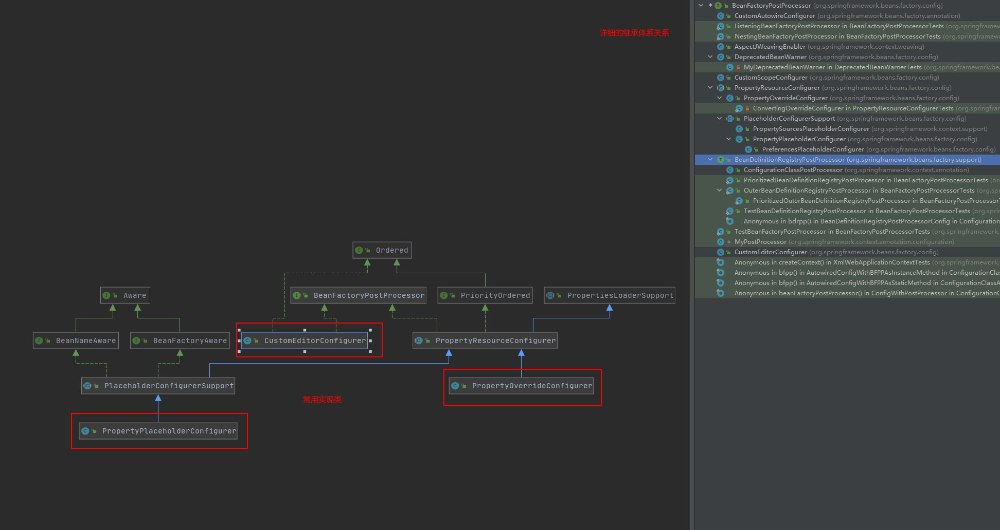

BeanFactory   
生产Bean的工厂,将应用所需的所有业务对象交给BeanFactory之后，剩下要做的，就是直接从BeanFactory取得最终组装完成并且可用的对象。  

在有这个工厂之前，我们是这样干的  
```java
FXNewsProvider newsProvider = new FXNewsProvider();//自己new一个要用到的对象
newsProvider.getAndPersistNews();//使用
```  
有了这个工厂之后  
先要给这个工厂原材料（业务对象类）和图纸（xml，元数据）
```xml
<!-- 图纸 -->
<beans>
    <bean id="djNewsProvider" class="..FXNewsProvider">
        <constructor-arg index="0">
            <ref bean="djNewsListener"/>
        </constructor-arg> 
        <constructor-arg index="1"> 
            <ref bean="djNewsPersister"/>
        </constructor-arg>
    </bean>
</beans>
```  
大致的工作思路如下：  
```java 
BeanFactory container = new XmlBeanFactory(new ClassPathResource("配置文件路径"));//给工厂送去图纸
FXNewsProvider newsProvider = (FXNewsProvider)container.getBean("djNewsProvider");//向工厂提出需求，索要产品
newsProvider.getAndPersistNews();//使用产品
```


# BeanFactory的对象注册与依赖绑定方式  
1. 直接编码实现  
spring中的实现思路大致如下：
BeanFactory是工厂，但只是一个接口，具体的还是需要实现类，DefaultListableBeanFactory就是其中一个具体的实现类，这个类同时还实现接口BeanDefinitionRegistry，这个接口才是实际管理业务对象和业务对象之间关联关系的实际实现接口，里面用到的BeanDefinition就是业务对象管理的替身（相应的业务对象构造与其相对应的BeanDefinition）。   
  
```java
void registerBeanDefinition(String beanName, BeanDefinition beanDefinition) throws BeanDefinitionStoreException;
```
  


上代码
```java
public static void main(String[] args)
{
    DefaultListableBeanFactory beanRegistry = new DefaultListableBeanFactory();//具体的工厂，BeanFactory只是一个接口，不能进行实际生产
    BeanFactory container = (BeanFactory)bindViaCode(beanRegistry);//管理业务对象
    FXNewsProvider newsProvider = (FXNewsProvider)container.getBean("djNewsProvider");//使用工厂生产产品
    newsProvider.getAndPersistNews();//使用产品
}
public static BeanFactory bindViaCode(BeanDefinitionRegistry registry)
{
    AbstractBeanDefinition newsProvider = ➥
    new RootBeanDefinition(FXNewsProvider.class,true);
    AbstractBeanDefinition newsListener = ➥
    new RootBeanDefinition(DowJonesNewsListener.class,true);
    AbstractBeanDefinition newsPersister = ➥
    new RootBeanDefinition(DowJonesNewsPersister.class,true);
    // 将bean定义注册到容器中
    registry.registerBeanDefinition("djNewsProvider", newsProvider);
    registry.registerBeanDefinition("djListener", newsListener);
    registry.registerBeanDefinition("djPersister", newsPersister);
    // 指定依赖关系
    // 1. 可以通过构造方法注入方式
    ConstructorArgumentValues argValues = new ConstructorArgumentValues();
    argValues.addIndexedArgumentValue(0, newsListener);
    argValues.addIndexedArgumentValue(1, newsPersister);
    newsProvider.setConstructorArgumentValues(argValues);
    // 2. 或者通过setter方法注入方式
    // MutablePropertyValues propertyValues = new MutablePropertyValues();
    // propertyValues.addPropertyValue(new ropertyValue("newsListener",newsListener));
    // propertyValues.addPropertyValue(new PropertyValue("newPersistener",newsPersister));
    // newsProvider.setPropertyValues(propertyValues);
    // 绑定完成
    return (BeanFactory)registry;
}
```

2. 配置文件实现  
Spring的IoC容器支持两种配置文件格式：Properties文件格式和XML文件格式(也可以引入自己的文件格式)。  

相比于上面直接编码实现，这中方式就需要多一些步骤了：  
需要根据不同的外部配置文件格式，给出相应的BeanDefinitionReader实现类，由BeanDefinitionReader的相应实现类负责将相应的配置文件内容读取并映射到BeanDefinition，后面就又一样了。  
>大部分工作，包括解析文件格式、装配BeanDefinition之类的工作，都是交给BeanDefinitionReader的相应实现类来做了  

```java
BeanDefinitionRegistry beanRegistry = new DefaultListableBeanFactory();//<某个BeanDefinitionRegistry实现类，通常为DefaultListableBeanFactory>;
BeanDefinitionReader beanDefinitionReader = new BeanDefinitionReaderImpl(beanRegistry);
beanDefinitionReader.loadBeanDefinitions("配置文件路径");//就取得了一个可用的BeanDefinitionRegistry实例
```

  

Properties文件和XML文件，都是类似的，由于XML使用比较普遍，以XML为例说明  
绘制加工图纸([more](./002001001常见XML使用记录.md))  
```xml
<?xml version="1.0" encoding="UTF-8"?>
<!DOCTYPE beans PUBLIC "-//SPRING//DTD BEAN//EN" 
"http://www.springframework.org/dtd/spring-beans.dtd">
<!-- 文档格式约束：。Spring 2.x之前，XML配置文件采用DTD实现文档的格式约束。2.x之后，引入了基于XSD的约束方式。（原来的基于DTD的方式依然有效） -->
<beans>
    <bean id="djNewsProvider" class="..FXNewsProvider">
    <constructor-arg index="0">
        <ref bean="djNewsListener"/>
        </constructor-arg>
        <constructor-arg index="1">
        <ref bean="djNewsPersister"/>
        </constructor-arg>
    </bean>
    <bean id="djNewsListener" class="..impl.DowJonesNewsListener">
    </bean>
    <bean id="djNewsPersister" class="..impl.DowJonesNewsPersister">
    </bean>
</beans>
```
给工厂图纸，按照图纸加工得到要的产品  
```java
public static void main(String[] args)
{
    DefaultListableBeanFactory beanRegistry = new DefaultListableBeanFactory();
    BeanFactory container = (BeanFactory)bindViaXMLFile(beanRegistry);//给工厂图纸，让工厂干活了
    FXNewsProvider newsProvider = (FXNewsProvider)container.getBean("djNewsProvider");//问工厂要产品
    newsProvider.getAndPersistNews();//使用产品
}
public static BeanFactory bindViaXMLFile(BeanDefinitionRegistry registry) { 
    XmlBeanDefinitionReader reader = new XmlBeanDefinitionReader(registry);//BeanDefinitionReader干活了
    reader.loadBeanDefinitions("classpath:../news-config.xml");//干活要图纸，去哪里那图纸
    return (BeanFactory)registry;//业务对象都准备好了，工厂准备就绪
}

```

3. 注解实现  
>应用程序使用了Spring 2.5以及Java 5或者更高版本的情况之下。

使用起来非常简单，大部分工作都是注解的实现代码里面帮我们解决了，我们只需要给出合适的标记，告诉工厂要处理那些地方就行  

先把我们要的东西标记出来，告诉工厂那些是要处理的，要怎么处理
```java
@Component//配合Spring 2.5中新的classpath-scanning功能使用，告诉Spring容器这是要关注的类
public class FXNewsProvider
{
    @Autowired//告知Spring容器需要为当前对象注入哪些依赖对象。
    private IFXNewsListener newsListener;
    @Autowired//告知Spring容器需要为当前对象注入哪些依赖对象。
    private IFXNewsPersister newPersistener;
    public FXNewsProvider(IFXNewsListener newsListner,IFXNewsPersister newsPersister)
    {
        this.newsListener = newsListner;
        this.newPersistener = newsPersister;
    }
    ...
}
@Component
public class DowJonesNewsListener implements IFXNewsListener
{
    ...
}
@Component
public class DowJonesNewsPersister implements IFXNewsPersister
{
    ...
}
```
上面的这些注解要起效，当然还要打开一个开关，Spring的配置文件中增加一个“触发器”  
```xml
<?xml version="1.0" encoding="UTF-8"?>
<beans  xmlns="http://www.springframework.org/schema/beans" 
        xmlns:xsi="http://www.w3.org/2001/XMLSchema-instance" 
        xmlns:context="http://www.springframework.org/schema/context" 
        xmlns:tx="http://www.springframework.org/schema/tx" 
        xsi:schemaLocation="http://www.springframework.org/schema/beans 
        http://www.springframework.org/schema/beans/spring-beans-2.5.xsd 
        http://www.springframework.org/schema/context 
        http://www.springframework.org/schema/context/spring-context-2.5.xsd 
        http://www.springframework.org/schema/tx 
        http://www.springframework.org/schema/tx/spring-tx-2.5.xsd">
<context:component-scan base-package="cn.spring21.project.base.package"/>
<!-- 打开开关 -->
</beans>
<context:component-scan/>
```
使用方法，贼简单  
```java
public static void main(String[] args)
{
    ApplicationContext ctx = new ClassPathXmlApplicationContext("配置文件路径");
    FXNewsProvider newsProvider = (FXNewsProvider)container.getBean("FXNewsProvider");
    newsProvider.getAndPersistNews();
}
```

以上就是spring ioc的Beanfactory的基本使用的三种方式了

# 一探究竟（Spring IoC背后的秘密）

知道了怎么使用之后，我们就该去了解一些更深入的东西了，背后的实现原理是什么呢？  

Spring的IoC在实现的时候大致上分为了两个阶段，容器启动和Bean实例化阶段，在这两个阶段中都有相应的扩展点，好让我们根据自己的需要加入自定义的扩展逻辑。  

## 第一阶段 容器启动


### BeanFactoryPostProcessor接口  
在容器实现的第一阶段最后加入一道工序，让我们对最终的BeanDefinition做一些额外的操作，比如修改其中bean定义的某些属性，为bean定义增加其他信息等。  

从这里面可以看出，当我们设计了多个BeanFacoryPostProcessor来处理定义的bean的是时候，为了可以正确完成指定改变动作，我们就需要制定一下顺序，就需要实现接口Ordered。  

话不多说，还是看看使用的大致方式比较直观（这里，spring的BeanFactory和ApplicationContext有所区别）  

对于BeanFactory，我们需要手动去添加相关代码实现  
```java
// 声明将被后处理的BeanFactory实例
ConfigurableListableBeanFactory beanFactory = new XmlBeanFactory(new ClassPathResource("...")); 
// 声明要使用的BeanFactoryPostProcessor 
PropertyPlaceholderConfigurer propertyPostProcessor = new PropertyPlaceholderConfigurer(); 
propertyPostProcessor.setLocation(new ClassPathResource("...")); 
// 执行后处理操作
propertyPostProcessor.postProcessBeanFactory(beanFactory); 
```  

对于ApplicationContext，简单一些，配置好以后就自动执行了  
```xml  
<beans> 
    <bean class="org.springframework.beans.factory.config.PropertyPlaceholderConfigurer"> 
        <property name="locations"> 
            <list> 
                <value>conf/jdbc.properties</value> 
                <value>conf/mail.properties</value> 
            </list>
        </property> 
    </bean> 
    ... 
</beans>

```


## 第二阶段 Bean实例化阶段


