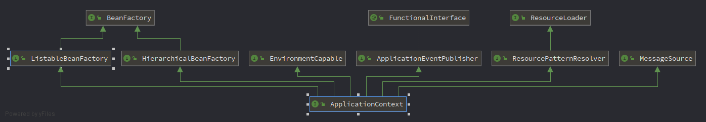
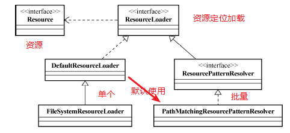
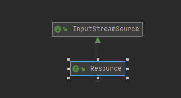
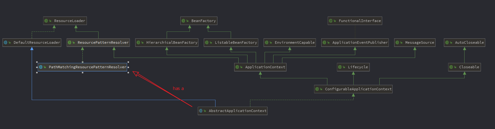

ApplicationContext  
  
“青出于蓝而胜于蓝”：BeanFactory支持的所有功能之外，还进一步扩展了基本容器的功能，包括BeanFactoryPostProcessor、BeanPostProcessor以及其他特殊类型bean的自动识别、容器启动后bean实例的自动初始化、国际化的信息支持、容器内事件发布等  

  


##　一、统一资源加载策略　　
>URL全名是Uniform Resource Locator（统一资源定位器）　　
>But，说是同统一资源定义，其实只限于网络形式发布的资源的查找与定位，实际上，资源可以以任何形式存在，也可以存在任何场所；资源查找后返回的的结果没有统一的抽象。  
Spring提出了一套基于Resource和ResourceLoader接口的资源抽象和加载策略。  



### Resource
资源抽象，Resource接口可以根据资源的不同类型，或者资源所处的不同场合，给出相应的具体实现。　　



###　ResourceLoader
查找和定位资源，ResourceLoader接口是资源查找定位策略的统一抽象。  

  

默认的实现类是`DefaultResourceLoader`，但是这个默认实现的处理逻辑最后`getResourceByPath(String)`返回的资源类型`Resource`的处理不统一，所以一般使用`FileSystemResourceLoader`，覆盖方法`getResourceByPath(String)`保证最后返回`Resource`为`FileSystemResource`。
```java
//DefaultResourceLoader的getResource()
    public Resource getResource(String location) {
        Assert.notNull(location, "Location must not be null");
        Iterator var2 = this.getProtocolResolvers().iterator();

        Resource resource;
        do {
            if (!var2.hasNext()) {
                if (location.startsWith("/")) {
                    return this.getResourceByPath(location);
                }

                if (location.startsWith("classpath:")) {
                    return new ClassPathResource(location.substring("classpath:".length()), this.getClassLoader());//classpath:为前缀的时候，返回ClassPathResource
                }

                try {
                    URL url = new URL(location);
                    return (Resource)(ResourceUtils.isFileURL(url) ? new FileUrlResource(url) : new UrlResource(url));//通过URL加载
                } catch (MalformedURLException var5) {
                    return this.getResourceByPath(location);//通过URL加载也失败了，就只能用最后的手段了
                }
            }

            ProtocolResolver protocolResolver = (ProtocolResolver)var2.next();
            resource = protocolResolver.resolve(location, this);
        } while(resource == null);

        return resource;
    }

    //构造一个不存在的Resource返回
    protected Resource getResourceByPath(String path) {
        return new DefaultResourceLoader.ClassPathContextResource(path, this.getClassLoader());
    }

    protected static class ClassPathContextResource extends ClassPathResource implements ContextResource {
        public ClassPathContextResource(String path, @Nullable ClassLoader classLoader) {
            super(path, classLoader);
        }

        public String getPathWithinContext() {
            return this.getPath();
        }

        public Resource createRelative(String relativePath) {
            String pathToUse = StringUtils.applyRelativePath(this.getPath(), relativePath);
            return new DefaultResourceLoader.ClassPathContextResource(pathToUse, this.getClassLoader());
        }
    }
```
为了可以批量的加载资源，而不是只能一个一个的加载，就有了继承的接口`ResourcePatternResolver`和对应的实现类`PathMatchingResourcePatternResolver`  
```java
public interface ResourcePatternResolver extends ResourceLoader {
    String CLASSPATH_ALL_URL_PREFIX = "classpath*:";//新的协议前缀
    Resource[] getResources(String var1) throws IOException;//获取多个Resource
}

public class PathMatchingResourcePatternResolver implements ResourcePatternResolver {
    private final ResourceLoader resourceLoader;
    public PathMatchingResourcePatternResolver() {
        this.resourceLoader = new DefaultResourceLoader();//默认内部有一个DefaultResourceLoader
    }
    public PathMatchingResourcePatternResolver(ResourceLoader resourceLoader) {//构造函数，可以传入指定的ResourceLoader，用它完成资源定位
        Assert.notNull(resourceLoader, "ResourceLoader must not be null");
        this.resourceLoader = resourceLoader;
    }
    //其他暂时忽略
}
```

### ApplicationContext与ResourceLoader  
ApplicationContext继承了ResourceLoader接口，本身就是一个ResourceLoader（ResourcePatternResolver），由于AbstractApplicationContext继承了DefaultResourceLoader，同时又有一个PathMatchingResourcePatternResolver（单独加载一个资源和同时加载多个资源的能力都有了，就问你强不强），因此，spring的ApplicationContext的实现类都可以做到资源统一加载。  
  

1. 扮演ResourceLoader  

2. ResourceLoader类型的注入（bean需要依赖于ResourceLoader查找定位资源的时候，注入：还记得bean实例化过程的[Aware接口](./MindMap/002/IoC容器工作过程.drawio)吗？）  

3. Resource类型的注入
ApplicationContext启动伊始，会通过一个ResourceEditorRegistrar来注册Spring提供的针对Resource类型的PropertyEditor实现到容器中,即ResourceEditor（如果应用对象需要依赖一组Resource，通过CustomEditorConfigurar告知容器ResourceArrayPropertyEditor就可以）。  


4. 在特定情况下，ApplicationContext的Resource加载行为  

协议前缀，比如`file:`、`http:`、`ftp:`等，ResourceLoader中增加`classpath:`，ResourcePatternResolver增加`classpath*`(classpath*:如果能够在classpath中找到多个指定的资源,返回多个)

>ClassPathXmlApplicationContext:默认从classpath中加载bean定义配置文件  
>FileSystemXmlApplicationContext:默认会尝试从文件系统中加载  
>当容器实例化并启动完毕，我们要用相应容器作为ResourceLoader来加载其他资源时，各种ApplicationContext容器的实现类依然会有不同的表现。

FileSystemXmlApplicationContext都可以通过前缀强制指定，改变加载行为

##　二、国际化信息支持  
internationalization，取头取尾中间有18个字母，so，i18n就是这么来的  

###　Locale　　
不同的Locale代表不同的国家和地区，每个国家和地区在Locale这里都有相应的简写代码表示，包括语言代码以及国家代码（ISO标准代码）；
>Locale.CHINA代表中国地区  代码：zh_CN
>Locale.US代表美国地区 代码：en_US
>Locale.ENGLISH代表英语地区，代码只有语言代码：en
常用的Locale都提供有静态常量，不用我们自己重新构造。  
参考：https://docs.oracle.com/javase/8/docs/api/java/util/Locale.html  

###　ResourceBundle　　
ResourceBundle用来保存特定于某个Locale的信息。
>通常，ResourceBundle管理一组信息序列，所有的信息序列有统一的一个basename，然后特定的Locale的信息，可以根据basename后追加的语言或者地区代码来区分　　
```properties
messages.properties 
messages_zh.properties 
messages_zh_CN.properties 
messages_en.properties 
messages_en_US.properties 
```
basename就是`messages`。  

>另外一种场景就是，每个资源文件中都有相同的键来标志具体资源条目，但每个资源内部对应相同键的资源条目内容，则根据Locale的不同而不同。  
```properties
# messages_zh_CN.properties文件中
menu.file=文件({0}) 
menu.edit=编辑
... 

# messages_en_US.properties文件中
menu.file=File({0}) 
menu.edit=Edit 
... 
```
这样，通过ResourceBundle的getBundle(String baseName, Locale locale)方法取得不同Locale对应的ResourceBundle，然后根据资源的键取得相应Locale的资源条目内容。

###　ApplicationContext与MessageSource  
Spring进一步抽象了国际化信息的访问接口，得到了MessageSource接口


