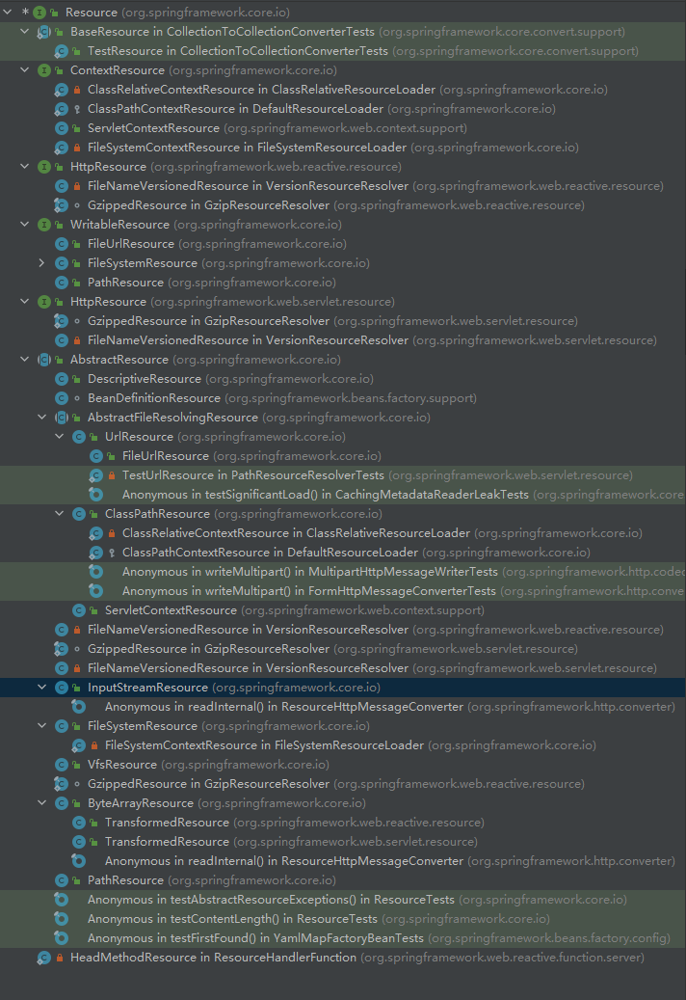
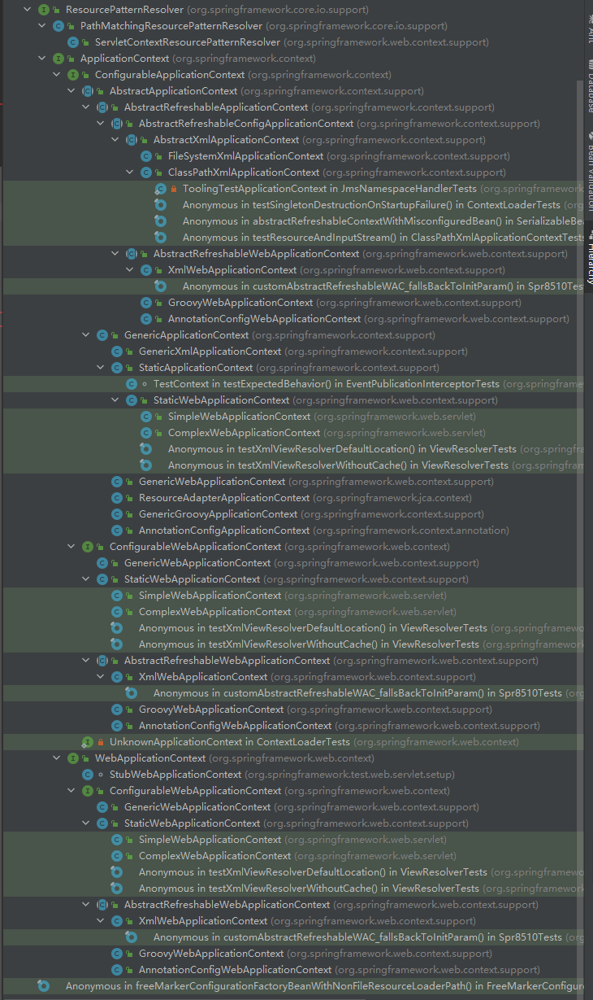

ApplicationContext  
  
“青出于蓝而胜于蓝”：BeanFactory支持的所有功能之外，还进一步扩展了基本容器的功能，包括BeanFactoryPostProcessor、BeanPostProcessor以及其他特殊类型bean的自动识别、容器启动后bean实例的自动初始化、国际化的信息支持、容器内事件发布等  

  

##　统一资源加载策略　　
>URL全名是Uniform Resource Locator（统一资源定位器）　　
>But，说是同统一资源定义，其实只限于网络形式发布的资源的查找与定位，实际上，资源可以以任何形式存在，也可以存在任何场所；资源查找后返回的的结果没有统一的抽象。  
Spring提出了一套基于Resource和ResourceLoader接口的资源抽象和加载策略。  

### Resource
资源抽象，Resource接口可以根据资源的不同类型，或者资源所处的不同场合，给出相应的具体实现。　　

###　ResourceLoader
查找和定位资源，ResourceLoader接口是资源查找定位策略的统一抽象。  

