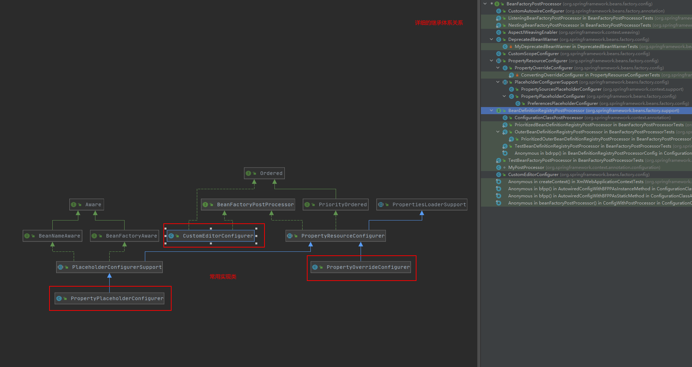
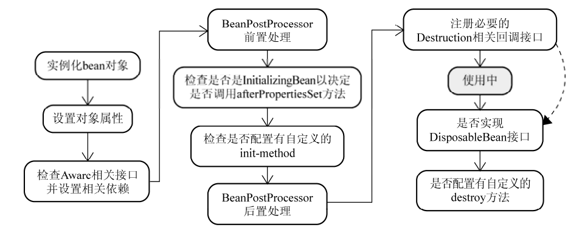

# 一探究竟（Spring IoC背后的秘密）

知道了怎么使用之后，我们就该去了解一些更深入的东西了，背后的实现原理是什么呢？  

Spring的IoC在实现的时候大致上分为了两个阶段，容器启动和Bean实例化阶段，在这两个阶段中都有相应的扩展点，好让我们根据自己的需要加入自定义的扩展逻辑。  

## 第一阶段 容器启动


### BeanFactoryPostProcessor接口  
在容器实现的第一阶段最后加入一道工序，让我们对最终的BeanDefinition做一些额外的操作，比如修改其中bean定义的某些属性，为bean定义增加其他信息等。  

从这里面可以看出，当我们设计了多个BeanFacoryPostProcessor来处理定义的bean的是时候，为了可以正确完成指定改变动作，我们就需要制定一下顺序，就需要实现接口Ordered。  

话不多说，还是看看使用的大致方式比较直观（这里，spring的BeanFactory和ApplicationContext有所区别）  

对于BeanFactory，我们需要手动去添加相关代码实现  
```java
// 声明将被后处理的BeanFactory实例
ConfigurableListableBeanFactory beanFactory = new XmlBeanFactory(new ClassPathResource("...")); 
// 声明要使用的BeanFactoryPostProcessor 
PropertyPlaceholderConfigurer propertyPostProcessor = new PropertyPlaceholderConfigurer(); 
propertyPostProcessor.setLocation(new ClassPathResource("...")); 
// 执行后处理操作
propertyPostProcessor.postProcessBeanFactory(beanFactory); 
```  

对于ApplicationContext，简单一些，配置好以后就自动执行了  
```xml  
<beans> 
    <bean class="org.springframework.beans.factory.config.PropertyPlaceholderConfigurer"> 
        <property name="locations"> 
            <list> 
                <value>conf/jdbc.properties</value> 
                <value>conf/mail.properties</value> 
            </list>
        </property> 
    </bean> 
    ... 
</beans>

```
几个常见的BeanFactoryPostProcessor  
1. PropertyPlaceholderConfigurer  
对于一些系统管理相关的信息，如数据库连接信息等，通常配置到一个properties文件，而不是与XML文件配置到一起，PropertyPlaceholderConfigurer的作用就是允许在xml中使用占位符，从properties文件加载对应的数据(BeanFactory完成第一阶段配置后，还是以占位符形式存在，当ropertyPlaceholderConfigurer被使用时，使用配置文件中的对应属性替换，完成真正的配置信息)。这里不仅仅会从配置文件properties中加载配置信息，还会从Java的System类的Properties中检查（可以设置模式，要不要检查，怎么检查）。
```xml
<bean id="dataSource" class="org.apache.commons.dbcp.BasicDataSource" destroy-method="close">  
    <property name="url"> 
        <value>${jdbc.url}</value>  
    </property> 
</bean> 
```
```properties
jdbc.url=jdbc:mysql://server/MAIN?useUnicode=true&characterEncoding=ms932&failOverReadOnly=false&roundRobinLoadBalance=true
```

2. PropertyOverrideConfigurer  
人如其名，这个PropertyOverrideConfigurer是用来修改替换bean中定义的property信息的，配置文件的规则是：`beanName.propertyName=value`,properties文件中的键是以XML中配置的bean定义的beanName为标志开始的（通常就是id指定的值），后面跟着相应被覆盖的property的名称。没有指定的那就使用原来的。  

从BeanFactoryPostProcessor的继承体系中可以看到，PropertyPlaceholderConfigurer和PropertyOverrideConfigurer都继承自PropertyResourceConfigurer，PropertyResourceConfigurer里面有一个convertPropertyValue方法，可以被覆盖，用来实现配置文件配置项密文转换为明文后在配置到对于定义的属性中等操作。

3. CustomEditorConfigurer  
前面的两个人都是把bean中定义的属性进行修改实现某种目的的，这个只是把后面可能要用到的信息注册到容器，不会去改动原来定义的bean。  
通过XML加载得到的都是String类型，但是我们最后要用的是各种各样的类型的对象，需要PropertyEditor完成类型的转换工作（每种对象类型都需要有一个PropertyEditor，Spring容器内部默认采用JavaBean框架内默认的PropertyEditor搜寻逻辑，Spring框架提供了一些自身实现的PropertyEditor：StringArrayPropertyEditor；ClassEditor；FileEditor；LocaleEditor；PatternEditor），对于Spring容器默认加载的PropertyEditor，我们不需要告诉容器也可以，但是对于那些自定义的或者不是默认加载的PropertyEditor，CustomEditorConfigurer就是帮助我们传达信息的一个中间人，帮助我们将某种类型的PropertyEditor告诉容器。

使用情形举例：  
>我们有一个DataFoo对象，依赖Date类型的对象
```java
public class DateFoo {
    private Date date; 
    public Date getDate(){
        return date; 
    } 
    public void setDate(Date date){
        this.date = date;
    } 
}
```
>XML描述关系如下  
```xml
<bean id="dateFoo" class="...DateFoo">
 <property name="date"> 
    <value>2007/10/16</value> 
 </property> 
</bean> 
```
>问题：Spring容器是没有默认的对应的PropertyEditor将字符串“2007/10/16”转换成对象所声明的java.util.Date类型，需要自定义一个PropertyEditor的实现类，然后用CustomEditorConfigurer告诉容器。  
```java
//1.实现接口PropertyEditor，完成自定义
//2.继承实现类PropertyEditorSupport，完成自定义（可以避免需要实现多个方法，只要关注重点方法即可）
public class DatePropertyEditor  extends PropertyEditorSupport { 
    private String datePattern; 
    //从string类型到相应对象类型的转换
    @Override 
    public void setAsText(String text) throws IllegalArgumentException { 
        DateTimeFormatter dateTimeFormatter = DateTimeFormat.forPattern(getDatePattern()); 
        Date dateValue = dateTi
        setValue(dateValue); 
    } 
    //getAsText()，反向转换
    public String getDatePattern(){
        return datePattern; 
    }
    public void setDatePattern(String datePattern）{
        this.datePattern = datePattern;
    }
}

```
>告诉容器我们自定义的PropertyEditor实现
```java
//BeanFactory方式
XmlBeanFactory beanFactory = new XmlBeanFactory(new ClassPathResource("..."));
//new 一个中间人
CustomEditorConfigurer ceConfigurer = new CustomEditorConfigurer(); 
//组装并告诉中间人要传递的信息
Map customerEditors = new HashMap();
customerEditors.put(java.util.Date.class, new DatePropertyEditor());
ceConfigurer.setCustomEditors(customerEditors);
//中间人把要传递的信息告诉工厂
ceConfigurer.postProcessBeanFactory(beanFactory);
```
```xml
<!-- pplicationContext，配置文件配置一下就可以。会自动识别BeanFactoryPostProcessor -->
<bean class="org.springframework.beans.factory.config.CustomEditorConfigurer">
    <property name="customEditors"> 
        <map> 
            <entry key="java.util.Date"> 
                <ref bean="datePropertyEditor"/> 
            </entry>
        </map>
    </property>
</bean>
<bean id="datePropertyEditor" class="...DatePropertyEditor"> 
    <property name="datePattern"> 
        <value>yyyy/MM/dd</value> 
    </property> 
</bean> 
```  
>Spring 2.0之后有变化，建议实现PropertyEditorRegistrar，通过propertyEditorRegistrars属性来指定自定义PropertyEditor，2.0之前是使用customEditors属性  
```java
public class DatePropertyEditorRegistrar implements PropertyEditorRegistrar { 
    private PropertyEditor propertyEditor;
    public void registerCustomEditors(PropertyEditorRegistry peRegistry) { 
        peRegistry.registerCustomEditor(java.util.Date.class, getPropertyEditor()); 
    }
    public PropertyEditor getPropertyEditor(){
        return propertyEditor;
    }
    public void setPropertyEditor(PropertyEditor propertyEditor){
        this.propertyEditor = propertyEditor;
    }
}
```
>对应的xml描述修改为
```xml
<!-- 通过CustomEditorConfigure的propertyEditorRegistrars属性告诉容器自定义的DatePropertyEditor -->
<bean class="org.springframework.beans.factory.config.CustomEditorConfigurer">
    <property name="propertyEditorRegistrars"> 
        <list> 
            <ref bean="datePropertyEditorRegistrar"/>
        </list>
    </property>
</bean>
<!-- 将DatePropertyEditor注入DatePropertyEditorRegistrar -->
<bean id="datePropertyEditorRegistrar" class="...DatePropertyEditorRegistrar"> 
    <property name="propertyEditor"> 
        <ref bean="datePropertyEditor"/>
    </property>
</bean> 
<!-- 自定义的DatePropertyEditor -->
<bean id="datePropertyEditor" class="...DatePropertyEditor"> 
    <property name="datePattern"> 
        <value>yyyy/MM/dd</value> 
    </property> 
</bean> 
```

## 第二阶段 Bean实例化阶段
第一阶段为我们准备好了bean对应的BeanDefinition，保存了实例化需要用到的必要的信息，只有当我们调用方法getBean()的时候，才可能会真正的实例化。（第一次，第二次的时候就是返回容器缓存，prototype的bean除外）
1. 显式调用  

2. 隐式调用  
### BeanFactory懒加载
对象实例化默认采用延迟初始化，当对象A被请求而需要第一次实例化的时候，如果它所依赖的对象B之前同样没有被实例化，那么容器会先实例化对象A所依赖的对象。这时容器内部就会首先实例化对象B，以及对象 A依赖的其他还没有实例化的对象。

### ApplicationContext调用
但ApplicationContext在实现的过程中依然遵循Spring容器实现流程的两个阶段，只不过它会在启动阶段的活动完成之后，紧接着调用注册到该容器的所有bean定义的实例化方法getBean()。


这里就不得不说Bean的生命周期了  
先上图  
  

1. 实例化与BeanWrapper  

2. 通过Wrapper设置Bean的属性  

3. 检查各色的Aware接口（主要是注入容器自身的引用等操作）  

4. BeanPostProcessor（一个接口，两个方法）  
用来处理容器中所有符合条件的实例化对象实例，postProcessBeforeInitialization和postProcessAfterInitialization在不同时机执行  
>常用的场景就是处理标记接口实现类，或者为当前对象提供代理实现  

为了显示其强大之处，自定义实现一下试试  
```java
//接口标记需要被处理的实现类
public interface PasswordDecodable { 
    String getEncodedPassword(); 
    void setDecodedPassword(String password); 
} 
public class DowJonesNewsListener implements IFXNewsListener,PasswordDecodable { 
    private String password; 

    public String[] getAvailableNewsIds() { 
    // 省略
    } 
    public FXNewsBean getNewsByPK(String newsId) { 
    // 省略
    } 
    public void postProcessIfNecessary(String newsId) { 
    // 省略
    } 
    public String getEncodedPassword() { 
        return this.password; 
    } 
    public void setDecodedPassword(String password) { 
        this.password = password; 
    } 
} 

//实现相应的BeanPostProcessor对符合条件的Bean实例进行处理
public class PasswordDecodePostProcessor implements BeanPostProcessor { 
    //在BeanPostProcessor结束的时候干点什么
    public Object postProcessAfterInitialization(Object object, String beanName) 
    throws BeansException { 
        return object; 
    } 
    //在BeanPostProcessor开始的时候干点什么
    public Object postProcessBeforeInitialization(Object object, String beanName) 
    throws BeansException { 
        if(object instanceof PasswordDecodable) 
        { 
            String encodedPassword = ((PasswordDecodable)object).getEncodedPassword(); 
            String decodedPassword = decodePassword(encodedPassword); 
            ((PasswordDecodable)object).setDecodedPassword(decodedPassword); 
        } 
        return object; 
    } 
    private String decodePassword(String encodedPassword) { 
        // 实现解码逻辑
        return encodedPassword; 
    } 
}
```
```java
//准备就绪，接下来就是注册BeanPostProcessor到容器，发挥效果
// 对于BeanFactory
ConfigurableBeanFactory beanFactory = new XmlBeanFactory(new ClassPathResource(...)); 
beanFactory.addBeanPostProcessor(new PasswordDecodePostProcessor()); 
```
对于ApplicationContext  
直接将相应的BeanPostProcessor实现类通过通常的XML配置文件配置一下即可
```xml
<bean id="passwordDecodePostProcessor" class="package.name.PasswordDecodePostProcessor"> 
 <!--如果需要，注入必要的依赖--> 
 </bean>
```

5. postProcessBeforeInitialization和postProcessAfterInitialization之间的InitializingBean和init-method  
二者效果基本一致，但是init-method侵入性没有那么强

6. 使用


7. DisposableBean与destroy-method  
只有该对象实例不再被使用的时候，才会执行相关的自定义销毁逻辑，此时通常也就是Spring容器关闭的时候；但Spring容器在关闭之前，不会聪明到自动调用这些回调方法，需要我们告知容器，在哪个时间点来执行对象的自定义销毁方法。  

***DisposableBean与destroy-method只针对些singtleton类型的bean对象，prototype类型的bean实例在容器实例化对象并返回给请求方之后，就不再管理其生命周期***

>对于BeanFactory：调用ConfigurableBeanFactory提供的destroySingletons()方法销毁容器中管理的所有singleton类型的对象实例。(如果不能在合适的时机调用destroySingletons()，DisposableBean接口/声明了destroy-method的bean定义对应的对象实例,它们的自定义对象销毁逻辑就形同虚设)  
>对于于ApplicationContext：registerShutdownHook()方法，该方法底层使用标准的Runtime类的addShutdownHook()方式来调用相应bean对象的销毁逻辑，从而保证在Java虚拟机退出之前，这些singtleton类型的bean对象实例的自定义销毁逻辑会被执行。