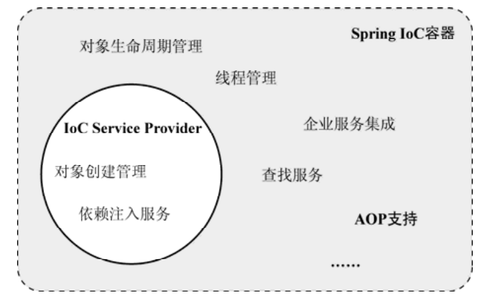

IoC:Inversion of Control控制反转  
含义：原来在我们的类里面要用到其他对象的时候，需要自己手动去new一个对象出来，是我们主动去找被依赖的对象；有了IoC容器之后，它就相当于的我们的一个“帮手”，我们要什么，给它一个眼神，它就为我们装备好了，把被依赖的对象准备好，送到我们手上。对于我们来说，一个是主动去找，一个是被动被服务，这就是控制反转了。  
  

IoC要开始了，准备好了吗？  

上面，当我们需要服务的时候，要先用一个眼神告诉我们的帮手，我们需要什么东西了，IoC也一样，要先说清楚我们的需求。  
# 依赖注入（DI）  
1. 构造方法注入  
被注入对象可以通过在其构造方法中声明依赖对象的参数列表，让外部（通常是IoC容器）知道它需要哪些依赖对象。  
被注入对象的构造乃至其整个生命周期由IoC Service Provider来管理，当我们要创建一个被注入对象的时候，IoC Service Provider会检查被注入对象的构造方法，取得它所需要的依赖对象列表，进而为其注入相应的对象。  

2. setter方法注入  
对于JavaBean对象来说，通常会通过setXXX()和getXXX()方法来访问对应属性，只要为被注入对象中的依赖对象所对应的属性添加setter方法，就可以通过setter方法将相应的依赖对象设置到被注入对象中。  

3. 接口注入  
被注入对象如果想要IoC Service Provider为其注入依赖对象，就必须实现某个接口，这个接口提供一个方法（方法是什么名称，接口是什么名称都不重要，重要的方法的参数要是被依赖对象的对应类型），用来为其注入依赖对象。
  

三种依赖注入方式的PK  
>接口注入：不提倡，需要强制被注入对象实现接口，带有侵入性  
>构造方法注入：在创建对象的时候，对象就已经准备就绪了，可以马上使用，但是存在构造函数无法被继承，无>法设置默认值，对于非必要的依赖，需要重载多个构造函数等问题。  
>setter方法注入：可以被继承，允许设置默认值，但是在对象创建的时候，无法马上进入就绪状态。    

IoC带来的一个重要的作用就是：  
>IoC是一种可以帮助我们解耦各业务对象间依赖关系的对象绑定方式！  

# IoC Service Provider  
有了依赖注入，我们的业务对象就可以关联起来了，但是还是需要有个“帮手”来帮助我们，而IoC Service Provider就对应IoC场景中的这一角色，这是一个抽象的概念（一段代码，一组相关的类，通用的IoC框架或IoC实现都可以）。  

IoC Service Provider的两个职责：  
>1）业务对象的构建管理   
>2）业务对象间的依赖绑定

为我们服务的“帮手”需要知道他手里有什么，以及如何为我们服务  

1. 直接编码实现  
通过程序编码的方式将被注入对象和依赖对象注册到容器，当我们需要一种类型的对象实例的时候，从容器中获取具体的实例。  

2. 配置文件实现  
像普通文本文件、properties文件、XML文件等，都可以成为管理依赖注入关系的载体。   

3. 元数据实现  
直接在类中使用元数据信息来标注各个对象之间的依赖关系，根据这些注解所提供的信息将这些对象组装后使用（注解最终还是通过代码实现的，就是一种比较特殊的编码实现）  

# Spring IoC容器
Spring的IoC容器是一个IoC Service Provider，提供IoC支持的轻量级容器和IoC之外的支持  
  

Spring提供了两种容器类型：
1. [BeanFactory](./002001BeanFactory.md)  
>基础类型IoC容器，提供完整的IoC服务支持。

2. [ApplicationContext](./002002ApplicationContext.md)   
>ApplicationContext在BeanFactory的基础上构建，是相对比较高级的容器实现，除了拥有BeanFactory的所有支持，ApplicationContext还提供了其他高级特性，比如事件发布、国际化信息支持等.

  

PK  
>BeanFactory:果没有特殊指定，默认采用延迟初始化策略（lazy-load）,只有当客户端对象需要访问容器中的某个受管对象的时候，才对该受管对象进行初始化以及依赖注入操作，适用于资源有限，需要启动较快的的场景。  
>该类型容器启动之后，默认全部初始化并绑定完成,适用于那些系统资源充足，并且要求更多功能的场景。  

[Spring容器的实现原理：IoC这么好用，那么Spring的IoC容器是怎么是实现的，我们也想要一探究竟](./002003SpringIoc一探究竟.md)

