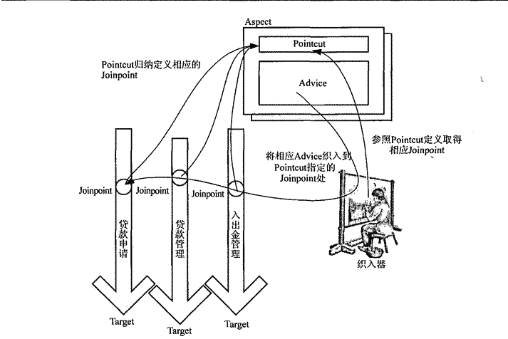

AOP里面的常用概念的理解  

### JoinPoint  
AOP的目的是为了在功能模块的某个位置完成系统需求的织入，这些可以执行织入操作的位置就是JoinPoint（基本上，只要允许，程序执行过程中的任何时间点都可以作为横切逻辑的织入点，即都是JointPoint）。  
几种基本的JointPoint类型：  
####　1. 方法调用  
某个方法被调用的时候所处的程序执行点

#### 2. 方法调用执行  
简称：方法执行，某个方法内部的执行开始时点  

>方法调用是在调用对象上的执行点，方法执行则是被调用的方法逻辑执行的时点，对于同一个对象方法调用要先于方法执行。  

#### 3. 构造方法调用  
某个对象调用其构造方法进行初始化的时点  

#### 4. 字段设置  
对象的某个属性通过setter方法被设置或者直接被设置的时点  

#### 5. 字段获取  
对象的某个属性被访问的时点  

#### 6. 异常处理执行  
在某些类型的异常抛出后，对应的异常处理逻辑执行的时点  

#### 7. 类初始化  
类中的某些静态类型或静态快的初始化时点  

### PointCut  
JointPoint的表述方式，参照PointCut规定的JointPoint信息，才知道在哪些JointPoint上需要织入横切逻辑（从所有的JointPoint中按照“规则”选出需要织入横切逻辑的JointPoint）。  

#### 1. 表述方式  
直接指定JointPoint所在方法名称：简单，功能有限，适用于JointPoint数量有限且较为简单的情况；   
正则表达式：普遍的表达的方式，利用正则表达式归纳表述需要符合某种条件的多组JointPoint；  
使用特定的PointCut表述语言：最为强大，灵活性较好，具体实现较为复杂。  

#### 2.PointCut运算  
PointCut之间进行逻辑运算  

### Advice  
单一横切关注点逻辑的载体，代表会织入到JointPoint的横切逻辑（Aspect类比为class的话，Advice就是method）  

#### 分类  
1. Before Advice    
JointPoint指定位置之前执行的Advice类型，主要用于做一些系统的初始化工作  
2. After Advice  
总的来说是JointPoint指定位置之后执行的Advice类型，还可以细分为：
    - After returning Advice  
    JointPoint执行流程正常结束，才会执行  
    - After throwing Advice  
    JointPoint执行过程中抛出异常的情况  
    - After Advice  
    finally，不管是否抛出异常（正常结束），都会执行的  
3. Around Advice  
包裹JointPoint，在指定的JointPoint之前和之后都指定相应的逻辑处理，甚至可以中断或者忽略原来的JointPoint执行流程  
4. Introduction  
比较特殊，不是根据横切逻辑JointPoint处的执行时机来区分的，而是根据可以完成的功能区别出来的。  
Introduction可以为原来的对象添加新的特性或者行为（本来是一个普通人，给了他某种特性类型的Introduction之后（警察，艺术家等等），这个人就有对应的特性或者行为了）  

### Aspect  
对系统横切关注点逻辑进行模块化封装的AOP概念实体，可以包含多个PonitCut以及相应的Advice定义  

### 织入与织入器  
上面都只是AOP里面的一些点，要实际起效果，需要“织入”这座桥，把AOP和OOP连接起来才可以，完成这个工作的那个人叫做"织入器"。  
>AspectJ有专门的织入器ajc，JBoss是自定义的类加载器，Spring AOP使用一组类完成最后的织入操作（ProxyFactory）  

### 目标对象  
符合PointCut所指定的条件，将在织入过程中被织入横切逻辑的对象就是目标对象  

