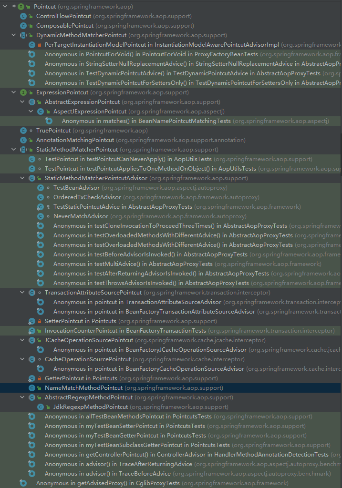
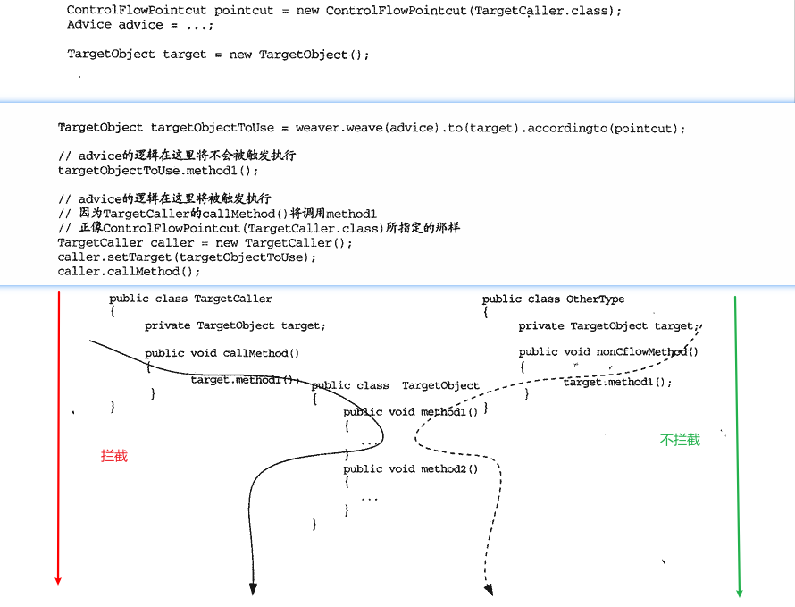
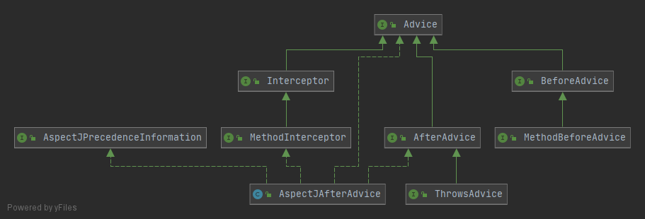
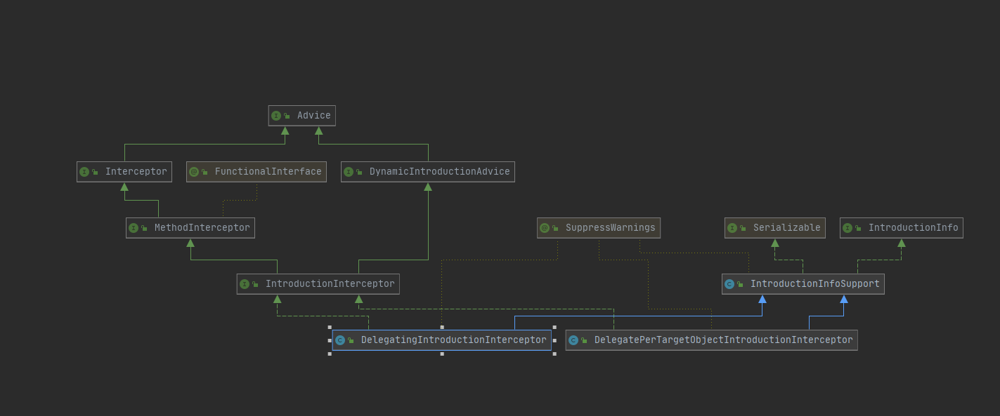

# Spring AOP 一代  
### JointPoint  
Spring AOP仅支持方法级别（更确切的就是方法执行）的Jointpoint。  
>Spring AOP目标是简单而强大的AOP框架，不最求大而全  
>如果对类中的属性级别的Jointpoint提供拦截支持，就破坏了面相对象的封装，真的有需要可以通过拦截getter和setter方法实现  
>应用需求超出Spring AOP的支持，可以求助于其他AOP实现产品，AspectJ等。

### PointCut
#### PointCut概览 
最顶层的抽象Pointcut  

```java
public interface Pointcut {
    //帮助捕捉系统中的Jointpoint
    //匹配将被执行织入操作的对象
    ClassFilter getClassFilter();
    //匹配将被执行织入操作的方法
    MethodMatcher getMethodMatcher();
    //分开定义对象和方法的目的是重用不同级别的匹配定义，并且可以在不同级别上进行组合，或者强制让某个子类只覆写相应的方法定义

    //TruePointcut类型的Pointcut，表示会对系统中的所有对象，以及对象上所有被支持的Jointpoint进行匹配
    Pointcut TRUE = TruePointcut.INSTANCE;
}

//ClassFilter是对Jointpoint所处的对象进行Class级别的类型匹配
@FunctionalInterface
public interface ClassFilter {
    //目标对象的Class类型与Pointcut所规定的类型相符，返回true，否则false（不会对该类型的目标对象进行织入操作）
    boolean matches(Class<?> clazz);
    //TrueClassFilter表示无所谓是什么类型，Pointcut会匹配系统中所有的目标类以及他们的实例
    ClassFilter TRUE = TrueClassFilter.INSTANCE;
}

public interface MethodMatcher {
    //重载了两个matches方法
    //matches方法1
    boolean matches(Method method, @Nullable Class<?> targetClass);
    boolean isRuntime();//matches分界线
    //matches方法2
    boolean matches(Method method, @Nullable Class<?> targetClass, Object... args);
    MethodMatcher TRUE = TrueMethodMatcher.INSTANCE;
}
```  
>MethodMatcher的更多解释:  
>isRuntime()为什么是分界线？是怎么用起来的？  
>假设我们需要对一个方法`login(String userName,String password)`进行拦截，拦截的目的有两种：一种是只需要统计这个方法被调用了多少次；另一种是统计某个用户登录了多少次；对应的，分别不需要关注参数和需要关注参数。  
>不需要关注参数的时候，isRuntime()返回false，那就是StaticMethodMatcher，这时matches方法1会被执行，执行结果将会成为其所属的Pointcut主要依据  
>需要对方法参数进行匹配检查的时候，isRuntime()返回true，那就是DynamicMethodMatcher，由于每次都要检查参数，而且不能缓存匹配结果，匹配效率相对较差（一般不轻易使用），只有***当matches方法1返回true，并且isRuntime()返回true***的时候，matches方法2才会被执行

Pointcut继承体系如下：  
  
 
#### 常见PointCut简介
- NameMatchMethodPointcut
最简单的实现，属于StaticMethodMatcherPointcut的子类，可以使用一组方法名称与Jointpoint处的方法名称进行匹配  
```java
NameMatchMethodPointcut nameMatchMethodPointcut = new NameMatchMethodPointcut();
nameMatchMethodPointcut.setMappedName("hello");//传入方法名称
nameMatchMethodPointcut.setMappedName(new String[]{"hello","world"});//传入多个方法名称
nameMatchMethodPointcut.setMappedName(new String[]{"hello*","*world"});//*表示通配符，如果还要更多，可以使用正则表达式
```
由于不关心参数，对于重载的方法就无能为力了  

- JdkRegexpMethodPointcut
（JDK1.4）专门的基于正则表达式的实现分支，可以指定一个或者多个正则表达式(1.4之前或者perl5风格的使用Perl5RegexpMethodPointcut)
```java
JdkRegexpMethodPointcut jdkRegexpMethodPointcut = new JdkRegexpMethodPointcut();
jdkRegexpMethodPointcut.setPattern("*.*match.*");//一个
jdkRegexpMethodPointcut.setPatterns(new String[]{"hello*","*world"});//多个
```
***正则表达式使用的时候需要匹配完整的包路径***，不能像NameMatchMethodPointcut那样只写方法名称就可以，比如包`package cn.kerwinshi.test`中有一个类`Demo`，其中一个方法为`hello()`，为了拦截他，正则表达式为`*.hello`才可以（相当于`package cn.kerwinshi.test.Demo.hello`），如果只写`hello.*`是不行的。  

正则表达式TODO

- AnnotationMatchingPointcut
（JDK1.5）根据目标对象中是否存在指定类型的注解来匹配Jointpoint  
```java  
//声明注解
@Retention(RetentionPolicy.RUNTIME)//注解作用时期
@Target(ElementType.TYPE)//注解作用目标类型
public @interface ClassLevelAnnotation{}//作用与类上的注解

@Retention(RetentionPolicy.RUNTIME)
@Target(ElementType.METHOD)
public @interface MethodLevelAnnotation{}//作用与方法上的注解

//使用注解标记
@ClassLevelAnnotation
public class TargetDemoObject{
    @MethodLevelAnnotation
    public void hello(){

    }

    public void world(){

    }
}

//定义Pointcut寻找符合预期的Jointpoint
AnnotationMatchingPointcut annotationMatchingPointcut = new AnnotationMatchingPointcut(ClassLevelAnnotation.class);//指定匹配类级别的注解，所有方法都会被拦截
AnnotationMatchingPointcut annotationMatchingPointcut = AnnotationMatchingPointcut.forClassAnnotation(ClassLevelAnnotation.class);//通过静态方法forClassAnnotation指定，等价的  

AnnotationMatchingPointcut annotationMatchingPointcut = AnnotationMatchingPointcut.forMethodAnnotation(MethodLevelAnnotation.class);//指定方法级别的注解，拦截指定注解注解的方法

AnnotationMatchingPointcut annotationMatchingPointcut = new AnnotationMatchingPointcut(ClassLevelAnnotation.class，MethodLevelAnnotation.class);//同时指定匹配类级别的注解和方法级别的注解，进一步缩小范围为指定标记类的指定标记方法
```  

注解TODO

- ComposablePointcut  
可以进行逻辑运算（交集、并集）的Pointcut  
```java
ComposablePointcut composablePointcu1 = new ComposablePointcut(calssFilter1, methodFilter1);
ComposablePointcut composablePointcut2 = new ComposablePointcut(calssFilter2, methodFilter2);
ComposablePointcut united = composablePointcu1.union(composablePointcut2);//求并集
ComposablePointcut intersection = composablePointcu1.intersection(composablePointcut2);//求交集
//以上可以看出Pointcut分成ClassFilter和MethodMatcher两部分的必要性之一，可以进行组合
//more  
ComposablePointcut composablePointcut3 = composablePointcut2.union(calssFilter1).intersection(methodFilter1);
```
工具类Pointcuts为我们提供了常用的Pointcut与Pointcut之间的逻辑运算
```java
Pointcut p1 = ...
Pointcut p1 = ...
Pointcut p3 = Pointcuts.union(p1,p2);
Pointcut p3 = Pointcuts.intersection(p1,p2);
```

- ControlFlowPointcut
匹配程序的调用流程，不是对某个方法执行所在的Jointpoint处的单一特征进行匹配。简单的说，被标记的方法只有被某些类型的对象的方法调用的时候才会织入横切逻辑，被其他类型的对象的方法调用的时候不会织入。   
  
需要在指定的Class类的指定方法调用目标方法才进行拦截的话，就在ControlFlowPointcut的构造函数中同时指定class和方法名称。  

#### PointCut扩展（自定义）  
- StaticMethodMatcher  
    - 默认忽略类的类型匹配（所有类都会被拦截），如果需要指定`setClassFilter`可以帮忙；
    - isRuntime返回false，三个参数的matches方法会抛出UnsupportOperationException;
    - 需要实现两个参数的matches方法；

- DynamicMethodMatcher
    - `getClassFilter`返回ClassFilter.TRUE,需要的话子类覆写该方法即可；
    - isRuntime返回true，两个参数的matches方法默认返回true
    - *通常*实现三个参数的matches方法即可，也可以实现两个参数的matches方法，正常使用；

### Advice  
 
Spring AOP加入了开源组织AOP Alliance，为了标准化AOP的使用，全部遵循了其规定的接口。    
按照自身实例能否在目标对象的类的实例中共享这一标准，划分为：
- per-class类型的Advice  
可以共享，只是拦截目标对象的方法，不会为目标对象添加属性和状态。   
    - Before Advice
    实现的横切逻辑在Jointpiont之前执行。使用的时候实现接口`MehtodBeforeAdvice`（继承标志接口`BeforeAdvice`，`BeforeAdvice`没有任何方法需要实现）。  
    使用场景：需要在指定的文件路径放置文件，就需要首先检查这些位置是否存在，不存在则创建，这时候我们可以做一些统一处理，避免这些工作散落在各个类中。  
    - ThrowsAdvice  
    接口`ThrowsAdvice`，没有定义任何方法，但是一般需要遵守规则`void afterThrowing（[Method ,args,target],ThrowableSubClass）`,\[\]中的参数可以省略。  
    使用场景：当系统发生异常的时候通过监控异常，通知监控人员或者运营人员。  
    - AfterReturningAdvice  
    接口`AfterReturningAdvice`(继承接口AfterAdvice)可以访问方法的返回值、方法、方法的参数以及所在的目标对象，前提是目标方法正常返回。注意：不能对返回值进行修改。  
    - Around Advice  
    由于没有提供finally的advice，Spring AOP使用Around Advice弥补了AfterReturningAdvice无法修改返回结果的遗憾。MehtodInterceptor作为Around Advice使用，没有AroundAdvcie这个接口。
    使用场景：监控方法执行性能。

- per-instance类型的Advice
不会在目标类的所有对象实例之间共享，为不同的对象保存各自的状态以及相关的逻辑。（打工人，大家都是打工人，但是每个人都是不一样的，有不一样的个人信息，不一样的工作资料）在Spring AOP中，Introduction就是唯一的一种per-instance类型的Advice。
    - Introduction
    在不改变目标类定义的前提下，为目标类添加新的属性和行为。（原来是研发，临时被拉去作为测试，完成测试工作，你还是你，但是需要完成的工作多了点，身份被加了点信息）首先，为目标对象添加属性和行为需要声明相应的接口和提供相应的实现，然后通过特殊的拦截器将对应的接口和实现逻辑附加到目标对象上（就是`IntroductionInterceptor`）  
 


```java
//methodinterceptor的使用实例
public class DiscountMethodInterceptor implements MethodInterceptor{
    private static final Integer DEFAULT_DISCOUNT_RATIO = 80;
    private static final Integer DEFAULT_DISCOUNT_RATIO = new IntRange(5,95);
    private Interger discountRatio = DEFAULT_DISCOUNT_RATIO;
    private boolean campaginAvailable;
    public Object invoke(MehtodInvocation invocation) throws Throwable{
        Object returnValue = invocation.proceed();//调用原有的方法逻辑，取得返回值，一定要调用proceed方法，不然目标对象的运算逻辑就被短路了
        // if(...){
        //     return ...;//返回值处理，根据条件修改返回值
        // }
    }
}

//DelegatingIntroductionInterceptor
//不会实现将要添加到目标对象上的新的逻辑行为，而是委派给其他实现类
public interface Ideveloper{
//目标对象接口
}
public class Developer{
//目标对象接口实现类
}
public interface Itester{
//将要添加到目标对象上的行为与属性的接口
}
public class Tester{
//将要添加到目标对象上的行为与属性的接口实现类
}

//织入
Itester delegate = new Tester();
DelegatingIntroductionInterceptor delegatingIntroductionInterceptor = new DelegatingIntroductionInterceptor(delegate);//DelegatingIntroductionInterceptor会使用持有的这个delegate为同一目标类（Ideveloper）的所有实例对象使用
Itester fakeTester = (Itester)weaver.weave(developer).with(delegatingIntroductionInterceptor).getProxy();
fakeTester.test();

//改进版，为每个目标对象都单独提供  DelegatePerTargetObjectIntroductionInterceptor
//DelegatePerTargetObjectIntroductionInterceptor内部持有一个目标对象与相应的Introduction逻辑实现类之间的映射关系
//使用与DelegatingIntroductionInterceptor基本一致，构造函数有所改变，不需要自己构造delegate了，只需要告诉类型就可以了
DelegatePerTargetObjectIntroductionInterceptor delegatePerTargetObjectIntroductionInterceptor = new DelegatePerTargetObjectIntroductionInterceptor(接口实现类，接口);
```

### Aspect   
Spring中最初并没有Aspect的概念，Advisor就是Spring中的Aspect，但是它只有一个Pointcut和一个Advice，是一种特殊的Aspect。


有了以上的了解，我们就对Spring AOP的基本概念都有了了解，接下来就是要学习如何使用这些概念实现我们的需求了。

### 织入


