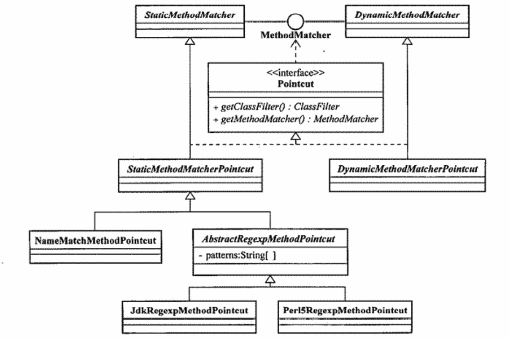

# Spring AOP 一代  
### JointPoint  
Spring AOP仅支持方法级别（更确切的就是方法执行）的Jointpoint。  
>Spring AOP目标是简单而强大的AOP框架，不最求大而全  
>如果对类中的属性级别的Jointpoint提供拦截支持，就破坏了面相对象的封装，真的有需要可以通过拦截getter和setter方法实现  
>应用需求超出Spring AOP的支持，可以求助于其他AOP实现产品，AspectJ等。

### PointCut
最顶层的抽象Pointcut  

```java
public interface Pointcut {
    //帮助捕捉系统中的Jointpoint
    //匹配将被执行织入操作的对象
    ClassFilter getClassFilter();
    //匹配将被执行织入操作的方法
    MethodMatcher getMethodMatcher();
    //分开定义对象和方法的目的是重用不同级别的匹配定义，并且可以在不同级别上进行组合，或者强制让某个子类只覆写相应的方法定义

    //TruePointcut类型的Pointcut，表示会对系统中的所有对象，以及对象上所有被支持的Jointpoint进行匹配
    Pointcut TRUE = TruePointcut.INSTANCE;
}

//ClassFilter是对Jointpoint所处的对象进行Class级别的类型匹配
@FunctionalInterface
public interface ClassFilter {
    //目标对象的Class类型与Pointcut所规定的类型相符，返回true，否则false（不会对该类型的目标对象进行织入操作）
    boolean matches(Class<?> clazz);
    //TrueClassFilter表示无所谓是什么类型，Pointcut会匹配系统中所有的目标类以及他们的实例
    ClassFilter TRUE = TrueClassFilter.INSTANCE;
}

public interface MethodMatcher {
    //重载了两个matches方法
    //matches方法1
    boolean matches(Method method, @Nullable Class<?> targetClass);
    boolean isRuntime();//matches分界线
    //matches方法2
    boolean matches(Method method, @Nullable Class<?> targetClass, Object... args);
    MethodMatcher TRUE = TrueMethodMatcher.INSTANCE;
}
```  
>MethodMatcher的更多解释:  
>isRuntime()为什么是分界线？是怎么用起来的？  
>假设我们需要对一个方法`login(String userName,String password)`进行拦截，拦截的目的有两种：一种是只需要统计这个方法被调用了多少次；另一种是统计某个用户登录了多少次；对应的，分别不需要关注参数和需要关注参数。  
>不需要关注参数的时候，isRuntime()返回false，那就是StaticMethodMatcher，这时matches方法1会被执行，执行结果将会成为其所属的Pointcut主要依据  
>需要对方法参数进行匹配检查的时候，isRuntime()返回true，那就是DynamicMethodMatcher，由于每次都要检查参数，而且不能缓存匹配结果，匹配效率相对较差（一般不轻易使用），只有***当matches方法1返回true，并且isRuntime()返回true***的时候，matches方法2才会被执行

Pointcut继承体系如下：  
  
其中，常见的有以下几种Pointcut实现  
- NameMatchMethodPointcut
最简单的实现，属于StaticMethodMatcherPointcut的子类，可以使用一组方法名称与Jointpoint处的方法名称进行匹配  
```java
NameMatchMethodPointcut nameMatchMethodPointcut = new NameMatchMethodPointcut();
nameMatchMethodPointcut.setMappedName("hello");//传入方法名称
nameMatchMethodPointcut.setMappedName(new String[]{"hello","world"});//传入多个方法名称
nameMatchMethodPointcut.setMappedName(new String[]{"hello*","*world"});//*表示通配符，如果还要更多，可以使用正则表达式
```
由于不关心参数，对于重载的方法就无能为力了  

- JdkRegexpMethodPointcut
（JDK1.4）专门的基于正则表达式的实现分支，可以指定一个或者多个正则表达式(1.4之前或者perl5风格的使用Perl5RegexpMethodPointcut)
```java
JdkRegexpMethodPointcut jdkRegexpMethodPointcut = new JdkRegexpMethodPointcut();
jdkRegexpMethodPointcut.setPattern("*.*match.*");//一个
jdkRegexpMethodPointcut.setPatterns(new String[]{"hello*","*world"});//多个
```
***正则表达式使用的时候需要匹配完整的包路径***，不能像NameMatchMethodPointcut那样只写方法名称就可以，比如包`package cn.kerwinshi.test`中有一个类`Demo`，其中一个方法为`hello()`，为了拦截他，正则表达式为`*.hello`才可以（相当于`package cn.kerwinshi.test.Demo.hello`），如果只写`hello.*`是不行的。  

正则表达式TODO

- AnnotationMatchingPointcut
（JDK1.5）根据目标对象中是否存在指定类型的注解来匹配Jointpoint  
```java  
//声明注解
@Retention(RetentionPolicy.RUNTIME)//注解作用时期
@Target(ElementType.TYPE)//注解作用目标类型
public @interface ClassLevelAnnotation{}//作用与类上的注解

@Retention(RetentionPolicy.RUNTIME)
@Target(ElementType.METHOD)
public @interface MethodLevelAnnotation{}//作用与方法上的注解

//使用注解标记
@ClassLevelAnnotation
public class TargetDemoObject{
    @MethodLevelAnnotation
    public void hello(){

    }

    public void world(){

    }
}

//定义Pointcut寻找符合预期的Jointpoint
AnnotationMatchingPointcut annotationMatchingPointcut = new AnnotationMatchingPointcut(ClassLevelAnnotation.class);//指定匹配类级别的注解，所有方法都会被拦截
AnnotationMatchingPointcut annotationMatchingPointcut = AnnotationMatchingPointcut.forClassAnnotation(ClassLevelAnnotation.class);//通过静态方法forClassAnnotation指定，等价的  

AnnotationMatchingPointcut annotationMatchingPointcut = AnnotationMatchingPointcut.forMethodAnnotation(MethodLevelAnnotation.class);//指定方法级别的注解，拦截指定注解注解的方法

AnnotationMatchingPointcut annotationMatchingPointcut = new AnnotationMatchingPointcut(ClassLevelAnnotation.class，MethodLevelAnnotation.class);//同时指定匹配类级别的注解和方法级别的注解，进一步缩小范围为指定标记类的指定标记方法
```  

注解TODO

- ComposablePointcut  
可以进行逻辑运算的Pointcut


