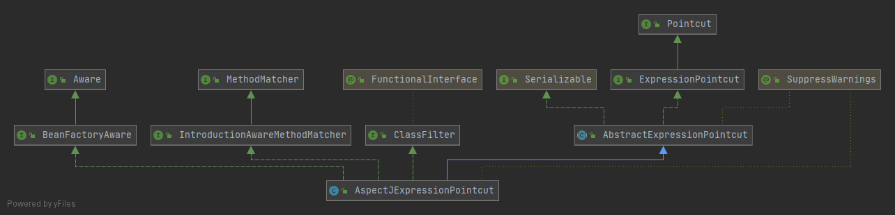

Spring AOP 二代  
一代目的重点的是了解各种概念和实现原理，这些都是框架的基础，无论如何升级框架，这些东西都是不会变的。  

###　AspectJ形式的Spring AOP
主要升级：  
- 使用POJO声明AspectJ和相关的Advice  
- 获得了新的Pointcut表述方式  

>Spring AOP还是那个Spring AOP，集成AspectJ只是穿了它的大衣。  

使用实例：   
#### 1.Aspect定义 与 目标对象
```java
//Aspect定义
@Aspect
public class PerformanceTraceAspect{
    //Pointcut定义
    @Pointcut("excution(public void *.method1())")
    public void pointcutName(){}

    //Advice定义
    @Around("pointcutName()")
    public Object performanceTrace(ProceedingJointPoint jiontPoint) throws Throwable{
        StopWatch watch = new StopWatch();
        try{
            watch.start();
            return jiontPoint.proceed();
        }finally{
            watch.stop();
        }
    }
}

public class Foo{
    public void method1（）{
        System.out.prinln("lalalal");
    }
}
```
2.将Aspect织入目标对象  
```java
//ProxyFactory
AspectJProxyFactory weaver  = new AspectJProxyFactory();
weaver.setProxyTargetClass(true);
weaver.setTarget(new Foo());
weaver.addAspect(PerformanceTraceAspect.class);
Object proxy = weaver.getProxy();
proxy.method1();


//AutoProxyCreator
//IoC注册AnnotationAwareAspectJAutoProxyCreator，然后自动搜索IoC容器中的Aspect，并用到Pointcut定义的目标对象上。
```

#### 2.@AspectJ形式的Pointcut
2.0之前，指定方法名和正则表达式两种方式就可以达到目的  
2.0之后，集成了AspectJ的Pointcut描述语言支持  
- 声明方式
依附在@Aspect标注的Aspect定义类之内，通过@Pointcut注解指定AspectJ形式的Pointcut表达式，然后注解标注到Aspect定义类的某个方法上即可。  
```java
//Aspect定义
@Aspect
public class PerformanceTraceAspect{
    //Pointcut Expression：规定Pointcut匹配规则的地方，包括Pontcut标志符和表达式匹配模式  
    @Pointcut("excution(public void *.method1())")
    public void pointcutName(){}//这个方法就是Pointcut Signature，返回值必须是void，public类型的可以在其他Aspect定义中引用，private则只能在当前的Aspect使用，避免重复Pointcut Expression的定义
    @Pointcut("pointcutName()")//Pointcut Signature的作用，当做Pointcut Expression标志符，引用第一个Pointcut的定义，还可以进一步的做逻辑运算&& || ！
    public void pointcutName1() {}

    //技巧：可以在一个Aspect中定义，管理所有的Pointcut
    //在其他的Aspect定义时，使用这些Pointcut
}

@Retention(RetentionPolicy.RUNTIME)
@Target(ElementType.METHOD)//方法级注解，不能脱离方法存在
public @interface Pointcut {
    String value() default "";
    String argNames() default "";
}
```
- @AspectJ形式的Pointcut表达式的标志符  
相比于@AspectJ，有所限制，被限制在方法级别的  
    - execution：支持方法执行类型的Jointpoint  
    匹配拥有指定方法签名的Jointpoint，规定格式如下：
    `execution(modifiers? ret-type-pattern declaring-type-pattern? name-parttern(param-pattern) throws-pattern?)`，方法的返回类型，方法名称以及参数部分必须指定，其他可以省略。`execution(public void Foo.doSomething(String))`和`execution(void doSomething(String))`都是可以的。  
    `*`可以用于任何部分的匹配模式中，可以匹配相邻的多个字符`execution(* *(*))`代表匹配一个参数的方法  
    `..`可以在declaring-type-pattern和参数位置使用`execution(void cn.springtest..*.doSomething(String))`匹配cn.springtest包下的所有类型，以及cn.springtest的子包中的所有类型；`void doSomething(..)`匹配有0到多个参数的方法，参数类型不限
    `*`和`..`还可以组合使用，更加强大。
    - within：支持类型声明  
    匹配指定类型下的所有Jointpoint，由于Spring只支持方法级别的Jointpoint，所以将匹配指定类的所有方法执行，`within(cn.spring.test.Hello)`会匹配Hello类中的所有方法声明，也可以通过`*`和`..`进行扩展，`within(cn.spring.test.*)`会匹配cn.spring.test包下所有类型的方法；`within(cn.spring.test..*)`会匹配当前包和子包中的所有类型的方法
    - target和this  
    ***Aspectj中***：this指调用方法一方所在的对象caller，target指被调用方法所在的对象callee，两者配合使用:`this(Object2)&&target(Object3)`表示在对象Object2调用Object3的方法的时候才会满足匹配条件即使Object1调用Object3的方法也不会匹配。
    ***Spring AOP中***：this表示目标对象的代理对象，target代表目标对象，`this(Objecttype)`自然就是表示目标对象的代理对象为Objecttype类型的时候匹配成功，`target(Objecttype)`表示目标对象为Objecttype类型的时候匹配成功。（这里，如果目标对象继承了接口，不论是基于接口的代理还是CGLib的代理，`this(ProxyInterface)`和`target(ProxyInterface)`效果是一样的，因为得到的代理对象都是ProxyInterface类型的，但是`this(ProxyInterfaceImpl)`和`target(ProxyInterfaceImpl)`效果就不太一样了，基于接口实现代理的时候，`target(ProxyInterfaceImpl)`可以匹配目标对象的所有方法，`this(ProxyInterfaceImpl)`则不可以；基于Cglib代理的时候差别不大）  
    -args：捕捉拥有指定参数类型，指定参数数量的方法  
    `args(cn.spring.test.User)`会把所有类型下参数为User类型的方法都找出来，而且args是在运行期间动态检查参数类型的，对于这样的也可以`public void login(Object user)`，使用`execution(* *(User))`就不行，因为他是静态的。
    -@within  
    （只接受注解类型，并对被指定注解标注的类生效，也就是说我们要先自定义一个注解，用来标记目标对象）对象标注了该注解后，将匹配该对象内部的所有Jointpoint，对于SpringAOP就是对象内部声明的所有方法级Jointpoint。  
    -@target  
    对象拥有@target标志符所指定的注解类型（也需要自定义一个注解先），对于SpringAOP，目标对象内部的所有方法级别的Jointpoint将会被匹配。（与@within基本一致，@within是静态的，@target在运行的时候动态匹配）  
    -@args  
    检查当前方法级别的Jointpoint的方法参数类型，会尝试对系统中所有的对象的每次方法执行的参数都进行检查，只要参数类型标注有@args指定的注解类型（也需要自定义注解），方法就会被匹配。  
    -@annotation  
    会尝试检查系统中所有对象的所有方法级别的Jointpoint，如果被检查的方法标注有@annotation指定的注解类型（也需要自定义注解），那么这个方法就会被匹配  

实际上，SpringAOP也就支持上面那些了，对于更多的AspectJ中的标志符，就不支持了，只是借用了AspectJ的外衣，本质上不是AspectJ，还是Spring AOP。@AspectJ形式的Pointcut最后都会通过内部解析，转化为具体的Pointcut对象。  
  

AspectJProxyFactory或者AnnotationAwareAspectJAutoProxyCreator通过反射获取到Aspect的Pointcut后，构造一个AspectJExpressionPointcut对象实例，得到Pointcut表达式，还是通过ClassFilter和MethodMatcher进行具体的匹配工作，只不过在实现的时候委托AspectJ的类库完成具体的工作。  

#### 3.@AspectJ形式的Advice
@AspectJ形式的Advice定义实际就是使用@AspectJ标注的Aspect定义类中的普通方法，只不过被相应的注解标注了  
- @Before  
- @AfterReturing：需要访问方法的返回值可以通过其returning属性将返回值绑定到After Returing Advice定义所在的方法  
- @AfterThrowing：其throwing属性限定Advice定义方法的参数名，并在方法调用的时候将相应的异常绑定到具体方法参数上。  
- @After：2.x才有这个类型的，适用于释放某些系统资源的场景    
- @Around：第一个参数必须为ProceedingJointPoint，而且必须指定，要通过他的proceed（）方法继续调用链的执行（一次或者多次），在调用该方法的时候，可以传入Object[]数组代表参数列表，  
- @DeclareParents：不是对Aspect中的各Advice方法标注，认识对实例变量定义进行标注  
    标注Introduction类型的Advice，但是该注解对应标注对象的域，而不是方法。

使用：可以直接指定@AspectJ形式的Pointcut，也可以指定单独声明的@Pointcut类型的Pointcut Signature
```java
@Aspect
public class MockAspect{
    @Pointcut("execution(* destryo(..))")
    public void destroy(){}

    //直接指定@AspectJ形式的Pointcut
    @Before("execution(public void *.mthodName(String))")
    public void setUpResourceFloder(Jointpoint jointpoint){
        //借助Jointpoint（位于第一个参数）的getArgs方法访问访问相应的参数，getThis方法获取当前代理对象，getTarget获取当前目标对象，getSignature获取当前的方法签名，如果不需要，Jointpoint可以不要
        //这种方式适用于除around和introduction之外的advice
    }

    //@Before("execution(public void *.mthodName(String)) && args(taskName)")
    //接受的不是具体的对象类型而是某个参数名称的时候会将这个参数名称（args指定的参数名称必须与Advice定义的所在方法的参数名称相同）对应的参数绑定到对advice方法的调用。
    //除了excution之外其他标志符原本都是指定对象类型的，但是如果他们指定的是参数名称，那么作用效果就和args是类似的

    //指定单独声明的@Pointcut类型的Pointcut Signature
    @After("destroy()")
}
```
introduction是通过将需要添加的行为逻辑以新的接口定义增加到目标对象上，所以需要声明一个实例变量，他的类型就是新增加的接口类型，然后使用DeclareParents对其进行标注。  
```java
@Aspect
public class IntroductionAspect{
    @DeclareParents(value="...MockTask",defaultImpl=CounterImpl.class)
    public Icounter counter;//将为目标对象新增加的对象类型
    //value可以指定将要应用到的目标对象，可以指定单一的对象也可以使用调配符指定一批目标对象
    //defaultImpl可以指定新增加的接口定义的实现类
}
```

执行顺序  
当出现在一个Aspect内的时候：  
根据Advice的声明顺序确定优先级，先出现的优先级高（对于Before，优先级高意味着先执行，对于AfterReturning则是优先级越高，执行越靠后）  
当出现在不同的Aspect内的时候：  
实现Ordered接口即可（IoC容器配合使用，编程实现由添加到AspectJProcyFactory的顺序决定），否则顺序不确定，getOrder的方法返回值越小，优先级越高  

实例化模式  
默认都是单例的（Singleton），Spring AOP只支持singleton perthis和pertarget三种，例如：`@Aspect(perthis(execution(boolean *.execute(String,..))))`

###　基于Schema的AOP
1. 配置方式的改变：配置方式由基于DTD的XML转变为基于Schema的XML，为Spring的AOP专门提供了命名空间  
2. @AspectJ形式的AOP折中，由于要使用 @AspectJ形式的AOP要求java 5以上的JDK或者JRE，注解是Java5引入的，但是又想使用基于POJO的Aspect声明方式，就可以使用基于Schema的Spring AOP  
```xml
<!-- 添加了AOP的命名空间 -->
<?xml version="1.0" encoding="UTF-8"?>
<beans xmlns="http://www.springframework.org/schema/beans"
    xmlns:xsi="http://www.w3.org/2001/XMLSchema-instance"
    xmlns:aop="http://www.springframework.org/schema/aop" 
    xsi:schemaLocation="
        http://www.springframework.org/schema/beans http://www.springframework.org/schema/beans/spring-beans.xsd
        http://www.springframework.org/schema/aop http://www.springframework.org/schema/aop/spring-aop.xsd">
    <!-- 在XML配置文件在，所有与AOP相关的配置必须置于<aop:config>范围内，可以有多个<aop:config> -->

    <!--aop:config有三个元素  aop:pointcut aop:advisor aop:aspect（要按顺序配置才行）-->
    <aop:config proxy-target-class="false">
    <!-- proxy-target-class属性，控制基于接口代理还是基于类代理 --> 
    <!-- aop:config取代各种AutoProxyCreator -->
        <!-- aop:pointcut可以被aop:advisor或者aop:aspect引用，但是当其是在aop:aspect中声明的时候只能被所在的aop:aspect使用 -->
        <aop:pointcut id="businessService" expression="execution(* com.jdsu.nc.portal.service.*.*(..))"/>
            <!-- type属性为regex表示为expressoin指定正则表达式描述pointcut，aspectj表示为expressoin指定aspectj形式的pointcut（默认） -->
    <!-- aop:advisor代替各种具体的Advisor实现类的bean定义声明 -->
    <!-- id:当前advisor的标志id  pointcut-ref：当前advisor对应的pointcut是什么，pointcut对象的引用 advice-ref：advice对象的引用 -->
        <aop:advisor id="testAdvisor" pointcut-ref="businessService" advice-ref="tx-advice"/>
    <!--  pointcut-ref也可以转为直接指定pointcut-->
        <!-- <aop:advisor id="testAdvisor"
            pointcut="execution(public void *.doSomething(..))"
            advice-ref="tx-advice"/> -->
    
        <aop:aspect id="myAspect" ref="aBean">
        <!-- Before Advice -->
            <aop:before pointcut-ref="businessService"  method="doAccessCheck"/>
        </aop:aspect>
    </aop:config>
    <bean id="aBean" class="...">
        ...
    </bean>
</beans>
```
基于Schema的使用实例：  
```java
// 定义aspect
public class SchemaBasedAspect{
    public void method1(){}
    public void method2(){}
    // Before Advice的定义
    public void doBefore(Jointpoint jp){}
    // After Returning Advice的定义，xml的returning属性表示返回参数的名称
    public void doAfterReturning(Jointpoint jp){}
    // After Throwing Advice的定义
    public void doAfterThrowing(RuntimeException e){}
    // After Advice的定义
    public void doAfter(){}
    // After Around的定义
    public void doProfile(ProceedingJointpoint pjp) throws Throwable{}
}

```

```xml
<aop:config>
    <aop:aspect id="myAspect" ref="schameBasedAspect" order="2">
        <aop:pointcut id="businessService" expression="execution(* ..service.*.*(..))"/>
    <!-- order表示Aspect内定义的Advice在同一个Jointpoint的执行顺序 -->
        <aop:before pointcut-ref="businessService"  method="doBefore"/>
    </aop:aspect>
</aop:config>

<!-- 特殊的Introduction -->
<!-- 在@AspectJ形式的AOP中，需要定义一个实例变量，但是在Schema中不需要，只需要给出实现新的接口implement-interface和该接口的实现类default-impl，types-matching指定需要对哪些目标对象进行进行Introduction逻辑织入 -->
    <aop:aspect id="usageTrackerAspect" ref="usageTracking">
        <aop:declare-parents
            types-matching="com.jdsu.nc.portal.service.*+"
            implement-interface="com.jdsu.nc.portal.service.tracking.UsageTracked"
            default-impl="com.jdsu.nc.portal.service.tracking.DefaultUsageTracked"/>
    </aop:aspect>
<bean id="schameBasedAspect" class="..SchemaBasedAspect">
```


>需要提一下的有：1.通过Advice对应的Schema配置元素arg-names属性指定参数，只要按照顺序定义Ponitcut和Advice方法的参数声明，可以省略arg-names使用；2.执行顺序通过aop:aspect的order属性决定；3.实例化的时候只有Sigleton模式。与@AspectJ形式的AOP要注意区分比较。


