# ProxyFactory背后的原理  
知其然，也要知其所以然  
### ProxyFactory
```java
public interface AopProxy{
    Object getProxy();
    Object getProxy(ClassLoader calssLoader);
}
```
AopProxy对不同的代理实现提供了相应的子类实现  
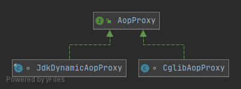  

AopProxy实例通过抽象工厂模式创建，通过AopProxyFactory接口完成  
```java
public interface AopProxyFactory{
    AopProxy creatAopProxy(AdvisedSupport config) throws AopConfigException;//根据AdvisedSupport确定生成什么类型的AopProxy，实际交给DefaultAopProxyFactory实现
}
```
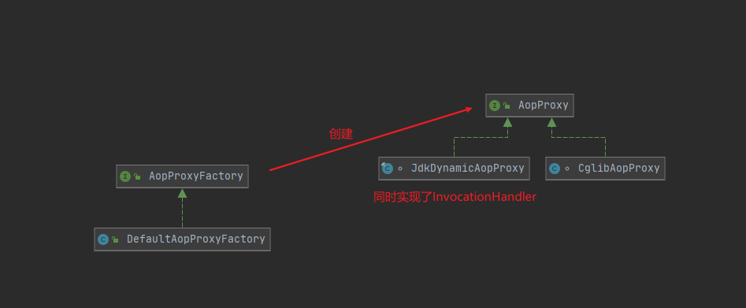

那么现在，关注点落在了AdvisedSupport上，他是何方神圣呢？  
接下来，就让我们揭开她的神秘面纱  
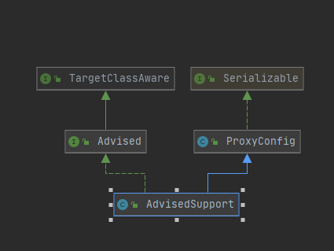  
AdvisedSupport其实包含了两部分内容：  
一部分就是用来记载生成代理对象的控制信息（ProxyConfig分支）；另一部分就是承载生成代理对象所需的必要信息（Advised分支，其实就是目标类、Advice、Advisor等）。  

- ProxyConfig（五个boolean属性）  
```java
//true则强制使用CGLIB代理
private boolean proxyTargetClass = false;
//告知代理对象是否需要采取进一步优化措施（即使为代理对象添加或移除了相应的Advice也会被忽略），true则强制使用CGLIB代理
private boolean optimize = false;
//是否可以强制转换为Advised，可以通过Advised查询代理对象的一些信息
boolean opaque = false;
//生成代理对象的时候，绑定到ThreadLocal，目标对象需要访问代理对象可以通过AopContext.currentProxy取得
boolean exposeProxy = false;
//true表示一旦代理对象的相关配置完成，不容许再修改
private boolean frozen = false;
```
- Advised  
要针对哪些目标类生成代理对象，要为代理对象加入何种横切逻辑，都可以通过Advised社设置查询，比如可以使用Advised访问代理对象持有的Advisor，实现添加、删除等动作。

ProxyFactory同时集成了AdvisedSupport（用来设置生成的代理对象的相关信息）和AopProxy（用来取得最终的代理对象）  
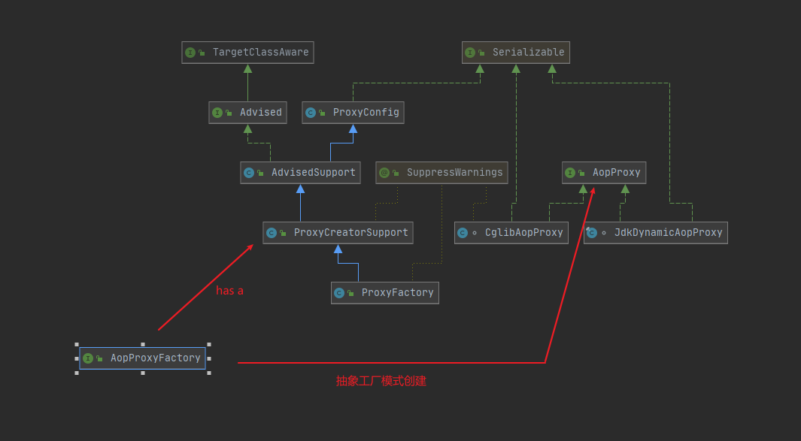  

>ProxyFactory可以独立于IoC之外实现对AOP的支持，但是结合AOP与IoC才是最强大的  

### ProxyFactoryBean  
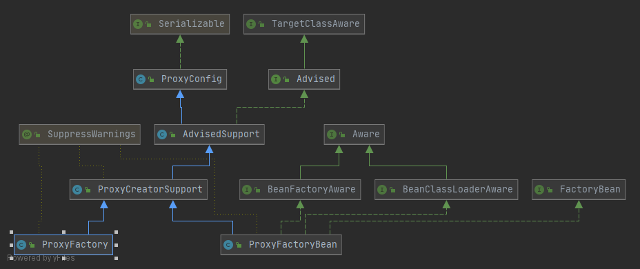  

Proxy + FactoryBean,是一个FactoryBean（持有某个FactoryBean的引用，取得的是getObject()方法返回的对象，对应这里，返回的就要是代理对象）   

```java
public Object getObject() throws BeansException {
    initializeAdvisorChain();
    if (isSingleton()) {//FactoryBean的scope要求
        return getSingletonInstance();
    }
    else {
        if (this.targetName == null) {
            logger.warn("Using non-singleton proxies with singleton targets is often undesirable. " +
                    "Enable prototype proxies by setting the 'targetName' property.");
        }
        return newPrototypeInstance();
    }
}

//如果是单例的返回缓存的实例singletonInstance，否则每次都返回一个新的代理对象
private synchronized Object getSingletonInstance() {
    if (this.singletonInstance == null) {
        this.targetSource = freshTargetSource();
        if (this.autodetectInterfaces && getProxiedInterfaces().length == 0 && !isProxyTargetClass()) {
            // Rely on AOP infrastructure to tell us what interfaces to proxy.
            Class<?> targetClass = getTargetClass();
            if (targetClass == null) {
                throw new FactoryBeanNotInitializedException("Cannot determine target class for proxy");
            }
            setInterfaces(ClassUtils.getAllInterfacesForClass(targetClass, this.proxyClassLoader));
        }
        // Initialize the shared singleton instance.
        super.setFrozen(this.freezeProxy);
        this.singletonInstance = getProxy(createAopProxy());
    }
    return this.singletonInstance;
}
```

ProxyFactory与ProxyFactoryBean相比基本一致，但是多出几个属性  
- proxyInterfaces：要采用基于接口的代理方式，就可以配置list来指定一个或者多个接口类型（等效通过Interfaces属性指定），autodetectInterfaces默认true，会自动检测目标对象实现的接口并进行代理  
- interceptorNames：指定多个将要织入到目标对象的Advice，拦截器以及Advisor。  
- singleton：FactoryBean的要求，返回的对象是单例的还是多例的  


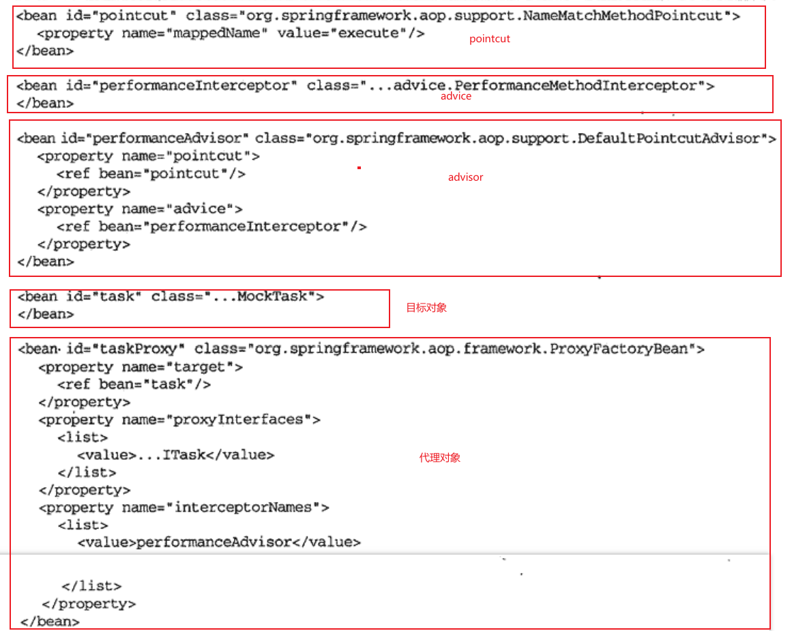  
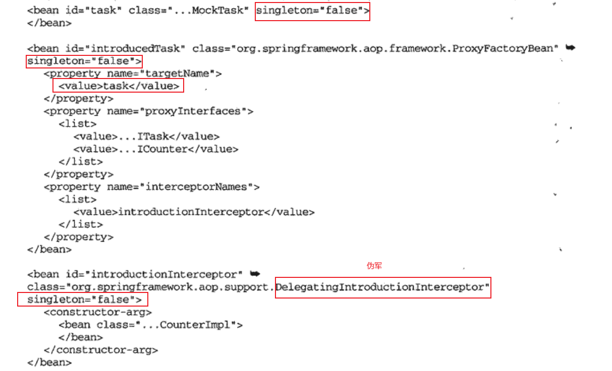  
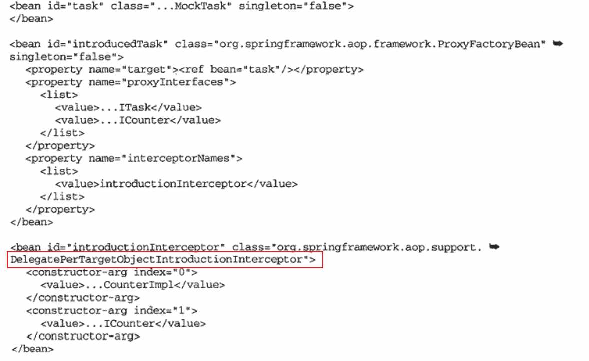  


>利用ProxyFactoryBean，可以实现目标对象的横切逻辑的织入，但是这是一个一个进行的，目标对象少的时候还可以接受，目标对象多了，就行不通了。  

### AutoProxy自动代理机制  
建立在IoC容器的BeanPostProcessor概念之上（大致就是在遍历bean的时候，对某些bean干点什么，比如返回代理对象，而不是目标对象本身）。  

这里，利用ProxyFactory或者ProxyFactoryBean可以生成代理对象，那么关键就落在如何判断为哪些bean创建并返回代理对象了  

- 1.AutoProxyCreator  
    - BeanNameAutoProxyCreator：通过指定一组容器内的目标对象对应的beanName，将指定的一组拦截器应用到这些目标对象上。（配置beanname的时候使用通配符，逗号分隔的数组都是小技巧）
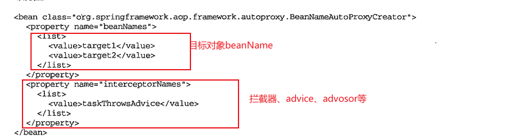         
    - DefaultAdvisorAutoProxyCreator
    全自动武器，只需要在ApplicationContext的配置文件中注册一下DefaultAdvisorAutoProxyCreator就可以了，其他事完全交给它去搞定就好了。（不过，只对Advisor中意，其他人不放在眼里的）  
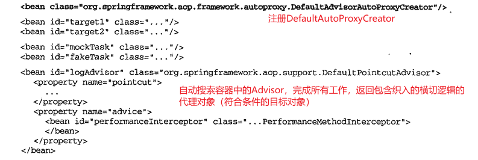       
    - 扩展AutoProxyCreator  
    背后的原理是所有的AutoProxyCreator都是InstantiationAwareBeanPostProcessor，这个BeanPostProcessor是比较特殊的，IoC检测到他的时候会直接通过InstantiationAwareBeanPostProcessor里面的逻辑构造对象实例返回，屏蔽正常的实例化流程。通过直接继承AbstractAutoProxyCreator或者AbstractAdvisorAutoProxyCreator，提供规则匹配一类的逻辑，最终实现自定义的AutoProxyCreator。  
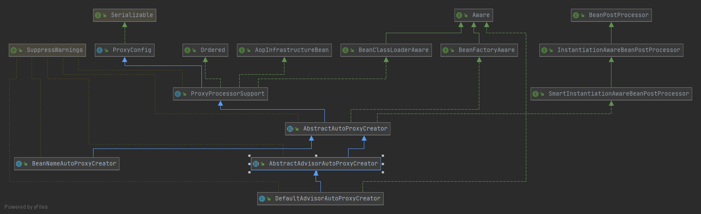  

### TargetSource
ProxyFactory通过setTarget/ProxyFactoryBean通过setTargetName实现指定目标对象在IoC容器中的名字，此外还可以通过TargetSource实现  

TargetSource的作用就是为目标对象在外面添加一个壳子，或者说是目标对象的容器。  
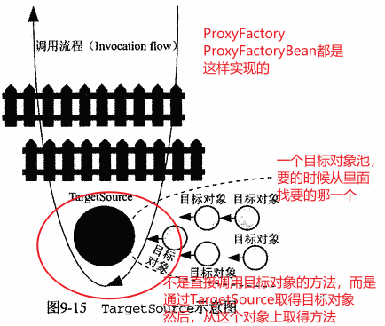  
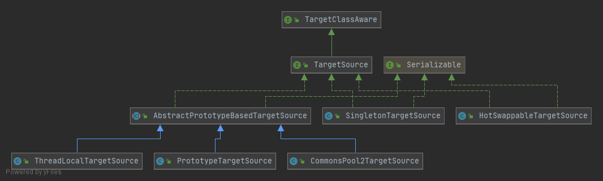  
实现类包括：  
- SingletonTargetSource：内部持有一个目标对象实例，每次调用都是返回同一个目标对象  
- PrototypeTargetSource：每次调用都会返回一个新的目标对象实例    
- HotSwappableTargetSource  
- CommonsPool2TargetSource  
- ThreadLocalTargetSource  
- 自定义的TargetSource


