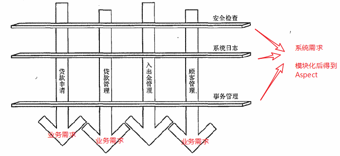

AOP  
从面向过程编程到面向对象编程，包括接下来要学的AOP，目的都是提高程序开发的扩展性，高效和易于维护。

面向对象编程帮我们解决了业务需求的开发的问题，按照功能模块划分并完成开发。  
但是，业务需求都基本是一对一的，需要什么功能，开发什么功能模块就行，系统需求不是，比如日志，权限控制等，都是系统需求，每个业务都需要实现的，对业务需求功能模块进行一个一个实现肯定是行不通的了，工作量太大，还都是重复性的工作（这样干的结果就是一堆垃圾）。AOP就是对面向对象编程的一个补足，将业务需求模块化，横切插入到业务需求中。    

>Aspect对于AOP就像class对于面向对象编程的重要性一样。   

AOP可以有自己的实现语言，AOL，AOL可以于系统语言相同，也可以不同。（Aspect基于Java进行扩展得到了AspectJ，除此之外还有AspectC，AspectC++等），但是AOL始终还是需要寄托于某一种系统语言，将AOP组件集成到OOP的过程就是“织入”，在开发完业务需求和系统需求之后，实现植入的方式有很多。  

java界的AOP又是非常奇妙的世界  

