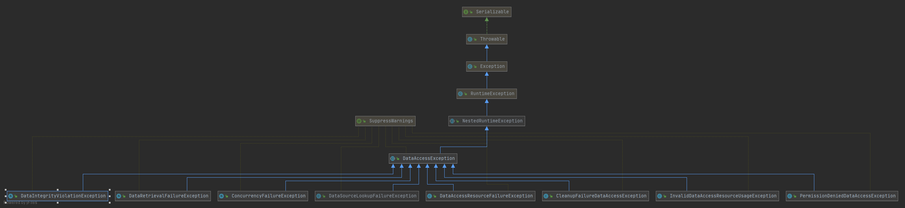

统一的数据访问异常层次体系   
DAO模式实现举例  
```java
// 接口
public class TestDao{
    Stu findStuByPK(String id);
    // 一系列方法定义
}
// Service层  
public class TestService{
    private TestDao testDao；

    public void method(String id){
        testDao.findStuByPK(id);
    }

}
// 针对不同的数据库访问技术，有不同的TestDao实现类，以Jdbc为例
public class JdbcTestDaoImpl extends TestDao{
    public Stu findStuByPK(String id){
        // dosomething here
    }
    // more override methods
}
```  

但是问题也随之而来，在上面的代码里，还没有涉及数据访问机制的代码，当涉及这些代码的时候局需要进行相关的异常处理，比如JDBC代码
```java
public Stu findStuByPK(String id) throws SQLException{
        Connection con = null;
        try{
            con = getDataSource().getConnection();
            Stu stu = ...;
            return stu;
        }catch(SQLException e){
            // 这里怎么处理呢？处理：客户端不知道这里异常了；抛出：那么Dao接口定义的时候要加throws SQLException
            // 异常和数据库相关起来了，为了处理这个异常，需要知道具体数据库，这样是不行的
            // 其他数据库访问机制访问的时候，需要再throws 一个对应的XXXXException，越来越多，肯定是不行的
        }finally{
            releaseConnection(con);
        }
    }
```

解决思路：对这些异常进行封装，由于这些数据库异常通常是系统处理不了，需要人为干预的，所以就要抛出unchecked exception  
```java
public Stu findStuByPK(String id) throws SQLException{
        Connection con = null;
        try{
            con = getDataSource().getConnection();
            Stu stu = ...;
            return stu;
        }catch(SQLException e){
        // 封装，抛出unchecked exception
           throw new RuntimeException(e);
        // 这种方式可以统一抛出异常，但是不够完善，比如同样是SQLException，数据库提供商存放异常信息的位置可能不同，那么客户端为了获取这些异常信息，还是需要差异处理
        // 这时候吗，就需要分类转译，对于不同的数据库提供商，进行处理，将对应的差异处理在这里就处理掉，以彻底屏蔽数据库差异对客户端的影响
        // 对异常进行分类，比如是访问不到数据库造成的异常，还是主键冲突等数据一致性造成的异常等等

        //总而言之就是对于不同的数据库访问技术，将相应的异常转换到定义的语义完整的异常体系中，对客户端来说，数据库访问异常的处理逻辑始终是不需要变化的
        }finally{
            releaseConnection(con);
        }
    }
```  

有人已经替我们干了这件事，我们不需要重复“造轮子”，这就是Spring的统一数据访问异常层次体系。  
DataAccessException 
--CleanupFailureDataAccessException  
已经完成数据库访问操作，但是清理使用的资源的时候失败，比如关闭连接  
--DataAccessResourceFailureException  
无法访问数据库资源，比如数据库挂了  
--DataSourceLookupFailureException   
尝试对Java命名和目录接口服务上或者其他位置上的DataSource进行查找，失败  
--ConcurrencyFailureException  
并发访问数据库操作失败的时候（还可以细分）  
--InvalidDataAccessApiUsageException  
以错误的方式，使用了特定的数据访问API  
--InvalidDataAccessResourceUsageException   
--DataRetrievalFailureException  
--PermissionDeniedDataAccessException  
--DataIntegrityViolationException  
--UncategorizedScriptException  
等等，还有很多异常，构成了Spring的统一数据访问异常层次体系。  

  