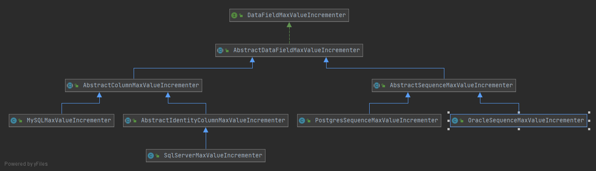
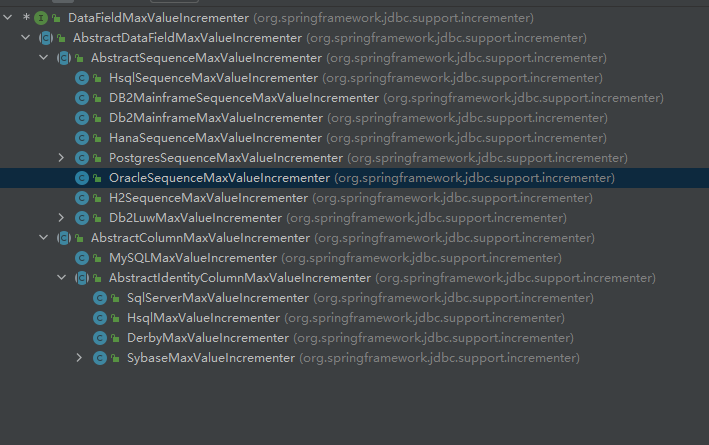
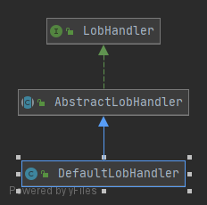

JdbcTemplate的基础使用
### 查询  
JdbcTemplate提供了一组便利的模板方法：
```java
// 简单查询，结果就一列数字型的结构，或者使用 sql函数，或者其他单列结果（结果只能单一，否则抛出异常）现在的spring版本好像又有不同，有的没有了
int queryForInt(String sql);
queryForObject
queryForMap  键为表列名称，值为对应的值
// 对于多行数据查询
queryForList list的一个元素为一行数据，是一个map 键为表列名称，值为对应的值
// 更复杂的查询：Callback接口  
// ResultSetExtractor：自行处理ResultSet，可以以任何想要的形式包装后返回
T extractData(ResultSet rs) throws SQLException, DataAccessException;
// RowCallbackHandler：只关注单行处理结果，处理后的结果可以根据需要存放到RowCallbackHandler对象内
// RowMapper：ResultSetExtractor精简版，功能类似RowCallbackHandler，只关注单行处理结果，处理结果由ResultSetExtractor实现类组合
//有的可能过时了，但是大致的思路都是一致的，就是将返回的多行数据手动或者自定转换为集合，不同的Callback有不同的实现效果而已
```

### 更新
数据插入，更新和删除都可以通过JdbcTemplate所提供的一组重载的update()模板方法
```java
public int update(final String sql);//等等，就可以满足简单的增删改操作了，如果不能满足，还有相关的Callback接口：包括使用PreparedStatementCreator与PreparedStatement对相关占位符进行设置等。
// 此外，还可以通过execute()（只能接受SQL语句），没有返回值，更适合于删除，创建表等操作
// 批量操作的话，我们有batchUpate
public int[] batchUpdate(String sql, final BatchPreparedStatementSetter pss);
```
存储过程：定义于数据库服务器端的计算单元，避免客户端计算那样在网络传输数据导致的性能损失，涉及多个数据表、大量数据的查询和更新，那么存储过程代替客户端计算是比较合适的做法（不是所有数据库都支持）  
主键生成策略：一般可以通过数据库服务器端生成，也可以是客户端生成，但是数据库端生成的话存在数据库移植困难的问题，客户端的话策略可以调整，比较灵活，这时，Spring的jdbc就为我们想好了  
DataFieldMaxValueIncrementer可以分为两类：基于独立主键表的*（依赖于为每一个数据表单独定义的主键表，其中定义的主键可以根据需要获取并递增,如：MYSQL）和基于数据库Sequence的，数据库本身支持基于Sequence的主键生成。  
  
   
LOB：large Object，数据库中能够存取大量数据的数据类型，包括BLOB（用于存放数据量大的二进制数据类型）和CLOB（数据量比较大的文本类型数据），JDBC使用的时候需要注意的是Oracle数据库，需要特殊处理；但是Spring帮我们处理好了，lob包下的一系列数据处理类屏蔽了数据库的差异。  
   

