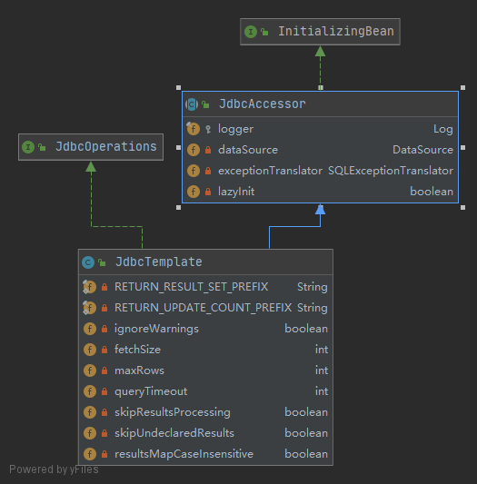
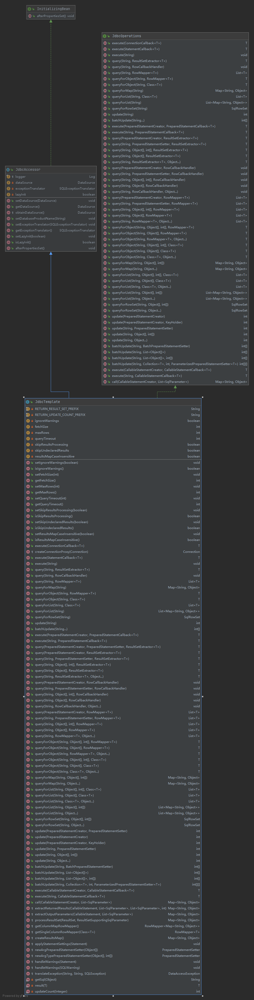
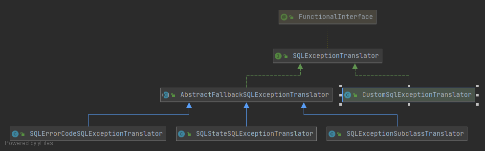
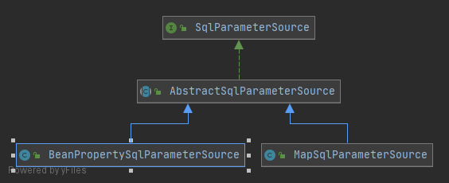
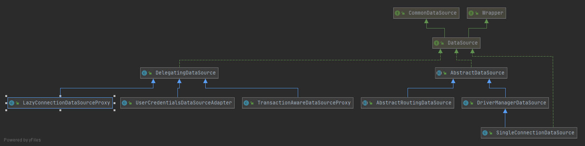
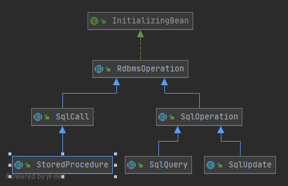

JDBC的API最佳实践  
### 基于Template的JDBC使用方式
以JdbcTemplate为核心的基于Template的JDBC使用方式  

首先，需要肯定的是JDBC是Java平台访问关系数据库的标准API，是整个Java平台面向关系数据库进行数据访问的基石。但是，JDBC的API过于面向较为底层的数据库操作，开发者需要写一堆按照API规矩规定的雷同的代码，不好好封装API就使用它访问数据库让人抓狂(1.每个开发者都要自己按着规矩重复写代码；2.每个人的开发风格和水平也是不一样的，代码有好有坏)；并且，数据访问异常也没有“将革命进行到底”，SQLException包括了所有异常，没有细分异常子类（虽然现在改了），此外，SQLException异常采用的ErrorCode是各个数据库提供商自己定义的，为了确定一个ErrorCode对应的异常，需要先确定数据库是什么数据库，才可以找到ErrorCode对应的含义。 

由于上述JDBC存在的不足之处，Spring出马了，定义了JdbcTemplate作为数据访问的helper类：  
1.用统一的格式和规范使用JDBC API，避免繁琐的易错的基于JDBC API的数据访问代码存在代码的各个角落，减少重复代码。    
2.对SQLException进行统一转译，将异常纳入Spring的异常层次体系，统一数据接口定义，简化客户端对数据异常的处理。  

JdbcTemplate是通过[模板方法模式](../Common/设计模式/模板方法模式.md)对基于JDBC的数据访问代码进行统一封装。  

JDBC访问数据库的时候，就可以提取出这样一套流程
```java
// 取得数据库连接
con = getDaraSource().getConnection();
// 根据Connection创建Satetment或者PreparedSatetment
stmt = con.creatSatetment();
ps = con.prepareSatetment();
// 根据传入的sql语句或者参数，借助Satetment或者PreparedSatetment进行数据库操作，修改，查询等
ResultSet rs = stmt.executeQuery(sql);
// 关闭Satetment或者PreparedSatetment
stmt.close();
stmt=null;
// 捕获处理异常
catch(SQLException e)
// 关闭数据库连接
finally{con.close()}
```

根据模板方法模式，定义一个抽象类，将使用JDBC访问数据库的公共部分：异常处理和连接释放等进行统一管理，但是抽象类意味着我们使用的时候需要实现一个子类，这又是反人类的，所以Spring还引入了相应的CallBack接口`StatementCallBack`，这样，我们就不需要关心JDBC底层的东西了，只需要关心与数据库访问逻辑相关的东西就可以了。
```java
public interface StatementCallBack{
    Object doInStatement(Statement stmt);
}

// JdbcTemplate简单版源码
// JdbcTemplate根据相应的CallBack接口公开的API自由度的大小进行划分：  
// 面向Connection的模板方法：ConnectionCallBack  
// 面向Statement的模板方法：StatementCallBack  
// 面向PreparedStatement的模板方法：PreparedStatementCallback  
// 面向CallableStatement的模板方法：CallableStatementCallback 
public class JdbcTemplate extends JdbcAccessor implements JdbcOperations {
	// 面向Statement的模板方法：StatementCallBack
	public <T> T execute(StatementCallback<T> action) throws DataAccessException {
		Assert.notNull(action, "Callback object must not be null");
		// DataSourceUtils而不是直接使用DataSource，可以做更多的事，比如Spring的事务和管理
		// 出于事物管理等目的，DataSourc中请求相应的Connection以及相关的Statement的时候，会返回对应的代理对象。有时候需要原始的对象的时候，JdbcTemplate内部定义NativeJdbcExtractor类型的实例变量，可以取得真正的目标对象（从源码看，好像又消失了）
		Connection con = DataSourceUtils.getConnection(obtainDataSource());
		Statement stmt = null;
		try {
			stmt = con.createStatement();
			applyStatementSettings(stmt);
			T result = action.doInStatement(stmt);
			handleWarnings(stmt);
			return result;
		}
		catch (SQLException ex) {
			// Release Connection early, to avoid potential connection pool deadlock
			// in the case when the exception translator hasn't been initialized yet.
			String sql = getSql(action);
			JdbcUtils.closeStatement(stmt);
			stmt = null;
			DataSourceUtils.releaseConnection(con, getDataSource());
			con = null;
			throw translateException("StatementCallback", sql, ex);
		}
		finally {
			JdbcUtils.closeStatement(stmt);
			DataSourceUtils.releaseConnection(con, getDataSource());
		}
	}

	//对JdbcTemplate的行为进行控制：每次取得的最大结果集，查询超时时间等等
	public void setFetchSize(int fetchSize) {
		this.fetchSize = fetchSize;
	}
	public void setQueryTimeout(int queryTimeout) {
		this.queryTimeout = queryTimeout;
	}		

}

// 使用示例
JdbcTemplate jdbcTemplate = ...;
// 数据库访问逻辑是我们要关心的
final String sql = "update ...";
StatementCallBack callBack = new StatementCallBack(){
    public Object doInStatement(Statement stmt){
        return new Integer(stmt.executeUpdate(sql));
    }
}
jdbcTemplate.execute(callBack);
```
  
   

JdbcOperations：定义了JDBC数据库操作集合  
JdbcAccessor：定义了一些公用的属性值  
    DataSource:JDBC的连接工厂  
    SQLExceptionTranslator：SQLException的转译  

   
SQLExceptionSubclassTranslator:将随JDK6发布的JDBC4中的新定义的异常转换到Spring的数据访问异常体系  
SQLErrorCodeSQLExceptionTranslator:基于SQLException返回的ErrorCode进行转译（信息不够才会求助SQLStateSQLExceptionTranslator，或者直接在Classpath的根路径下添加固定的配置文件）  
```java
public class SQLErrorCodeSQLExceptionTranslator extends AbstractFallbackSQLExceptionTranslator {
	// 第一步：尝试自定义方法是否可以转译SQLException，不行，返回null，下一位
	protected DataAccessException customTranslate(String task, @Nullable String sql, SQLException sqlEx) {
			return null;
		}

	// 第二步：如果java 6以下版本，没有；java 6版本以上SQLExceptionSubclassTranslator尝试转译  
	// 第三步：SQLErrorCodesFactory尝试，Spring的jar包中有各个厂商的ErrorCode配置文件sql-error-codes.xml，如果ClassPath路径下有配置文件sql-error-codes.xml，就覆盖默认配置文件sql-error-codes.xml
	// 第四步：SQLErrorCodeSQLExceptionTranslator
}
```
SQLStateSQLExceptionTranslator:根据SQLException.getSqlState()返回的信息进行异常转译  

轮子已经造好了，其实还有更多可以选择的轮子（出于Java版本升级，使用过程中的便利性等原因）  

NamedParameterJdbcTemplate：可以通过容易记忆或者更加有语义的符号最为SQL中的参数占位符。  
>内部持有一个JdbcOperations（唯一实现类是JdbcTemplate），可以接收使用命名参数符号的SQL和SqlParametersource或者Map作为方法参数。模板方法首先解借助NamedParameterUtils对参数符号的SQL解析，然后再使用JdbcTemplate进行实际操作
```
<!-- 前 -->
select count(*) from test where filename = ?

<!-- 后 -->
select count(*) from test where fileName = :filename

```
```java
// 为sql语句赋予参数
SqlParameterSource parameterSource = new MapSqlParameterSource("fileName","1.jpg")
// 如果参数通过bean对象进行封装，并使用对应的bean对象的属性作为参数符号的值，可以是使用BeanPropertySqlParameterSource
User user = new User("name",16);
SqlParameterSource parameterSource = new BeanPropertySqlParameterSource(user)

```
   

SimpleJdbcCall:java 5以上  
>集NamedParameterJdbcTemplate与JdbcTemplate功能于一身，在NamedParameterJdbcTemplate上又套了一层，最终还是JdbcTemplate干了最终的工作

Datasource：DataSource的基本角色是ConnectionFactory，所有数据库连接将通过DataSource接口统一管理  
>JDBC2.0之后引入了javax.sql.DataSource接口是Spring的数据访问框架在数据库资源的管理的标准，无论是JdbcTemplate还是各种ORM方案的集成，都是如此。  
Datasource大致上可以分为三类：  
1.简单Datasource的实现：只提供作为ConnectionFactory角色的基本功能，更多的是适用于开发测试，正式环境不用，如DriverManagerDataSource（每次返回一个新的连接，是对DriverManager进行按照DataSource标准封装的结果，每次都要在使用完以后调用close方法关闭连接），SingleConnectionDataSource（在DriverManagerDataSource基础上构建，每次请求的时候都是返回同一个数据库连接，使用close方法关闭后，再次访问就会抛出异常）。  
2.拥有连接缓冲池的Datasource的实现：除了ConnectionFactory的基本功能，内部通过连接缓冲池对数据库连接进行管理，适用于生产环境，当客户端的Connection调用close的时候，只是将连接还给缓冲池，而不是真正关闭。  
3.支持分布式事务的DataSource实现：实际上是javax.sql.XADatasource的实现类，除非是确实需要分布式事务，否则，没有必要使用这类。

访问方式：  
1.本地访问：当前程序的上下文中构造并持有相应的DataSource实现，可以通过本地访问。  
2.远程访问：对于各种应用服务器提供的特有的DataSource实现，或者绑定到应用服务器命名服务的独立的DataSource实现，通过JNDI对其访问

自定义DataSource   
扩展AbstractDataSource，DriverManagerDataSource和AbstractRoutingDataSource（提供一组DataSource，调用getConnection()方法的时候，从中选取符合条件的一个，然后才真正getConnection()，可以用在应用程序有多个数据库连接，并且根据需要让应用程序访问不同的数据库）都是他的扩展实现  
为现有的DataSource添加新的行为，DelegatingDataSource（自身持有一个其他的DataSource实例作为目标对象，getConnection()等方法被调用的时候，DelegatingDataSource转发个这个DataSource，不做任何事情，但是在DelegatingDataSource的子类中覆写相应方法之后，可以在转发之前干点什么）
   

JdbcDaoSupport  
>当一个单独的DAO使用的时候，我们可以自己注入JdbcTemplate和DataSource，但是有多个DAO的时候，就会想要提取公共的部分（JdbcTemplate和DataSource）,JdbcDaoSupport帮我们干了这件事。 


### 基于操作对象的JDBC使用方式  
在JdbcTemplate基础上构建的基于操作对象的JDBC使用方式，将查询、更新、调用存储过程等数据库访问操作抽象为操作对象
  
主要分为三部分：  
查询操作分支SqlQuery  
MappingSqlQueryWithParameters：实现SqlQuery的newRowMapper()方法，返回RowMapperImpl（RowMapper的实现类，MappingSqlQueryWithParameters的内部类，实现RowMapper的时候将mapRow()方法转发到MappingSqlQueryWithParameters的mapRow()）,所以使用的时候需要子类，并实现这个mapRow方法。(四个参数ResultSet rs, int rowNum, @Nullable Object[] parameters, @Nullable Map<?, ?> context)  
MappingSqlQuery：实现MappingSqlQueryWithParameters，将四个参数的mapRow()转换为两个参数的mapRow().（两个参数：ResultSet rs, int rowNum）  
```java
protected final T mapRow(ResultSet rs, int rowNum, @Nullable Object[] parameters, @Nullable Map<?, ?> context)
			throws SQLException {

		return mapRow(rs, rowNum);
	}

protected abstract T mapRow(ResultSet rs, int rowNum) throws SQLException;
```
SqlFunction:只返回一行一列（已经是实现类，不是抽象方法了，可以直接使用）  
UpdatableSqlQuery：对应可更新结果集查询，对查询后的结果进行更新，主要目的是更新，继承他，实现方法updateRow()
更新操作分支SqlUpdate  
SqlUpdate：基本更新操作  
可以直接使用，不需要继承后才能使用；继承后使用也是可以的，封装具体的更新操作，提供强类型参数的更新操作方法。  
BatchSqlUpdate：批量更新操作  
可以直接使用，不需要继承后才能使用；其update方法会将数据添加到一个队列，当数据达到batchSize的时候，才会自动触发批量更新操作，最后需要调用flush()方法才能确保数据都更新到数据库，最后剩下的那一点点没办法自动触发。

存储过程分支StoredProcedure  
抽象类，需要实现子类才可以使用


