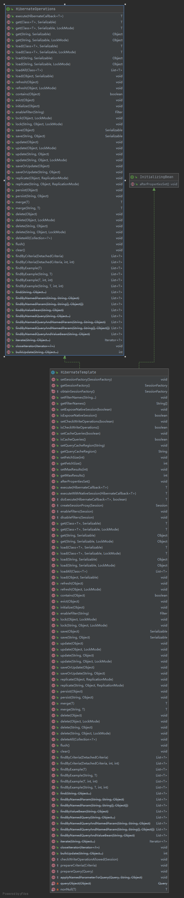

使用Spring访问数据  
1. 统一的数据访问异常层次体系  
>不管数据库访问技术如何变化，异常只有一套封装好的标准，客户端只要处理这套标准的异常即可。
2. JDBC的API最佳实践  
>JDBC规范了各个数据库厂商之间的数据访问接口，但是他的API设计和使用上存在问题：SQLException的设计标准没有贯彻到底，数据库提供商不同，异常信息不同；API使用繁琐，如连接释放等问题容易出现。
3. 以统一的方式对各种ORM方案的集成  
>对象关系映射，屏蔽对象和数据库之间的关系。  

Spring的数据访问层：以统一的数据库访问异常层次体系为核心，以JDBC API的最佳实践和统一集成各种ORM为两翼，为Java平台的数据库访问铺就一条平坦大道。  
 

### Spring对于Hibernate的集成  
Hibernate凭借先期优势和后续跟进，成为基于ORM进行数据访问的事实标准  
前：  
每个开发人员需要继承公共的抽象类，对Session进行管理，还需要关注事务，还得处理异常，总而言之，一不小心就会出错。  
后： 
HibernateTemplate对Hibernate的使用进行模板化封装，并且在模板方法内统一进行数据访问异常的处理。  
#### Session资源管理
HibernateTemplate统一Session的获取与释放等管理逻辑，对于不同的数据访问需求，HibernateTemplate提供HibernateCallback回调接口
```java

public <T> T execute(HibernateCallback<T> action) throws DataAccessException {
    return doExecute(action, false);
}

protected <T> T doExecute(HibernateCallback<T> action, boolean enforceNativeSession) throws DataAccessException {
    Assert.notNull(action, "Callback object must not be null");

    Session session = null;
    boolean isNew = false;
    try {
        session = obtainSessionFactory().getCurrentSession();
    }
    catch (HibernateException ex) {
        logger.debug("Could not retrieve pre-bound Hibernate session", ex);
    }
    if (session == null) {
        session = obtainSessionFactory().openSession();
        session.setFlushMode(FlushMode.MANUAL);
        isNew = true;
    }

    try {
        enableFilters(session);
        Session sessionToExpose =
                (enforceNativeSession || isExposeNativeSession() ? session : createSessionProxy(session));
        return action.doInHibernate(sessionToExpose);
    }
    catch (HibernateException ex) {
        throw SessionFactoryUtils.convertHibernateAccessException(ex);
    }
    catch (PersistenceException ex) {
        if (ex.getCause() instanceof HibernateException) {
            throw SessionFactoryUtils.convertHibernateAccessException((HibernateException) ex.getCause());
        }
        throw ex;
    }
    catch (RuntimeException ex) {
        // Callback code threw application exception...
        throw ex;
    }
    finally {
        if (isNew) {
            SessionFactoryUtils.closeSession(session);
        }
        else {
            disableFilters(session);
        }
    }
}
```
SessionFactoryUtils完成异常的转译
```java
	public static DataAccessException convertHibernateAccessException(HibernateException ex) {
		if (ex instanceof JDBCConnectionException) {
			return new DataAccessResourceFailureException(ex.getMessage(), ex);
		}
		if (ex instanceof SQLGrammarException) {
			SQLGrammarException jdbcEx = (SQLGrammarException) ex;
			return new InvalidDataAccessResourceUsageException(ex.getMessage() + "; SQL [" + jdbcEx.getSQL() + "]", ex);
		}
		if (ex instanceof QueryTimeoutException) {
			QueryTimeoutException jdbcEx = (QueryTimeoutException) ex;
			return new org.springframework.dao.QueryTimeoutException(ex.getMessage() + "; SQL [" + jdbcEx.getSQL() + "]", ex);
		}
		if (ex instanceof LockAcquisitionException) {
			LockAcquisitionException jdbcEx = (LockAcquisitionException) ex;
			return new CannotAcquireLockException(ex.getMessage() + "; SQL [" + jdbcEx.getSQL() + "]", ex);
		}
		if (ex instanceof PessimisticLockException) {
			PessimisticLockException jdbcEx = (PessimisticLockException) ex;
			return new PessimisticLockingFailureException(ex.getMessage() + "; SQL [" + jdbcEx.getSQL() + "]", ex);
		}
		if (ex instanceof ConstraintViolationException) {
			ConstraintViolationException jdbcEx = (ConstraintViolationException) ex;
			return new DataIntegrityViolationException(ex.getMessage()  + "; SQL [" + jdbcEx.getSQL() +
					"]; constraint [" + jdbcEx.getConstraintName() + "]", ex);
		}
		if (ex instanceof DataException) {
			DataException jdbcEx = (DataException) ex;
			return new DataIntegrityViolationException(ex.getMessage() + "; SQL [" + jdbcEx.getSQL() + "]", ex);
		}
		if (ex instanceof JDBCException) {
			return new HibernateJdbcException((JDBCException) ex);
		}
		// end of JDBCException (subclass) handling

		if (ex instanceof QueryException) {
			return new HibernateQueryException((QueryException) ex);
		}
		if (ex instanceof NonUniqueResultException) {
			return new IncorrectResultSizeDataAccessException(ex.getMessage(), 1, ex);
		}
		if (ex instanceof NonUniqueObjectException) {
			return new DuplicateKeyException(ex.getMessage(), ex);
		}
		if (ex instanceof PropertyValueException) {
			return new DataIntegrityViolationException(ex.getMessage(), ex);
		}
		if (ex instanceof PersistentObjectException) {
			return new InvalidDataAccessApiUsageException(ex.getMessage(), ex);
		}
		if (ex instanceof TransientObjectException) {
			return new InvalidDataAccessApiUsageException(ex.getMessage(), ex);
		}
		if (ex instanceof ObjectDeletedException) {
			return new InvalidDataAccessApiUsageException(ex.getMessage(), ex);
		}
		if (ex instanceof UnresolvableObjectException) {
			return new HibernateObjectRetrievalFailureException((UnresolvableObjectException) ex);
		}
		if (ex instanceof WrongClassException) {
			return new HibernateObjectRetrievalFailureException((WrongClassException) ex);
		}
		if (ex instanceof StaleObjectStateException) {
			return new HibernateOptimisticLockingFailureException((StaleObjectStateException) ex);
		}
		if (ex instanceof StaleStateException) {
			return new HibernateOptimisticLockingFailureException((StaleStateException) ex);
		}
		if (ex instanceof OptimisticEntityLockException) {
			return new HibernateOptimisticLockingFailureException((OptimisticEntityLockException) ex);
		}
		if (ex instanceof PessimisticEntityLockException) {
			if (ex.getCause() instanceof LockAcquisitionException) {
				return new CannotAcquireLockException(ex.getMessage(), ex.getCause());
			}
			return new PessimisticLockingFailureException(ex.getMessage(), ex);
		}

		// fallback
		return new HibernateSystemException(ex);
	}

```
基本数据访问操作  
HibernateOperations接口定义了能够通过HibernateTemplate使用的所有基于Hibernate的数据访问方法，HibernateTemplate实现了该接口。
  


查询：
主要可以分为以下四组：  
get模板方法  
通过指定的主键从数据库获取数据，没有返回null  
load模板方法  
通过指定的主键从数据库获取数据，没有抛异常  
find模板方法  
1.find：通过HQL查询，list返回，占位符为`?`；2.findByNamedParam：可以指定使用命名参数占位符的HQL语句进行查询；3.findByNamedQuery：对于Hibernate的映射文件的HQL查询定义，占位符使用`?`;4.findByNamedQueryAndNamedParam：可以指定使用命名参数占位符。  
iterate模板方法  
按照方法指定的HQL查询语句以及参数执行，结果以迭代器的形式返回。


更新（插入，删除，更新）：
save模板方法  
包括save，saveOrUpdate，前者本地构建持久化对象，插入数据库，后者根据实际情况决定插入还是更新方法参数所提供的持久化对象  
update模板方法  
将修改后的信息更新到数据库  
delete模板方法  
从数据库中删除  


以上这些操作的基本步骤都是：
```java

//获取session  SessionFactory相当于DataSource
SessionFactory sessionFactory = ...;
// SessionFactory创建基本方法：直接编写代码；
// FactoryBean方法获取：
// LocalSessionFactoryBean就是最常用的一个：实际内部使用的就是DataSource，通过xml文件配置实现
// AnnotationSessionFactoryBean：通过注解实现
// 通过JNDI获取：

//构造HibernateTemplate
HibernateTemplate hibernateTemplate = new HibernateTemplate(sessionFactory);
//使用HibernateTemplate
hibernateTemplate.XXX();
```


为了不需要每个人都new一个HibernateTemplate来使用，HibernateDaoSupprot又帮我们准备好了，只要继承这个类就可以获取到HibernateTemplate


### Spring对于iBATIS的集成   
介于JDBC与Hibernate之间  
前世：  
需要一个总的配置文件获取Sql映射文件，使用SqlMapClientBuilder构建一个SqlMapClient实例。  
基于SqlMapClient的主动提交事务型简单数据访问  

基于SqlMapClient的非自动提交事务型数据访问  

基于SqlMapSession的数据访问：通过SqlMapClient获取SqlMapSession，自己管理事务  

今生：  
为了Spring进行统一的事务管理，使用SqlMapSession进行集成，通过SqlMapClientTemplate结合SqlMapClientCallback实现数据库访问操作        


基本都是和HibernateTemplate类似的
参考：[Spring对于iBATIS的集成](https://www.it610.com/article/1282596922636386304.htm)


除了上面的两种：  
Spring对JDO的集成  
Spring对TopLink的集成  
Spring对JPA的集成：公司目前的开发项目使用较多  


这里有一个可以推广的点就是使用模板方法，对数据访问进行管理，避免资源获取与释放散落在系统的各个角落里，避免资源泄露。以后见到XXXXXTemplate基本就是模板方法管理的结果，FTPClientTemplate，HttpClientTemplate都是。

数据访问中的多数据源问题：  
大型系统中，数据源通常有多个，多个数据库服务器，就需要管理多个数据源。  
主权独立：每个数据源都独立对外承担公开的数据库资源职能：各自有自己的业务划分，干什么就找对应的数据库；数据库读写分离，有的专门写，有的专门读；  

合纵连横：所有数据访问类的交互通过盟主进行，职责是更加倾向于协调管理联盟里面的DataSource的一个比较特殊的DataSource。  
热备份：多台功能地位相当的服务器互为备份，一台挂了，另一台顶上，影响较小；  
负载均衡：地位相当的服务器，一台忙不过来，其他兄弟帮帮忙；  
运行期间判断哪台服务器作为盟主，动态的。