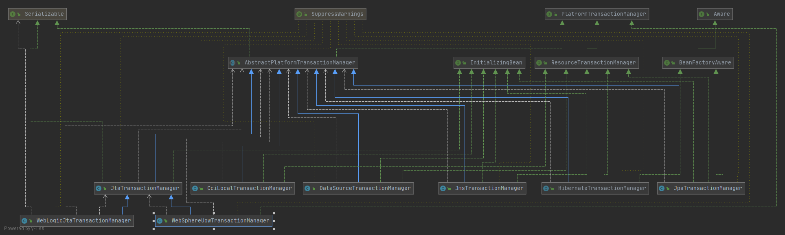
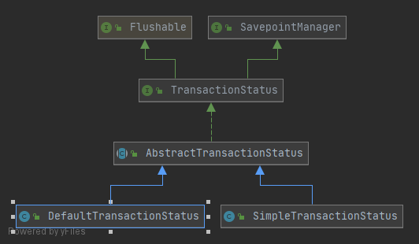

# Spring事务管理  
利用Spring的事务框架，可以按照统一的编程模型进行事务编程，不用关心具体的数据访问技术以及访问什么类型的事务资源；还可以和Spring数据访问支持结合，1+1>2；还可以结合AOP，可以有使用CMT那样的使用效果，却不需要绑定到任何用服务器。  

>设计原则:事务管理关注点与数据访问关注点分离  
>使用事务API的时候，不关心事务将要加诸于上的事务资源是什么（不关心资源对象是谁，不管你的事务控制长什么样）  
>数据访问对可能需要参与事务的数据资源进行访问的时候，使用数据访问PI就好，不要关心当前事务资源如何参与事务或者是否参与（访问数据就是访问数据，不关心事务，不管你有没有事务，怎么实现事务）


## 统一中原的方针  
PlatformTransactionManager为应用程序提供事务界定的同一方式(战略蓝图)：
```java
// 从这里可以看到事务三剑客：PlatformTransactionManager  TransactionDefinition TransactionStatus 
// PlatformTransactionManager用于界定事务边界
// TransactionDefinition用于定义事务相关的属性，如隔离级别，传播行为等，PlatformTransactionManager参照他的属性开启相关事务  
// TransactionStatus事务开启到事务结束期间的事务状态由其负责，也可以进行有限的事务控制
public interface PlatformTransactionManager {
    TransactionStatus getTransaction(@Nullable TransactionDefinition definition)
			throws TransactionException;
	void commit(TransactionStatus status) throws TransactionException;
    void rollback(TransactionStatus status) throws TransactionException;
}
```  
针对不同的数据访问方式以及全局事务场景，提供相应的实现类。  

实现思路模拟：  
```java
public void serviceMethod(){
    Object txObject = transactionManager.beginTransaction();
    // 1.
    // ...
    // 普通情况下的事务管理代码
    dao1.doDataAcess();
    dao2.doDataAcess();
    
    // 2.
    // 由于JDBC的事务是通过Connection来完成的，所以要保证DAO的数据访问处于同一个事务，就要保证使用同一个Connection
    Connection connection = (Connection)txObject;
    dao1.doDataAcess(connection);
    dao2.doDataAcess(connection);
    // 但是这种方法的问题是事务管理代码无法摆脱Connection，数据访问对象的定义要绑定到具体的数据访问技术上
    // 思路是对的，方法不对

    // ...
    transactionManager.commitTransaction();
}
```
将整个事务对应的Connection放到一个地方，要使用，就问他要，从而解除事务管理和数据访问之间通过Connection直接耦合（事务开始前Connection就取得并绑定到调用线程上，之后从当前线程获取Connection以供使用，用完以后解除Connection与线程的绑定关系），这就是PlatformTransactionManager要干的。  


## 统一战略
### 事务三剑客：  
#### PlatformTransactionManager  
这里是Spring事务的核心所在，整个抽象体系基于[策略模式](../Common/设计模式/策略模式.md)：PlatformTransactionManager对事务进行统一抽象，具体的界定策略的实现交由具体的实现类。  
##### 两条路
- 面向局部事务  
   
>整个框架以面向全局事务PlatformTransactionManager为顶层接口，具体实现交给不同的实现类，以策略模式为基础；不过，其中更多的是依赖于模板方法模式：AbstractPlatformTransactionManager以模板方法的形式封装了固定的事务处理逻辑，而只将于事务资源相关的操作以protected或者abstract方法的形式留给各个实现类。  
>AbstractPlatformTransactionManager主要实现的固定的事务内部处理逻辑包括:判断是否存在当前事务，然后根据判断结果执行不同的处理逻辑；结合是否存在当前事务的情况，根据TransactionDefinition中指定的传播行为的不同语义执行后续逻辑；根据情况挂起事务或者恢复事务；提交事务之前检查readOnly是否被设置，是的话以事务回滚代替提交；事务回滚时，清理并恢复事务状态；如果事务的Synchonnization处于active状态，在事务的固定时点触发注册的Synchonization回调接口。  

JtaTransactionManager：由于JTA规范没有明确要求对JtaTransactionManager的支持，所以各个JTA提供商有所差异，需要获取不同的JtaTransactionManager的实现，注入到JtaTransactionManager进行使用（FactoryBean）。

##### 窥一斑而知全豹  
>就拿常见的DataSourceTransactionManager开刀  
###### 概念  
transaction object：承载当前事务的必要信息，TransactionManager实现类根据它决定如何处理当前事务  
TransactionSynchronization：是可以注册到事务的处理过程中的回调接口，就像是事务处理的事件监听器，当是事务处理的某些规定时点发生时，会调用TransactionSynchronization上的一些方法执行相应的回调逻辑（事务完成后资源）  
TransactionSynchronizationManager：管理TransactionSynchronization，当前事务的状态以及具体事务资源  

```java
//开启一个事务
public final TransactionStatus getTransaction(@Nullable TransactionDefinition definition) throws TransactionException{
    //获取transaction object
    // 返回的transaction object会因为具体的实现类的不同而各异，以Object类型接收
    // doGetTransaction()是getTransaction开放给子类来实现的abstract类型方法，一般是从TransactionSynchronizationManager获取绑定的资源，然后添加到对应的transaction object并返回
    Object transaction = doGetTransaction();
    // 获取Log类的debug信息，避免重复获取，以后以debugEnabled进行传递
    boolean debugEnabled = logger.isDebugEnabled();

    // 检查TransactionDefinition的合法性，参数为空创建默认
    if (definition == null) {
			// Use defaults if no transaction definition given.
			definition = new DefaultTransactionDefinition();
		}

            // 
    if (debugEnabled) {
				logger.debug("Creating new transaction with name [" + definition.getName() + "]: " + definition);
			}
    // 根据得到的transaction object判断当前事务，根据判定结果采取不同的处理方式
    // 默认返回false，
    if (isExistingTransaction(transaction)) {
			// Existing transaction found -> check propagation behavior to find out how to behave.
			return handleExistingTransaction(definition, transaction, debugEnabled);
		}
    // 方法返回false的话：当前不存在事务
// PROPAGATION_MANDATORY：强制要求当前有一个事务，不存在，就抛出异常（一个方法本省不管理事务，但是需要事务支持）
if (definition.getPropagationBehavior() == TransactionDefinition.PROPAGATION_MANDATORY) {
			throw new IllegalTransactionStateException(
					"No existing transaction found for transaction marked with propagation 'mandatory'");
		}else if (definition.getPropagationBehavior() == TransactionDefinition.PROPAGATION_REQUIRED ||
				definition.getPropagationBehavior() == TransactionDefinition.PROPAGATION_REQUIRES_NEW ||
				definition.getPropagationBehavior() == TransactionDefinition.PROPAGATION_NESTED) {
                    // 创建新的事务
			SuspendedResourcesHolder suspendedResources = suspend(null);
			if (debugEnabled) {
				logger.debug("Creating new transaction with name [" + definition.getName() + "]: " + definition);
			}
			try {
				boolean newSynchronization = (getTransactionSynchronization() != SYNCHRONIZATION_NEVER);
				DefaultTransactionStatus status = newTransactionStatus(
						definition, transaction, true, newSynchronization, debugEnabled, suspendedResources);
				doBegin(transaction, definition);
				prepareSynchronization(status, definition);
				return status;
			}
			catch (RuntimeException | Error ex) {
				resume(null, suspendedResources);
				throw ex;
			}
		}
		else {
			// Create "empty" transaction: no actual transaction, but potentially synchronization.
			if (definition.getIsolationLevel() != TransactionDefinition.ISOLATION_DEFAULT && logger.isWarnEnabled()) {
				logger.warn("Custom isolation level specified but no actual transaction initiated; " +
						"isolation level will effectively be ignored: " + definition);
			}
			boolean newSynchronization = (getTransactionSynchronization() == SYNCHRONIZATION_ALWAYS);
			return prepareTransactionStatus(definition, null, true, newSynchronization, debugEnabled, null);
		}
}

// 默认false，子类根据情况进行覆写
protected boolean isExistingTransaction(Object transaction) throws TransactionException {
		return false;
	}

//方法返回true的话：当前存在事务，由handleExistingTransaction方法统一处理存在当前事务，应该如何创建事务对应的TransactionStatus实例并返回  
	private TransactionStatus handleExistingTransaction(
			TransactionDefinition definition, Object transaction, boolean debugEnabled)
			throws TransactionException {
        // PROPAGATION_NEVER：用于不需要事务 
		if (definition.getPropagationBehavior() == TransactionDefinition.PROPAGATION_NEVER) {
			throw new IllegalTransactionStateException(
					"Existing transaction found for transaction marked with propagation 'never'");
		}
        // PROPAGATION_NOT_SUPPORTED：不支持当前事务，而是在没有事务的情况下执行；有事务，就挂起
        if (definition.getPropagationBehavior() == TransactionDefinition.PROPAGATION_NOT_SUPPORTED) {
			if (debugEnabled) {
				logger.debug("Suspending current transaction");
			}
            // 挂起当前事务
			Object suspendedResources = suspend(transaction);
			boolean newSynchronization = (getTransactionSynchronization() == SYNCHRONIZATION_ALWAYS);
            // 返回不包含事务
			return prepareTransactionStatus(
					definition, null, false, newSynchronization, debugEnabled, suspendedResources);
		}
        // PROPAGATION_REQUIRES_NEW：不管当前是否存在事务，都会创建新的事务，当前存在事务的话，挂起当前事务（Suspend）
        if (definition.getPropagationBehavior() == TransactionDefinition.PROPAGATION_REQUIRES_NEW) {
			if (debugEnabled) {
				logger.debug("Suspending current transaction, creating new transaction with name [" +
						definition.getName() + "]");
			}
            // 挂起事务
			SuspendedResourcesHolder suspendedResources = suspend(transaction);
			try {
				boolean newSynchronization = (getTransactionSynchronization() != SYNCHRONIZATION_NEVER);
                // 开始新的事务
				DefaultTransactionStatus status = newTransactionStatus(
						definition, transaction, true, newSynchronization, debugEnabled, suspendedResources);
				doBegin(transaction, definition);
				prepareSynchronization(status, definition);
				return status;
			}
			catch (RuntimeException | Error beginEx) {
				resumeAfterBeginException(transaction, suspendedResources, beginEx);
				throw beginEx;
			}
		} 
        // PROPAGATION_NESTED：如果当前存在事务，则在当前事务的一个嵌套事务中执行；不存在，就创建事务；
        if (definition.getPropagationBehavior() == TransactionDefinition.PROPAGATION_NESTED) {
            // 是否允许嵌套
			if (!isNestedTransactionAllowed()) {
				throw new NestedTransactionNotSupportedException(
						"Transaction manager does not allow nested transactions by default - " +
						"specify 'nestedTransactionAllowed' property with value 'true'");
			}
			if (debugEnabled) {
				logger.debug("Creating nested transaction with name [" + definition.getName() + "]");
			}
            // useSavepointForNestedTransaction默认true，使用savepoint创建嵌套事务，子类不支持的话就要覆写这个方法
			if (useSavepointForNestedTransaction()) {
				// Create savepoint within existing Spring-managed transaction,
				// through the SavepointManager API implemented by TransactionStatus.
				// Usually uses JDBC 3.0 savepoints. Never activates Spring synchronization.
				DefaultTransactionStatus status =
						prepareTransactionStatus(definition, transaction, false, false, debugEnabled, null);
				status.createAndHoldSavepoint();
				return status;
			}
			else {
				// Nested transaction through nested begin and commit/rollback calls.
				// Usually only for JTA: Spring synchronization might get activated here
				// in case of a pre-existing JTA transaction.
				boolean newSynchronization = (getTransactionSynchronization() != SYNCHRONIZATION_NEVER);
				DefaultTransactionStatus status = newTransactionStatus(
						definition, transaction, true, newSynchronization, debugEnabled, null);
				doBegin(transaction, definition);
				prepareSynchronization(status, definition);
				return status;
			}
		}
        // isValidateExistingTransaction对隔离级别和readonly进行检查
        if (isValidateExistingTransaction()) {
			if (definition.getIsolationLevel() != TransactionDefinition.ISOLATION_DEFAULT) {
				Integer currentIsolationLevel = TransactionSynchronizationManager.getCurrentTransactionIsolationLevel();
				if (currentIsolationLevel == null || currentIsolationLevel != definition.getIsolationLevel()) {
					Constants isoConstants = DefaultTransactionDefinition.constants;
					throw new IllegalTransactionStateException("Participating transaction with definition [" +
							definition + "] specifies isolation level which is incompatible with existing transaction: " +
							(currentIsolationLevel != null ?
									isoConstants.toCode(currentIsolationLevel, DefaultTransactionDefinition.PREFIX_ISOLATION) :
									"(unknown)"));
				}
			}
			if (!definition.isReadOnly()) {
				if (TransactionSynchronizationManager.isCurrentTransactionReadOnly()) {
					throw new IllegalTransactionStateException("Participating transaction with definition [" +
							definition + "] is not marked as read-only but existing transaction is");
				}
			}
		}
        // 其他情况直接构建TransactionStatus
        // PROPAGATION_REQUIRED：如果当前存在事务，则加入当前事务；不存在，则创建（默认级别）  
        // PROPAGATION_SUPPORTS：如果当前存在事务，则加入当前事务；不存在，直接执行  
        return prepareTransactionStatus(definition, transaction, false, newSynchronization, debugEnabled, null);
}
```
事务处理完成，两种结果--回滚或者提交事务
```java
// 检查rollBackOnly状态确定是否回滚
// 回滚事务：嵌套事务，释放savepoint；TransactionStatus表示当前事务是一个新事务，调用子类的doRollBack方法真正回滚事务；当前存在事务，且rollBackOnly被设置，调用子类实现的setRollBackOnly方法，设置transaction object状态为rollBackOnly
// 触发Synchronization事件，triggerBeforeCompletion  triggerAfterCompletion：
// 清理事务资源：设置事件状态完成；清理当前事务Synchronization；doCleanupAfterCompletion；恢复挂起的事务
public final void rollback(TransactionStatus status) throws TransactionException {
    if (status.isCompleted()) {
        throw new IllegalTransactionStateException(
                "Transaction is already completed - do not call commit or rollback more than once per transaction");
    }

    DefaultTransactionStatus defStatus = (DefaultTransactionStatus) status;
    processRollback(defStatus, false);
}
// 正常完成
// 提前检测全局rollBackOnly：释放存在的savePoint；子类提交事务方法，提交事务
// 触发Synchronization事件：triggerBeforeCommit  triggerBeforeCompletion  triggerAfterCommit triggerAfterCompletion
// rollbackOnCommitFailure：提交事务失败，回滚
// 清理事务资源：设置事件状态完成；清理当前事务Synchronization；doCleanupAfterCompletion；恢复挂起的事务
public final void commit(TransactionStatus status) throws TransactionException {
    if (status.isCompleted()) {
        throw new IllegalTransactionStateException(
                "Transaction is already completed - do not call commit or rollback more than once per transaction");
    }

    DefaultTransactionStatus defStatus = (DefaultTransactionStatus) status;
    if (defStatus.isLocalRollbackOnly()) {
        if (defStatus.isDebug()) {
            logger.debug("Transactional code has requested rollback");
        }
        processRollback(defStatus, false);
        return;
    }

    if (!shouldCommitOnGlobalRollbackOnly() && defStatus.isGlobalRollbackOnly()) {
        if (defStatus.isDebug()) {
            logger.debug("Global transaction is marked as rollback-only but transactional code requested commit");
        }
        processRollback(defStatus, true);
        return;
    }

    processCommit(defStatus);
}


```


#### TransactionDefinition  
定义事务属性：  
- 事务隔离级别Isolation  
ISOLATION_DEFAULT：默认隔离级别，一般是Read Committed  
ISOLATION_READ_UNCOMMITTED：Read Uncommited  
ISOLATION_READ_COMMITTED：Read Committed  
ISOLATION_REPEATABLE_READ：Repeatable Read  
ISOLATION_SERIALIZABLE：Serializable  
- 事务传播行为Propagation Behavior  
PROPAGATION_REQUIRED：如果当前存在事务，则加入当前事务；不存在，则创建（默认级别）  
PROPAGATION_SUPPORTS：如果当前存在事务，则加入当前事务；不存在，直接执行  
PROPAGATION_MANDATORY：强制要求当前有一个事务，不存在，就抛出异常（一个方法本省不管理事务，但是需要事务支持）
PROPAGATION_REQUIRES_NEW：不管当前是否存在事务，都会创建新的事务，当前存在事务的话，挂起当前事务（Suspend）（某个业务对象所做的事情不想影响外层的事务，比如向数据库插入日志信息，插入失败也不能影响实际操作事务，导致事务回滚）  
PROPAGATION_NOT_SUPPORTED：不支持当前事务，而是在没有事务的情况下执行；有事务，就挂起    
PROPAGATION_NEVER：用于不需要事务   
PROPAGATION_NESTED：如果当前存在事务，则在当前事务的一个嵌套事务中执行；不存在，就创建事务；  
- 事务超时时间Timeout  
TIMEOUT_DEFAULT：默认-1，采用事务系统的默认超时时间
- 是否为只读事务ReadOnly    
只是给ResourceManger的优化提示，具体优化不优化，看具体ResourceManger

  
##### 两条路
- 编程式事务  
TransactionTemplate：又是一个模板方法，直接通过TransactionTemplate本身提供事务控制属性  
- 声明式事务
TransactionAttribute：主要面向Spring AOP进行声明式事务管理的场景，添加方法`boolean rollbackOn(Throwable ex);`可以通过声明的方式指定业务方法在抛出哪些异常的时候回滚事务。  


#### TransactionStatus   
提供相应的方法查询事务的状态;通过setRollbackOnly()方法标记当前事务，以使其回滚;如果PlatformTransactionManager支持Savepoint，可以通过TransactionStatus在当前事务中创建内部嵌套事务。
    
DefaultTransactionStatus：主要使用  
SimpleTransactionStatus：测试使用


