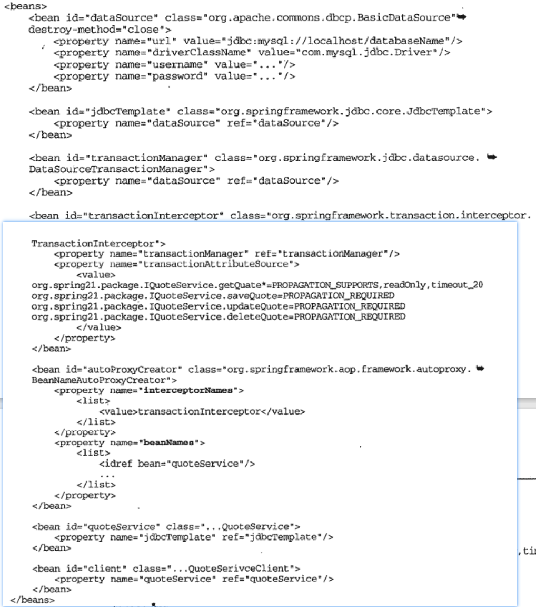

# Spring事务管理使用 
## 编程式事务管理
#### 直接使用PlatformTransactionManager
```java
DefaultTransactionDefinition definition = new DefaultTransactionDefinition();
definition.setTimeout(20);
// 其他设置
TransactionStatus status = transactionManager.getTransaction(definition);//提供合适的PlatformTransactionManager实现类就可以

try{
	// 业务逻辑
}catch(ApplicationException e){
	transactionManager.rollback(status);
	throw e;
}
// 更多异常捕获
transactionManager.commit(status);
```
>可以完全控制整个事务的处理过程，但是，过于底层，异常处理过于复杂，而且会导致大量的重复代码  

#### TransactionTemplate
>参考Spring的数据访问层，模板方法与Callback结合，设计TransactionTemplate，开发者关注相应的Callback接口提供具体的事务界定内容即可  
```java
TransactionTemplate template = ...;
//捕捉Callback接口事务操作抛出的unchecked exception并回滚事务，然后将异常抛给上层处理（只需要处理特定的异常，不需要对所有可能的异常都处理一遍）
Object result = template.execute(new TransactionCallback(){
	public Object doInTransaction(TransactionStatus status){
		Object result = null;
		// 各种事务操作
		return result;
	}
});
// 或者
template.execute(new TransactionCallbackWithoutResult(){
	@Override
	protected void doInTransactionWithoutResult(TransactionStatus status){
		// 各种事务操作
	}
});

// 顺利结束，template会帮助提交事务
// 需要回滚
// 1、抛出unchecked exception，template会回滚事务
template.execute(new TransactionCallbackWithoutResult(){
	@Override
	protected void doInTransactionWithoutResult(TransactionStatus status){
		try{
			// 各种事务操作
		}
		catch(CheckedException e){
			// 抛出特定异常以避免一般情况下使用的RuntimeException
			throw new RuntimeException(e);
		}
	}
});
// 2、使用Callback接口公开的TransactionStatus将事务标记为rollBackOnly，在template最终提交事务的时候改为回滚事务
template.execute(new TransactionCallbackWithoutResult(){
	@Override
	protected void doInTransactionWithoutResult(TransactionStatus status){
		boolean needRollBack = false；
		// 各种事务操作
		if(needRollBack){
			status.setRollBackOnly();
		}
	}
});
// 如果不想抛出异常，但是又要回滚，这就是一种方法，但是在捕获异常的时候不能直接吞掉异常，至少要打印日志
```
#### 基于Savepoint的嵌套事务
>TransactionStatus也可以作为SavepointManager帮助我们使用Savepoint机制创建嵌套事务  
一个例子：银行转账的时候，A账户转到B账户，如果失败就转到B的副账号C（必须转到B C之间的一个）
```java
template.execute(new TransactionCallbackWithoutResult(){
	@Override
	protected void doInTransactionWithoutResult(TransactionStatus status){
		BigDemical num = new BigDemical("20000")；
		try{
			// A转出
			// 创建嵌套事务
			Object savePointBeforeDeposit = status.creatSavePoint();
			try{
				// 转账到B
			}catch(DepositException e){
				logger.warn("提示转账到B失败");
				// 回滚嵌套的事务
				status.rollbackToSavePoint(savePointBeforeDeposit);
				// 转账到C
			}finally{
				// 提交嵌套事务
				status.releaseSavePoint(savePointBeforeDeposit);
			}
		}catch(TransferException e){
			logger.warn("转账失败");
			status.setRollback();
		}
	}
});
```
>事务代码与逻辑代码混在一起，声明式事务管理可以避免事务代码影响具体业务逻辑实现  


## Spring声明式事务管理使用  
### XML元数据
  
```java
// MethodInterceptor的实现类
public class PrototypeMethodInterceptor implements MethodInterceptor{
	private PlatformTransactionManager transactionManager；
	public Object invoke(MethodInvocation invication) throws Throwable{
		Method method = invication.getMethod();
		TransactionDefinition definition = getTransactionDefinitionByMethod(method);
		TransactionStatus status = transactionManager.getTransaction(definition);
		Object result = null;
		try{
			result = invication.proceed();//业务逻辑方法执行
		}catch(Throwable t){
			//事务回滚，提交
		}
		transactionManager.commit(status);//提交事务
		return result;
	}
}
// 两个问题
// 1、一个方法是否需要事务支持，需要的话从哪里获取事务相关信息
// 2、抛出异常，如何处理，哪些异常回滚事务，哪些异常不需要回滚
// 
// Spring就有两种方式：基于XML和基于注解
```
开始之前的准备工作  
```java
public interface IQuoteService{
	Quote getQuate();
	Quote getQuateByDateTime();
	void saveQuote(Quote quote);
	void updateQuote(Quote quote);
	void deleteQuote(Quote quote);
}

public QuoteService implements IQuoteService
{
	private JdbcTemplate jdbcTemplate;
	public Quote getQuate(){
		return (Quote)getJdbcTemplate().queryForObject("",new RowMapper()){
			public Object mapRow(ResultSet rs, int row)throws SQLException{
				Quote quote = new Quote();
				// ...
				return quote;
			}
		}
	}
	public Quote getQuateByDateTime(){
		throw new NotImplementedException();
	}
	public void saveQuote(Quote quote){
		throw new NotImplementedException();
	}
	public void updateQuote(Quote quote){
		throw new NotImplementedException();
	}
	public void deleteQuote(Quote quote){
		throw new NotImplementedException();
	}
	public JdbcTemplate getJdbcTemplate(){
		return JdbcTemplate;
	}
	public void setJdbcTemplate(JdbcTemplate jdbcTemplate){
		this.jdbcTemplate = jdbcTemplate;
	}

}
```
#### 使用ProxyFctory（ProxyFctoryBean） + TransactionInteceptor
  
通常通过TransactionAttribute为TransactionInterceptor设置需要的TransactionAttributeSource，TransactionAttributeSource的实现类以不同形式存储不同位置获取的事务管理元数据：
1、transactionAttribute属性：使用transactionAttribute的属性为TransactionInterceptor设置映射信息，TransactionInterceptor通过构造一个NameMatchTransactionAttributeSource  
2、transactionAttributeSource属性：就是直接可以使用的TransactionAttributeSource类型，IoC容器配置文件是String的，通过TransactionAttributeSourceEditor完成转换（RuleBasedTransactionAttribute），设置给TransactionInterceptor，然后构造一个MethodMapTransactionAttributeSource    
>PROPAGATION_NAME,[ISOLATION_NAME],[readOnly],[timeout_NNNN],[+Exception1],[-Exception2]
>PROPAGATION_NAME:事务传播行为；ISOLATION_NAME：隔离级别；readOnly：事务只读；timeout_NNNN：超时时间，后面为时间，单位s；[+Exception1],[-Exception2]：自定义异常回滚规则，+表示即使抛出该异常照样提交事务，-表示抛出该异常，事务回滚；
#### 一站式TransactionProxyFctoryBean
改进版，减少配置  
将TransactionInterceptor直接纳入自身管理，使用TransactionProxyFctoryBean代替ProxyFctoryBean进行事务管理。  
  

#### BeanNameAutoProxyCreator
进一步简化，只需要向IoC容器的配置文件中增加业务对象bean定义，BeanNameAutoProxyCreator自动添加事务支持  
  
#### 声明式事务2.x  
  


### 注解元数据
#### 注解  
Transactional注解可以指定与`<tx:method>`几乎相同的信息，直接在业务方法或者业务方法所在的对象定义上标注即可
```java
@Target({ElementType.TYPE, ElementType.METHOD})
@Retention(RetentionPolicy.RUNTIME)
@Inherited
@Documented
public @interface Transactional {
	@AliasFor("transactionManager")
	String value() default "";

	@AliasFor("value")
	String transactionManager() default "";

	Propagation propagation() default Propagation.REQUIRED;

	solation isolation() default Isolation.DEFAULT;

	int timeout() default TransactionDefinition.TIMEOUT_DEFAULT;

	boolean readOnly() default false;

	lass<? extends Throwable>[] rollbackFor() default {};

	String[] rollbackForClassName() default {};

	Class<? extends Throwable>[] noRollbackFor() default {};

	String[] noRollbackForClassName() default {};
}
```
如果将@Transactional标注为对象级别的话，对象中的方法将继承该对象级别上的@Transactional的事务管理元数据信息，如果某个事务有特殊事务管理需求，可以在方法级别上添加更加详细的设定（实际上，只是标记没有用，还是需要有对应的代码冲处理逻辑，只不过这里搜寻注解，读取内容，构建事务等操作都由Spring的IoC容器搞定了）  
```xml
<!-- 开启注解 -->
<tx:annotation-driven transaction-manager="transactionManager">
```