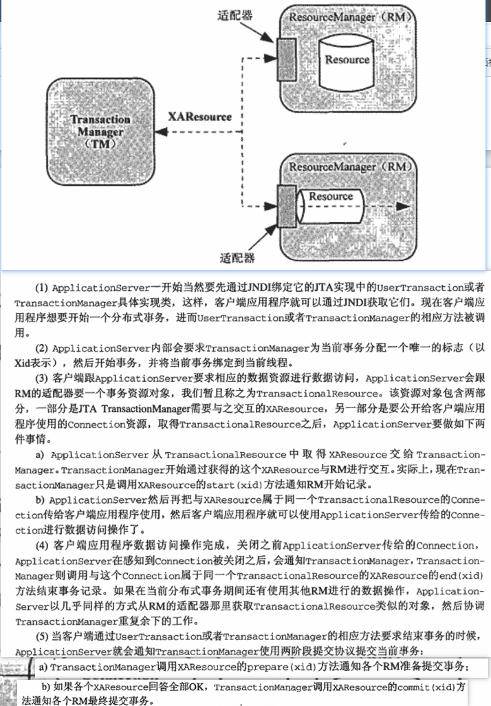
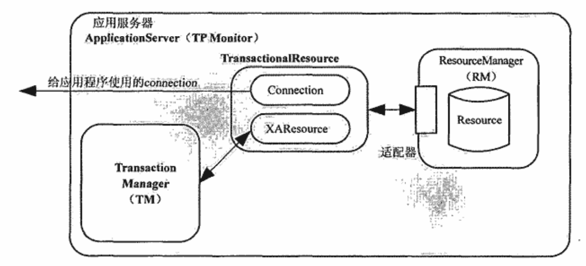

>为了避免connection-passing的问题，使用ThreadLocal解决，认知一下，他是谁？    
## ThreadLocal  
用于支持线程局部变量的标准实现类，为了解决多线程问题中对系统的同一个或者多个对象状态的访问的线程安全问题。  

解决线程安全问题的几种方法：  
- 1.同步方式Synchronization    
每次都只和其中一个线程打交道，来回换，但是一不小心就出错了，如果是打架的话就会受伤，555  
- 2.避免对象的共享ThreadLocal  
多个分身，各自应对自己的情况（目的是尽量避免对象的共享），猴哥分身打群架  

ThreadLocal自身不保存特定的数据资源，这些数据资源特定于各个线程，各个线程自己管理，每个线程都有一个ThreadLocal.ThreadLocalMap类型的名为threadLocals的实例变量，它就是保持那些通过ThreadLocal设置给这个线程的数据资源的地方。  
```java
Thread thread = Thread.currentThread();
ThreadLocalMap threadLocalMap = thread.threadLocals;
// 。。。
threadLocalMap.set(this, obj);
```
>以城市公交为比喻，公交线路就是Thread，多个公交线就是多线程，同时运行；公交线上的公交车就是threadLocals，在线程上运输数据；每一个公交站点就是ThreadLocal，虽然公交站点会有相交点，但是同一时间，一个乘客只会坐上要坐的一辆公交；  

ThreadLocal横向上，是为了多个线程之间为每个线程分配一份各自特定的数据资源；纵向上，单一线程内，通过ThreadLocal设置的特定于各个线程的数据资源可以随着线程的执行流程随波逐流；  
>JDBC数据访问的过程中，Connection就是有状态并且非线程安全的类，为了保证多个线程使用connection进行数据访问的安全，每一个线程分配一个各自持有的connection；并在当前程序执行流程内实现数据传递。相比于同步，在多个线程需要使用到共享对象的时候需要排队，ThreadLocal以空间换时间，多开几个窗口，不用排队，至少队伍分散成几个队伍，变短一些，优化性能；另外，对于一些初始化代价比较大，但是执行流程中又会多次使用到的，可以在第一次初始化后用ThreadLocal保存起来，提高性能。 


## 分布式事务   
  
  


