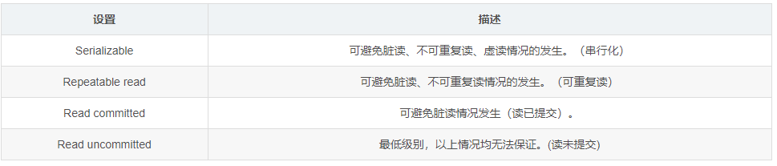

事务管理本身是一个很深的研究方向，这里只是和关注Spring事务管理抽象层的理念以及相关内容  

##  什么是事务  
### ACID
#### 原子性（atomicity)  
全部操作不可分割，要么全部成功，要么全部失败  
#### 一致性（consistency)
数据资源在事务执行前后，数据一致状态。（银行转账，钱不能凭空出现，也不能凭空消失）
#### 隔离性（isolation）
事务之间的相互影响程度
##### 隔离级别
###### 读未提交（Read Uncommited）
最低级别，一个事务可以读取另一个事务没有提交的更新结果  
###### 授权读取也称为已提交读（Read Committed）
大部分数据库默认级别，只有在事务提交后，另一个事务才可以读取到
###### 可重复读（Repeatable Read)
保证对同一笔数据读取始终是一致的
###### 串行化（Serializable)   
最为严格，一次执行，最为安全，但是性能较低
##### 隔离级别导致问题  
###### 脏读(Dirty Read) 
一个事务对数据修改，但是还没有提交就被另外一个事务读到了（一个事务回滚了，数据实际不存在系统中）
###### 不可重复读（non-Repeatable Read) 
一个事务中，同一笔数据，多次读取结果不一样（有些字段被修改了）
###### 幻读（phantom reads) 
一个事务中，同一个查询，每次结果查到结果集不一样。

#### 持久性（durability）
数据一旦提交，变更不可逆转。

### 家族成员
#### Resource Manager：RM
负责存储并管理系统数据资源状态，数据库服务器等
#### Transaction Processor Monitor：TPM  
分布式事务中协调包含多个RM的事务处理，Application Server等  
#### Transaction Manager：TM
TPM的核心，直接负责多RM之间的事务处理协调工作，提供事务界定，事务上下文传播等功能接口。  
#### Application
独立形式存在的或者运行于容器中的应用程序，事务边界的触发点。

### 分类
#### 全局事务Global Transaction
多个RM，需要TPM参与，TPM采取两阶段提交保证ACID(牧师主持婚礼：1.牧师询问双方是否同意，2.双方都同意，牧师宣布完婚)
#### 局部事务Local Transaction
只有一个RM（一个事务涉及的RM，而并非系统中有几个）

###  群雄逐鹿  
从局部到全局
#### 局部事务Local Transaction 
会随着所使用的数据访问技术的不同而各异，不是使用专门的事务API管理事务，而是通过当前使用的数据访问技术所提供的基于connection的API来管理事务。  
>数据库资源的局部事务管理：JDBC是基于Connection，设置AutoCommit为false就改为手动提交来控制事务的提交或者回滚；Hibernte进行数据访问就使用Session进行数据访问期间的事务管理。JDO，TopLink甚至JPA都在自己的数据访问API上，提供了相应的事务管理支持。  
>消息服务资源的局部事务管理：JMS的Session控制整个处理过程的事务。  
>此外，可能需要借助于JCA（Java Connector Architecture）管理局部事务。（需要绑定到相应的Java EE服务器上）

#### 全局事务Global Transaction
Java平台的分布式事务主要是通过JTA（Java Transaction API）或者JCA（Java Connector Architecture）进行。
>JTA是sun公司提出的标准化分布式事务访问的Java接口规范，只是接口定义，实现需要各个提供商实现，各Java EE服务器需要提供对JTA的支持。几个独立的实现：JOTM  Atomikos  JBoss Transaction  
```java
// 方式1：编程事务管理
try{
    UserTransaction ut = (UserTransaction)ctx.lookup("javax.transaction.UserTransaction")
    ut.begin();
    // do something
    ut.commit();
}catch(NamingException e){
    // do something
}catch(SystemException e){
    // do something
}...
// 方式2：声明式事务管理
// 使用EJB进行声明式事务管理，只限于EJB容器内部，对于应用程序完全透明，只需要在相应的部署描述符中指定相应的事务属性
```

>JCA规范主要是面向EIS（Enterprise Information System）的集成。


问题：  
局部事务管理绑定到了具体的数据访问方式，大家都有各自的API，事务代码与数据访问代码，甚至逻辑代码混合在一起；  
异常处理的时候没有统一的异常体系，特定API需要捕捉特定异常进行处理，抛出的异常许多时候是checked exception，实际最好是不可恢复的unchecked exception；  
事务处理API多样性造成的困扰；  
CMT声明式事务局限为必须借助于EJB容器，才能分离事务管理与数据资源访问的耦合。  

>幸好，Spring事务管理就是来解决这些问题的  


### Spring的事务管理  
[Spring的事务管理](./005001Spring事务管理.md)
[Spring的事务管理使用](./005002Spring事务管理使用.md)


