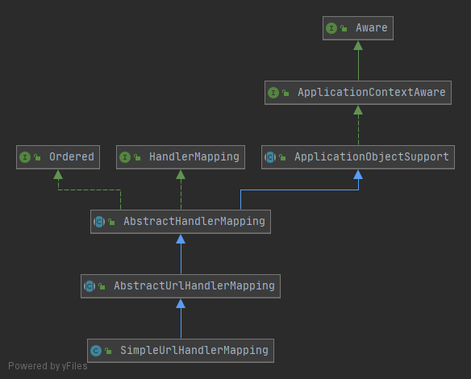
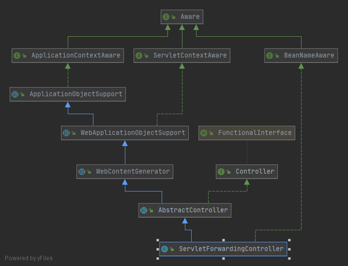
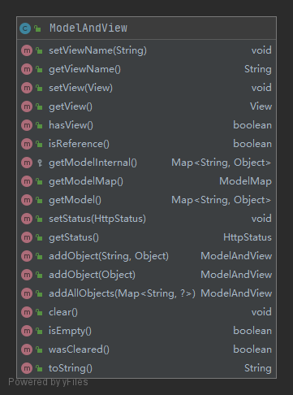
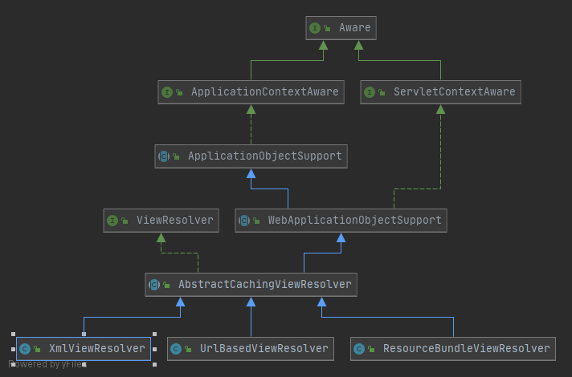
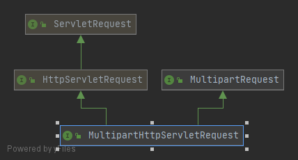
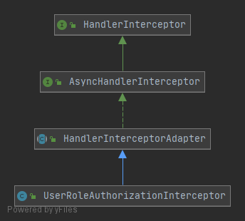
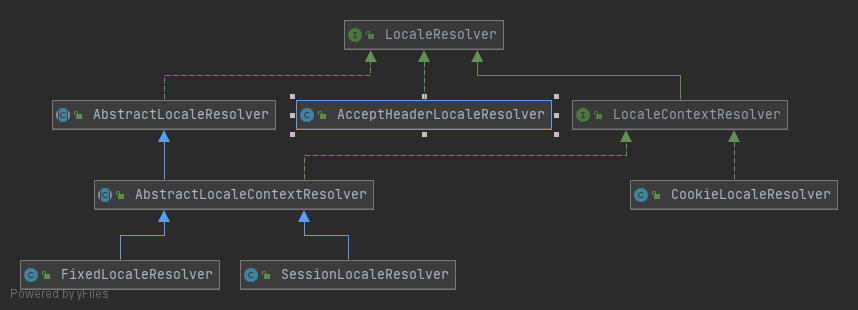
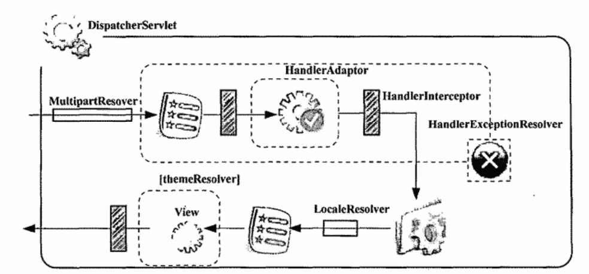

# Spring MVC主要角色  
>前面我们已经大致了解过Spring MVC的工作流程，也接触过一些主要角色的一些相关内容，有了前面的内容可以应付80%的情况，Spring MVC已经为我们做好了很多的准备工作，避免我们重复处理某些方面的内容。  

## HandlerMapping  
主要作用是：帮助DispatcherServlet进行web请求的url到具体处理类（handler）的匹配。  

Spring MVC默认提供了多个默认的HandlerMapping的实现，SimpleUrlHandlerMapping就是其中一个。  

在基于Spring MVC开发web应用程序的过程中，我们可以为DispatcherServlet提供多个HandlerMapping，这些HandlerMapping将会根据一系列指定的优先级进行排序，然后使用优先级排在前面的HandlerMapping，如果可以处理并返回可用的Handler，就适用当前HandlerMapping，不行就问下一个，直到找到一个HandlerMapping。（Ordered接口）  

  

## Controller  
用于处理web请求的handler类型之一。  
```java
    public interface Controller {
        // 返回了一个ModelAndView
        ModelAndView handleRequest(HttpServletRequest request, HttpServletResponse response) throws Exception;
    }
```
但是其实，为了更方便的使用，不需要关注很多底层细节，需要寻求Spring MVC的Controller框架类。  
>两个派别：更接近于底层细节的自由挥洒派（自由度高，更接近Servlet的使用）；规范操作派，一系列的规范化封装处理（自动抽取请求参数到Command对象；提供统一的数据验证方式；规范化表单请求处理流程，虽然受到限制了，但是使用方便啊） 

AbstractController：继承体系的起源
主要解决的就是：管理当前的Controller支持的请求方法类型（GET/POST）;管理页面缓存设置，是否允许浏览器缓存当前页面；管理执行流程在会话(Session)上的同步。  

其他的Controller是为了进一步简化我们的使用进行的一系列规范化的封装，具体细节用到了就会知道。  

  

## ModelAndView
Controller处理完web请求以后，返回的实例，主要包含：  
1. 视图相关内容；  
>逻辑视图，或者具体的View实例，当返回的是View实例的话，直接使用并渲染视图；但是如果只是的返回了逻辑视图名称的话，就需要ViewResolver的帮助。  
2. 模型数据；  
>视图渲染的时候会将数据合并入最终的视图输出，ModelMap
  


## ViewResolver  
根据ModelAndView中的逻辑视图名称返回对应的View实例。
```java
public interface ViewResolver {
    // 返回对应的View实例
	View resolveViewName(String viewName, Locale locale) throws Exception;
}
```
面向单一视图的ViewResolver：UrlBasedViewResolver及其子类，不需要具体的逻辑视图名到具体view的映射关系，只需要视图模板所在位置，一个ViewResolver只负责一个View  
面向多视图的ViewResolver：需要通过某种配置方式明确逻辑视图与具体视图之间的映射关系，虽然麻烦一点，但是可以顾及多种视图类型的映射管理。

具体的遇到了再说  

同样的，并不是说我们只能使用一个ViewResolver进行视图查找，也可以接受多个ViewResolver处理视图查找；也会根据优先级进行排序，然后顺序遍历ViewResolver，知直到找到一个。
   

## View
基于模板的视图生成方式，一个View实现类要做的就是使用相应的API技术将模板和模型数据合并到一起，输出页面到客户端（JSP模板文件和模型数据的合并操作是web容器完成的，如：tomcat，只是需要通过Servlet API将要合并的工作转发给web容器）
```java
public interface View {
    // 关键所在
	void render(@Nullable Map<String, ?> model, HttpServletRequest request, HttpServletResponse response)
			throws Exception;
}
```


# 更多角色  
上面的角色已经可以实现大部分的功能，但是为了更丰满，我们还需要认识更多的角色。  
## MultipartResolver  
如果需要通过表单上传文件，那么MultipartResolver就是处理文件上传的主要组件

当web请求到达DispatcherServlet并等待处理的时候，DispatcherServlet首先会检查webapplicationcontext中找到一个MultipartResolver实例。  
```java
public interface MultipartResolver {
    // 检查当前web请求是否为multipart类型
    boolean isMultipart(HttpServletRequest request);
    // 是multipart类型，resolveMultipart返回MultipartHttpServletRequest，返回供后继处理流程使用
    // 不是，直接返回最初的HttpServletRequest
    MultipartHttpServletRequest resolveMultipart(HttpServletRequest request) throws MultipartException;
    // 释放处理文件上传过程所占用的资源
    void cleanupMultipart(MultipartHttpServletRequest request);
}
public interface MultipartHttpServletRequest extends HttpServletRequest, MultipartRequest {
    HttpMethod getRequestMethod();
    HttpHeaders getRequestHeaders();
    HttpHeaders getMultipartHeaders(String paramOrFileName);
}
```
   


## Handler与HandlerAdaptor  
HandlerMapping将会通过HandlerExecutionChain返回一个Controller用于具体web请求的处理，但是事实上，用于处理web请求的处理对象可以不只是controller一种类型，HandlerMapping通过HandlerExecutionChain返回的是一个Object类型的Handler对象。但是要怎么判断到底要使用什么类型的Handler呢？HandlerAdaptor接口就是干这事的。  

### Handler
目前为止使用最多的就是Controller，除此之外还有其他类型的Handler；Spring MVC还有ThrowawayController；自定义的Handler；
>自定义的Handler对于Handler类型没有任何限制，只需要用`@Handler`标注一下类就可以，但是为了发挥Handler的作用，需要为我们的Handler提供必要的HandlerMapping和HandlerAdaptor（HandlerMapping负责查找Handler处理请求，所以需要一个能够识别我们的Handler的andlerMapping实现类，而且DispatcherServlet是不管我们的Handler是何方神圣的，这就需要一个HandlerAdaptor实现类）  

### HandlerAdaptor
调用HandlerAdaptor实现类找出对应的Handler，完成web请求处理，然后将结果转换为ModelAndView返回


### 告知Handler与HandlerAdaptor的存在  
如果使用的Handler是现有的Handler，无需在DispatcherServlet的WebApplicationContext中做任何配置，默认的HandlerAdaptor就足够了，如果需要添加这些HandlerAdaptor支持的Handler之外的Handler的话，就需要在添加自定义HandlerAdaptor的基础上，添加默认的HandlerAdaptor实现。  


## HandlerInterceptor  
HandlerMapping返回的用于处理web请求的Handler对象是通过HandlerExecutionChain对象封装的，其实就是一个数据载体，包含一个Handler和HandlerInterceptor（可以在Handler的执行前后对处理流程进行拦截操作）
```java
public interface HandlerInterceptor {
    //在HandlerAdaptor调用具体的Handler处理Web请求之前执行，返回boolean表示是否继续执行后续流程，true表示允许执行后续（HandlerInterceptor位于中间，继续执行下一个HandlerInterceptor的preHandle，最后一个的话就允许处理web请求的Handler执行）；false表示不允许后续流程继续执行。
    default boolean preHandle(HttpServletRequest request, HttpServletResponse response, Object handler)
			throws Exception {

		return true;
	}
    //处理web请求的Handler执行之后，在视图解析和渲染之前，可以进一步处理返回的ModelAndView
    default void postHandle(HttpServletRequest request, HttpServletResponse response, Object handler,
			@Nullable ModelAndView modelAndView) throws Exception {
	}
    // 视图渲染完之后，不论是否异常，都将执行该方法，
    default void afterCompletion(HttpServletRequest request, HttpServletResponse response, Object handler,
			@Nullable Exception ex) throws Exception {
	}

}

```
为了使得HandlerInterceptor发挥最庸，要将他加入到对应的HandlerMapping就可以
Filter就是HandlerInterceptor之外的替换选择，只不过Filter在DispatcherServlet之前，在servlet层面对DispatcherServlet进行拦截，而HandlerInterceptor是DispatcherServlet内部的，对Handler进行拦截，能够提供细粒度的拦截时点。  
为了让Filter能够更好的在Spring MVC框架中发挥作用，DelegatingFilterProxy作为一个Filter的Proxy对象，DelegatingFilterProxy位于web.xml中，实际发挥作用的家伙却位于WebApplicationContext中，和Spring进行默契配合使用。  
   


## HandlerExceptionResolver  

```java
public interface HandlerExceptionResolver {
    // 负责处理与相关Handler所关联的某种异常，并异常处理完之后，将处理结果以ModelAndView形式返回。
    ModelAndView resolveException(
			HttpServletRequest request, HttpServletResponse response, @Nullable Object handler, Exception ex);
}
```


## LocaleResolver  
在ViewResolver根据逻辑视图解析视图的时候，除了接受逻辑视图名称之外，还同时接受一个Locale对象，LocaleResolver就可以根据Locale返回不同的视图。
   
LocaleChangeInterceptor用于处理web应用程序使用过程中切换Locale的情况。  

## ThemeResolver  
主题切换  
### 资源ThemSeource
根据主题名称返回Them实例

### 管理ThemeResolver
解决哪个主题名称到ThemSeource查找要用的主题资源  

### 切换ThemeChangerInterceptor
用于处理web应用程序使用过程中切换Theme的情况

   

# 基于注解的Controller  
传统的Controller需要继承接口，但是使用`@Controller`可以将一个普通的POJO作为Handler
>为基于注解的Controller提供相应的HandlerMapping以处理Web请求到Handler的映射关系，需要提供相应的HandlerAdaptor以调用并执行自定义的handler的处理逻辑。  
### 自定义HandlerMapping  
`@RequestMapping`标记类  
### 自定义HandlerAdaptor 
`@RequestMapping`标记方法  


