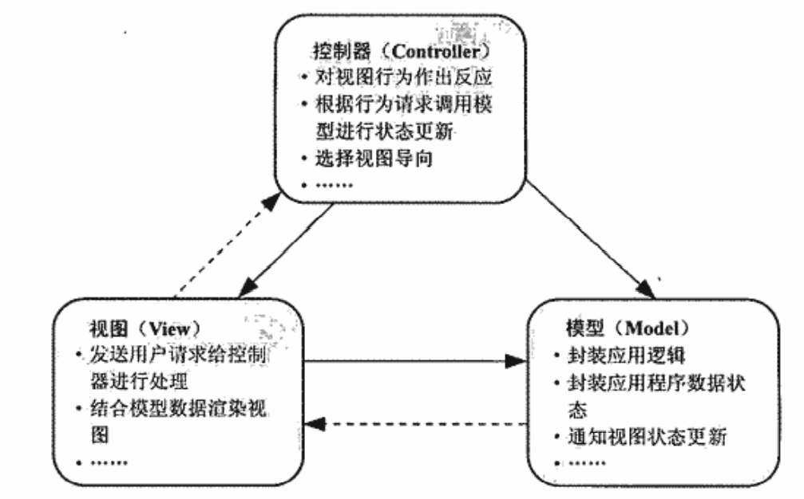
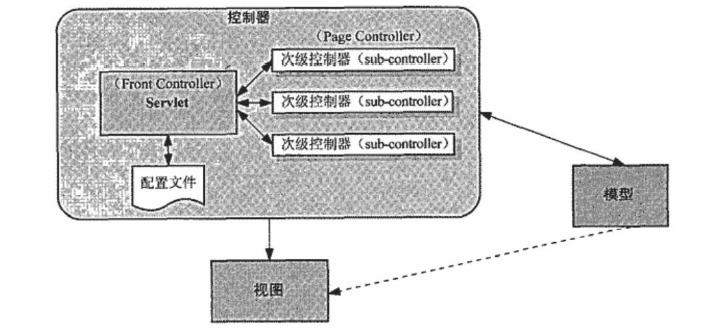
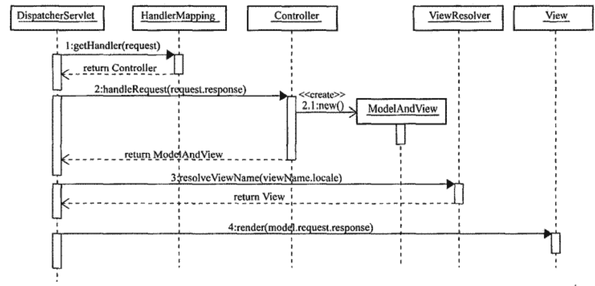
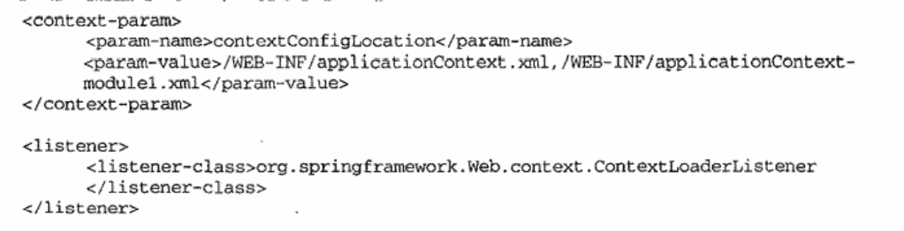

## java平台web开发历程  
1. Servlet  
是java平台上第一个用于web开发的技术，运行于web容器内，提供了session和对象生命周期管理等功能，最主要的是他是java类，可以直接访问Java平台的各种服务，使用相应的api。  
>这东西是好，但是总是要说但是。。。  
但是，Magic Servlet的存在，并不意味着一个web应用程序只存在一个Servlet实现，实际上，更多时候是一个Servlet处理一个web请求；并且html这些渲染工作也都混在java代码里面，不好找，美工，前台开发后台开发都要维护这一份写死在java里面的代码。  

2. JSP  
>为了把Servlet中的视图渲染的逻辑抽取出来，使用模板化的方法，jsp的提出，成为java平台开发web应用程序事实上的模板化视图标准  

jsp把Servlet中通过out.println语句输出的视图渲染逻辑抽取到.jsp模板文件  

jsp最终是编译为Servlet来运行的，可以在jsp中编写java代码；而且，使用Servlet处理web请求，需要在web.xml文件中配置URL与Servlet之间的映射关系。  

>但是，又是但是  

但是，由于jsp可以直接当做servlet使用，开始不满足于作为视图模板使用，野心膨胀了，抢走了原本属于Servlet的活，代替Servlet。这，这不回到起点了么。  

3. Servlet与JSP的联盟  
回到JSP设计的最初起点，Servlet负责请求处理流程的控制以及与业务层的交互，JSP负责页面开发或者表现层，并且引入JavaBean，得到JSP Model2  

4. MVC(Model-View-Controller)  
Controller：负责接收视图发送的请求并处理，根据请求条件通知模型进行应用程序状态更新，之后选择合适的视图显示给用户。  
Model：封装应用的逻辑以及数据状态，收到控制器通知执行相应的逻辑，完成后，通过事件机制返回给视图，显示最新数据状态。  
View：面向用户的接口，通过视图发起请求，给到控制器进行处理，最终接受模型的状态更新通知，更新自身的展示  
  

web应用程序中使用多个Servlet作为控制器：一个Servlet对应一个web请求的处理，随着应用规模的增加，web.xml体积越来越庞大，请求处理流程各自份上管理，不利于系统开发和维护  
web应用程序中使用一个Servlet作为控制器：所有的请求全部由web应用程序中定义的这个单一的Servlet控制器进行，但是会导致servlet的膨胀，控制器类需要自己根据url进行分析，判断流程的流向。  


>web框架为web应用程序的开发提供了一套可复用的基础设施，开发人员只要关注特定于每个应用的逻辑开发工作。  
1. 请求驱动的Web框架：request/response框架，基于Servlet的请求响应处理模型构建
2. 事件驱动的Web框架：基于组件的Web开发框架，将视图组件化，由视图中的相应组件触发事件，进而驱动整个处理流程

>Spring MVC就是基于请求驱动的Web框架，更加倾向于使用单一Servlet作控制器，但是为了避免Servlet膨胀，结合Page Controller以及Front Controller，对Servlet进行改进，进行逐步分离（单一Servlet作为Front Controller，参照预先可配置的映射信息转发一级控制器（sub-controller））  
   

## Spring MVC出场  
### 鸟瞰  
Front Controller:DispatcherServlet    
Page Controller：Controller  
>servlet处理请求的一般流程分为：获取请求信息，请求路径，参数值等等；根据请求信息，调用具体的服务对象处理具体的Web请求；处理完成后，将要在视图中显示的模型数据通过request传递，最后通过RequestDispatcher选择具体的jsp视图并显示。DispatcherServlet的处理流程没有什么大的改变，不同之处在于DispatcherServlet将各项工作细化并分给独立的角色完成。    

DispatcherServlet处理流程  
1. HandlerMapping（web请求的处理协调人）
```xml
<servlet>
    <servlet-name>dispatcher</servlet-name>
    <servlet-calss>org.springframework.web.servlet.DispatcherServlet</servlet-name>
    <load-on-startup>2</load-on-startup>
</servlet>
<servlet-mapping>
    <servlet-name>dispatcher</servlet-name>
    <url-pattern>*.do</url-pattern>
</servlet-mapping>
```
DispatcherServlet需要自己处理具体的Web请求与处理类之间的映射关系，一般来说处理方式有：掐头去尾，获取路径信息；借助某个参数的值作为匹配标准；以cookies或者session的某些信息作为匹配标准。总之，需要规定一些惯例或者约定，来解析Web请求的URL路径信息，为了不写死映射匹配的逻辑，HandlerMapping就是专门用来处理映射的匹配，当Web请求到达DispatcherServlet后，Dispatcher会群求具体的HandlerMapping，获取当前请求的具体处理类Controller。  

2. Controller（web请求的处理者）
Controller实现对应某个具体Web请求的处理逻辑，通过HandlerMapping找到具体的Controller并处理当前Web请求，处理完毕以后，返回ModelAndView（视图的逻辑名称-决定为用户显示哪个视图；模型数据-视图渲染过程中需要将模型数据并入视图的显示中）  

3. ViewResolver和View（视图独立战争的领导者）  
这两个接口用于屏蔽Web框架在使用不同的Web视图技术时候的差异性，将相同的模型数据纳入不同的视图形式并显示。  
通常来说，Servlet自身提供了文本和二进制两种方式，Servlet公开的HttpServletResponse就可以应付，这种情况下，只要在最终将视图数据通过HttpServletResponse输出前，借助不同的视图技术API并结合模型数据和相应的模板文件，就能生成最终的视图结果。
>1.获取模型数据；
>2.获取视图模板文件；
>3.结合模型数据和相应的模板文件，使用相应的视图技术API生成视图结果；
>4.通过HttpServletResponse输出;
>5.打完收工  

View接口就是Spring MVC用来统一的抽象视图生成策略的接口，DispatcherServlet只需要根据ModelAndView返回的信息，选择具体的View实现类做最终的具体工作即可。DispatcherServlet需要 ViewResolver来帮助他处理逻辑视图与具体的View实例之间的映射对应关系， ViewResolver根据ModelAndView的逻辑视图名称，查找相应的View实现类，然后返回给DispatcherServlet，DispatcherServlet将模型数据交给view处理视图渲染。  
   


### 实战  
一个机遇Spring MVC的web应用仍然是一个遵循servlet规范的web应用程序，所以就拥有一个遵循servlet规范的web应用程序应有的目录结构和相应的部署描述符文件。  
但是，spring mvc在web.xml的基础上还会增加两个或者多个配置文件。  
web.xml开始，首先通过<listener>元素增加一个ServletContextListener定义（ContextLoaderListener），为web应用程序加载顶层WebApplicationContext（默认配置文件为WEB-INF/applicationContext.xml，也可以通过web.xml的contextConfigLocation的配置参数配置多个分割后的配置文件），主要用于提供应用所使用的中间层服务。 
   

对于web.xml中的DispatcherServlet的注册，是基于Spring mvc框架的web应用程序的front controller，将负责几乎所有对当前web应用程序的web请求处理，包括了handlermapping，controller，viewresolver定义等，默认路径也是/WEB-INF/，如果DispatcherServlet对应的<servlet-name>为controller，那么配置文件的名称为controller-servlet.xml；DispatcherServlet启动后将加载XXX-servlet.xml,并构建顶层WebApplicationContext，将ContextLoaderListener加载的WebApplicationContext作为父容器，DispatcherServlet的contextConfigLocation的初始化参数就是为了分割XXX-servlet.xml。  


 


