# Spring与JavaEE
JavaEE平台由许多企业级应用服务组成：JMS、JTA、JavaMail等，但是这些服务规范所给出的API设计虽然强大，但是往往过于底层，Spring框架通过对各种Java EE服务API的封装，简化开发。  

## Spring与JNDI  
JNDI(Java Naming and Directory Interface,java命名与目录接口)，统一各种命名与目录服务的访问接口。  
### JNDI API
主要公开给Java应用程序使用，为其访问各种命名与目录服务提供统一的接口  

### JNDI SPI
主要公开给具体命名与目录服务提供商使用，为他们提供一个扩展层  

## Spring与JMS  
>MOM(Message-Oriented Middleware，面向消息中间件)，但是在企业信息系统中使用这些MOM通常不得不使用特定的API，基于各种语言实现。JMS是一套API接口规范  
### 版本  
#### JMS1.02  
两种消息域模型
##### 点对点模式PTP  
消息发送者会将消息发送的指定的消息队列中，消息的接收者也是从同一消息队列中获取数据，并对消息进行处理（类似于多线程模式下的生产者-消费者模式）

##### 发布订阅模式Pub/Sub  
消息发送者将消息发送到指定的消息主题（Topic），多个消息接收者可以从相应主题中获取某个相同的消息的拷贝进行处理（报纸和订阅）  

#### JMS1.1  
更倾向于使用较为同的消息访问API接口，使用一套通用的API访问现有的两种消息域模型  

### 组成  
#### JMS类型的客户端程序
使用java语言编写的用于发送或者接受消息的程序  

#### 非JMS类型的客户端程序  
使用相应的消息系统或者产品提供的本地Api，而不是JMS API进行消息访问的程序

#### 消息
作为消息用，传递的就是消息：StreamMessage、ByteMessage、MapMessage、TextMessage和ObjectMessage

#### JMS Provider  
特定于MOM产品的JMS API接口实现以及相关功能实现就称之为JMS Provider  

#### 受管理对象  
向不同的JMS类型客户端程序屏蔽各种JMS provider之间的差异，系统管理员可以将某些特定类型的对象通过JMS Provider提供的管理工具提前配置到系统中。（ConnectionFactory：客户端需要通过ConnectionFactory获取相应Connection，创建其他相关对象；Destination：消息发送或者接受的目的地。可以分为消息队列和消息主题两种类型）  
>通常被绑定到相应的JNDI服务

### Spring改进后的JMS  
#### 消息的发送和同步接收
```java
// JmsTemplate核心模板方法
// startConnection：是否要调用Connection的start()方法，对于发送消息，不需要；但是对于消息接受，应该为true
public Object execute(SessionCallback action,boolean startConnection)throws JmsException{
    try{
        // 获取connection
        // 创建相应的session
        return action.doInJms(sessionToUse);
    }catch(Exception ex){
        // 转换并抛出异常
    }finally{
        // 清理相应资源
    }
}
// 简化版的，默认false：只能用在发送消息上
public Object execute(SessionCallback action)throws JmsException{
    return execute(action,false);
}
```
JmsTemplate模板方法大致划分为三类  
##### 消息发送模板
```java
public interface ProducerCallback{
    Object doInJms(Session session, MessageProducer producer) throws JmsException;
}
```
```java
// 使用SessionCallback回调接口的execute()模板方法需要在其中自己创建发送消息的MessageProducer实例，并在合适的时候关闭
jmsTemplate.execute(new SessionCallback(){public Object doInJms(Session session, MessageProducer producer) throws JmsException{
    ObjectMessage requestMessage = session.creatObjectMessage();
    MessageProducer producer = creatProducer(session, destnation);
    try{
        producer.send(requestMessage);
    }finally{
        JmsUtils.closeMessageProducer(producer);
    }
    return null;
}});
// 使用ProducerCallback回调接口
jmsTemplate.execute(new ProducerCallback(){public Object doInJms(Session session, MessageProducer producer) throws JmsException{
    Message message = session.creatObjectMessage();
    producer.send(destnation,message);
}});
// 使用MessageCreator的send方法
jmsTemplate.send(new MessageCreator(){public Message createMessage(Session session throws JmsException{
    ObjectMessage message = session.creatObjectMessage();
    return message;
}});
// 使用MessageConverter的convertAndSend方法
// 负责具体消息类型与对象类型之间的转换  
public interface MessageConveter{
    // 将相应对象转换为Message以便发送
    Message toMessage(Object object,Session session) throws JMSException,MessageConversionException;
    // 将Message转为应用程序使用的对象类型
    Object formMessage(Message message)throws JMSException,MessageConversionException;
}
```
##### 消息的同步接收
```java
// 直接接收，以receive()方法接收是最直接也是最简单的同步消息接收方法

// 可以指定MessageSelector表达式的模板方法，receiveSelected方法   

// 使用MessageConveter的模板方法receiveAndConvert方法

// 结合MessageSelector表达式和MessageConveter的模板方法receiveSelectedAndConvert方法

```
##### 使用QueueBrower检查消息队列
```java
// 不使用MessageSelector的模板方法，browse方法可以接收BrowserCallback
public interface BrowserCallback{
    Obiect doInJms(Session session, QueueBrowser browser) throws JMSException;
}

// 使用MessageSelector的模板方法
// 重载后的browseSelected可以指定一个selector表达式
```

JmsTemplate的defaultDestination属性指定的默认Destination，系统中有多个消息被发送到同一个Destination或者从同一个Destination接收消息，设置为默认的defaultDestination是合适的；如果指定了Destination但是找不到，也会使用defaultDestination。  
当然，也可以指定其他的Destination：一种是指定直接的Destination类型实例；一种是String形式给出，借助DestinationResolver，完成转换。
```java
public interface DestinationResolver{
    Destination resolveDestinationName(Session session, String destinationName, boolean pubSubDomain) throws JMSException;
}
```

#### 异步接收消息
Spring提供了一个MessageListenerContainer（用于处理消息的消息驱动POJO必须实现MessageListener接口，MessageListenerContainer负责管理，接管了EJB容器在异步消息接收处理领域的部分职责）：负责到指定的Destination接收符合处理条件的消息；将接收的消息通过某种策略发送给指定类型的MessageListener实现类处理；还需要关注Connection，Session等一系列对象的生命周期，异常处理，甚至消息处理过程中涉及的本地事务与全局事务相关的种种关注点。MessageListener接口的实现类中处理已经分配的Message就可以了。  
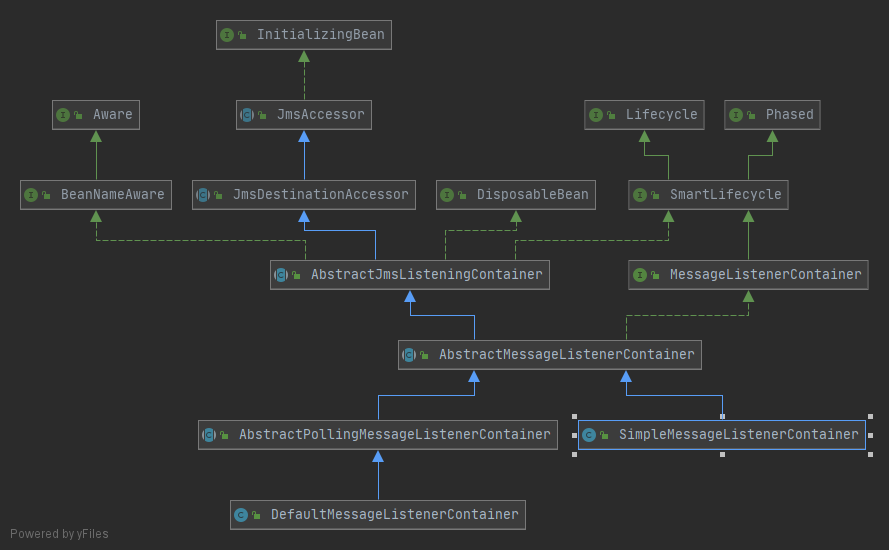   

## Spring与E-mail  
>申请账户的时候，邮件确认；定期发送数据给用户；系统监控，异常通知；  
Java平台上E-mail解决方案使用范围最广的就是Sun的JavaMail，但是相关API使用起来也是麻烦的一批，怎么办，自己封装或者采用现成的别人的封装成果来简化发送邮件。  

Spring所提供的E-mail抽象层主要体现为两个层次：MailMessage和MailSender
### MailMessage
>对要发送的信息进行抽象和建模，定义一套标准的邮件信息操作方式；不需要关系最终底层使用的是什么样的E-mail解决方案，完全以一种统一的方式来准备将要发送的邮件信息就可以了。
#### SimpleMailMessage
普通文本邮件信息
#### MimeMailMessage
更丰富内容的MIME类型的邮件信息
### MailSender
发送邮件的人，屏蔽各种E-mail解决方案的差异性，不管底层的解决方案怎么变，只要把使用这些解决方案实现的MailSender实现类注入给依赖MailSender接口的对象就可以了。
```java
public interface MailSender {
    // 注定只能是发送普通文本邮件，COSMailSenderImpl就是第一个直接实现类
    void send(SimpleMailMessage simpleMessage) throws MailException;
    void send(SimpleMailMessage... simpleMessages) throws MailException;
}
```
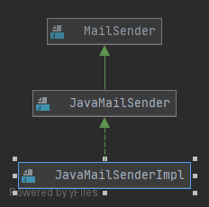   

JavaMailSender扩展自MailSender，在发送普通文本邮件的基础上添加发送MIME邮件的功能。
#### 1.直接外部创建MailMessage实例，然后传给JavaMailSender发送
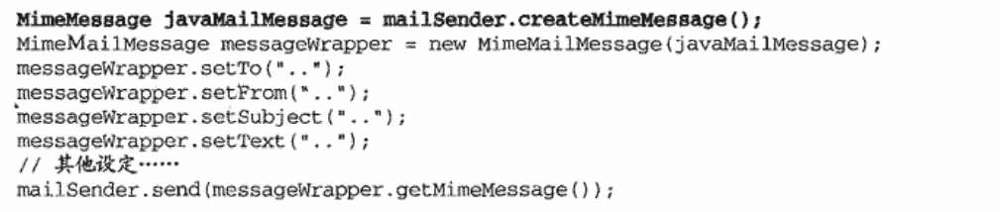   


#### 2.使用JavaMailSender公开的MimeMessagePreparator回调接口
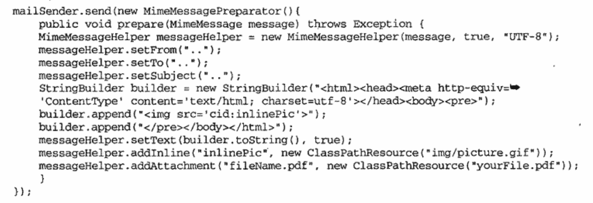   

## Spring与任务调度，线程池支持  
### Spring与Quartz  
Quartz是一款开源的任务调度框架：允许批处理任务状态的持久化，并且提供不同的持久化策略支持；批处理任务的远程调度；提供基于web的监控接口；集群支持；插件式的可扩展性；
#### 角色划分
##### Job
被调度的任务
##### JobDetail
提供Job执行的上下文，Job所依赖的某些配置信息，通过JobDataMap进行数据交互  
##### Trigger
用于触发被调度任务的执行，可以根据不同的触发条件通过不同的Trigger实现（一个Trigger只能用于一个Job，但是多个Trigger可以用于同一Job）  
##### Scheduler
核心调度程序，负责管理所有相关的Trigger和JobDetail 

#### Spring中的角色  
>Spring采用了FactoryBean这一“武器”  
##### Job的实现
>Job需要的执行上下文信息是由对应的JobDetail提供的，二者通过JobDataMap进行数据通信  
```java
JobDetail jobDetail = new JobDetail("jobName",Schedule.DEFAULT_GROUP,HelloWorldJob.class);
jobDetail.getJobDataMap().put("message","helloWorld");

// 在HelloWorld中，我们通过如下方式获得上下文
public class HelloWorldJob implements Job{
    public void execute(JobExecutionContext ctx) throws JobException{
        JobDataMap jobDataMap = ctx.getJobDetail().getJobDataMap();
        String message = jobDataMap.getString("message");
    }
}

// 改善版，继承QuartzJobBean，直接以bean属性的形式访问当前Job执行的上下文信息
// QuartzJobBean将保证上下文信息在executeInternal(JobExecutionContext ctx)方法执行之前被逐一注入到相应的bean中
public class HelloWorldJobExtendingQuartzJobBean extends QuartzJobBean{
    private String message;
    @override
    protected void executeInternal(JobExecutionContext ctx) throws JobException{
        // getMessage();并使用
    }
    // getter/setter 方法
}

// 1.5的版本之后，Quartz提供了一种JobFactory机制，允许对要执行的Job进行定制，Job不需要受到任何父类继承的限制了（SpringBeanJobFactory）

```
##### JobDetail的更多选择
Job需要JobDetail来帮助提供执行的上下文信息（JobDetailBean）
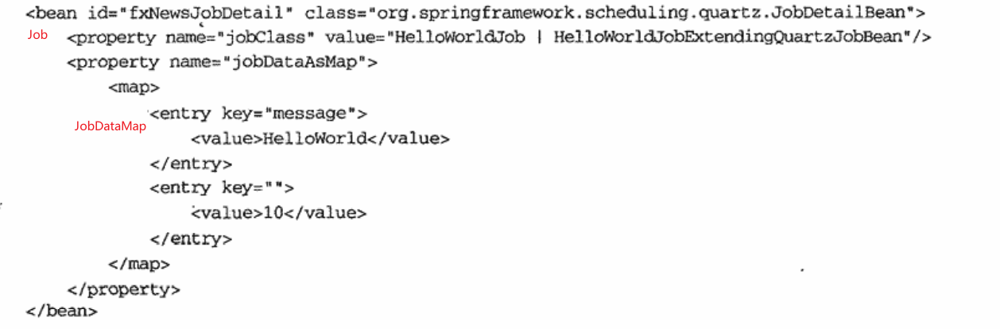   

MehtodInvokingJobDetailFactoryBean只需要指定调度执行时候应该调用哪个对象实例的哪一方法就可以了
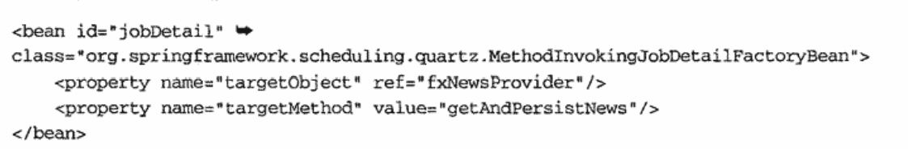   

##### Trigger的可配置化  
SimpleTrigger和CronTrigger是Trigger的两种实现，但是实例化的时候需要指定相应的管理组和组内唯一标志名称，Spring提供了对应的SimpleTriggerBean和CronTriggerBean，提供合理的默认值，采用FactoryBean的机制实现  
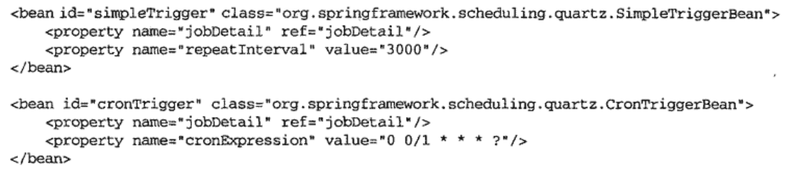   
虽然，一个trigger只能对应一个Job，但是多个Trigger所对应的Job可以是同一个，通过组合多个Trigger来指定同一Job的调度；多个Trigger规则的附加或许是为了补足单一Trigger调度规则覆盖范围不够的问题，但是当tirgger规则覆盖范围足够大的时候，只是范围内有小部分的规则需要剔除，可以结合Calender来排除不需要的部分  
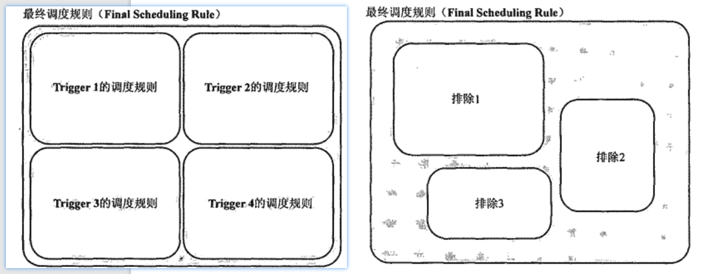   

##### Scheduler  
通过SchedulerFactoryBean为所管理的Scheduler实例注册相应的Trigger、Calender等系列装备，管理的Schedule将随ApplicationContext的实例化自动启动，随着ApplicationContext的关闭自动关闭。


### Spring与JDK Timer
JDK Timer时JDK1.3引入的任务调度标准装备，但是没办法和专业的Quartz相比。但是对于简单使用的场景和有三方类库限制的场景，就比较适合。  
```java
// 经由Timer调度的任务都需要继承TimerTask
public class FXNewsTimerTask extends TimerTask{
    @override
    public void run(){
        // do someting
    }
}

// 任务调度
FXNewsTimerTask task = new FXNewsTimerTask();
Timer timer = new Timer("schedulerName[optional]"); 
timer.schedule(task,0,6000);
```

#### Spring集成
>强制任务需要继承TimerTask，具有强侵入性  
Spring提供了MethodInvokingTimerTaskFactoryBean，代替业务对象作为一个TimerTask，在真正需要执行调度逻辑的时候，才会根据指定的信息通过反射调用指定实例上的指定方法。  

>Trigger信息本来是在将TimerTask提交给Timer调度的时候指定的
Spring通过ScheduledTimerTask对TimerTask和相关的Trigger信息进行模块化封装

Spring通过TimerFactoryBean对Timer进行封装，将以ScheduledTimerTask封装好的调度任务提交给TimerFactoryBean

### Executor  
Java 5带来的一套崭新的任务执行框架  
```java
// 分离任务的提交和任务的执行，解除二者的耦合，以Runnable类型界定的任务提交后，最终会以什么样的执行策略执行（时间，交给谁），完全由不同的Executor实现类负责，提交任务的客户端完全可以忽略后者的实现细节
public interface Executor{
    void execute(Runnable task);
}
```
Spring2.0之后提出的TaskExecutor可以让我们在之前版本的Java平台上使用Eexcutor的功能。  
```java
public interface TaskExecutor{
    void execute(Runnable task);
}
```
>最主要的其实是Spring为TaskExecutor提供了足够的实现类，即使没有相应的TaskExecutor和某个Executor提供的功能相对应，Spring也提供了架桥的方法。  

#### 可用的TaskExecutor实现类
##### SyncTaskExecutor
直接在当前调用线程中执行，测试的时候较多使用

##### SimpleAsyncTaskExecutor
异步执行，为每个任务都创建新的线程，不设置限制的时候，可以无上限创建，但是为了避免线程创建和销毁带来的开销，我们需要某个使用线程池提供异步任务执行能力的TaskExecutor

##### ThreadPoolTaskExecutor
针对java.util.concurrent.ThreadPoolExecutor进行封装

##### ConcurrentTaskExecutor
为Java5的Executor和Spring的TaskExecutor架桥，使得Executor的一些实现类以TaskExecutor的形式公开出来
```java
Executor executor  =Executors.newScheduledThreadPool(10);
TaskExecutor taskExecutor  = new ConcurrentTaskExecutor(executor);
```

##### SimpleThreadPoolTaskExecutor WorkManagerTaskExecutor 
使用特定的调度程序(Job Scheduler)来执行提交给他们的任务  

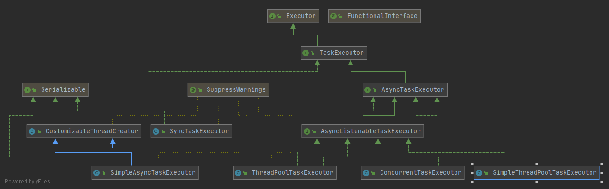   


## Spring远程方案（分布式）  
>以前，对象间进行调用的时候，对象都是在相同进程中的，但是有一天，对象之间距离比较远，怎么办？进入分布式的领域了，这时候其实就需要使用RMI、EJB、Web服务等手段（大部分情况其实不需要分布式，这种情况下就不要主动去引入分布式，复杂化我们的系统）  

### Spring Remoting架构
组合Service Exporter和Service Accessor  
#### 远程访问异常体系
>远程访问异常的中可能发生各种异常，本地调用不用关心，因为并不存在，这些异常纯粹是引入分布式架构，需要执行各种远程机制进行服务访问后的产物  
各种远程方案特定的异常类型在采用Spring Remoting这套标准远程访问体系之后将被转译。
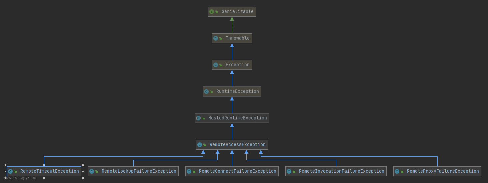     

#### 统一的远程服务公开与访问方式
几种远程交互方式：  
- 面向消息中间件（MOM）使用的MessagePassing方式  
- 数据库管理系统(DBMS)使用的共享存储区Shared Repository方式  
- RPC（remote procedure call）方式（Spring Remoting的行为基础）  

>RPC是建立在客户端-服务端模型上的（C/S），客户端发起请求，请求数据通过相应协议传输到服务器端，服务器端处理后将处理结果返回给发起请求的客户端（返回结果之前，客户端处于阻塞状态）  

```Service Exporter和Service Accessor```就是Spring Remoting的核心所在
#####  Service Exporter
>负责远程服务对象的公开工作，根据使用的远程机制接收服务请求，对请求内容进行解组（un-marshaling），根据解组后的请求内容调用本地服务对象，调用完成后，将结果重新编组（marshaling）发送到客户端  

##### Service Accessor
>帮助客户端对远程服务对象进行远程访问，客户端发起请求后，Service Accessor对请求内容进行编组，然后根据使用的远程机制对编组后的内容进行发送；收到Service Exporter的结果后，对调用结果进行解组，把解组后的调用结果传给本地的客户端对象使用  

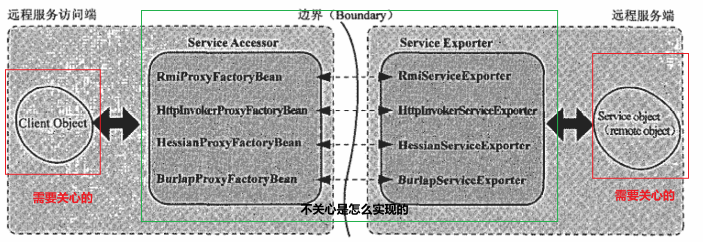    

##### Spring Remoting  
>场景：之前提供给前端请求用的接口，现在要通过远程访问的方式提供给其他客户端使用  

###### RMI方案
RMI是java SE的标准远程机制，采用java序列化机制进行远程数据传输，Spring Remoting在此基础上进行封装，在支持传统的RMI编程的同时，引入RMI Invoker机制进一步解除业务对象与RMI之间的耦合
- 公开远程服务  
1.继承接口java.rmi.Remote，抛出异常RemoteException，且接口定义的方法参数和返回值都要符合Java序列化需求  
2.引入RMI Invoker机制，可以避免接口java.rmi.Remote和异常RemoteException对业务接口的侵入，同样的配置方式，背后的机制变了，把这部分工作交给了RemoteInvocationHandler，当RmiServiceExporter检测到业务接口不符合RMI规范的时候使用RMI Invoker机制从invoke()方法获取被调用业务方法的信息，然后通过反射调用方法。
- 使用远程服务
通过RmiProxyFactoryBean访问，创建一个实际业务对象的代理对象，通过代理对象访问实际的业务方法  

###### 基于HTTP的轻量级方案  
>基于http远程方案的实现原型：使用浏览器访问其实就是远程访问，要将一个本地服务以http的方式公开给远程客户端使用，最简单的就是提供一个servlet统一接客户端的请求，然后调用本地服务最终返回给相应的客户端。因为Spring MVC已经有DispatchServlet，要公开相应的服务对象，只需要有相应的Handler（包括controller）；HttpRequestHandler就是Spring Remoting提供的handler。  
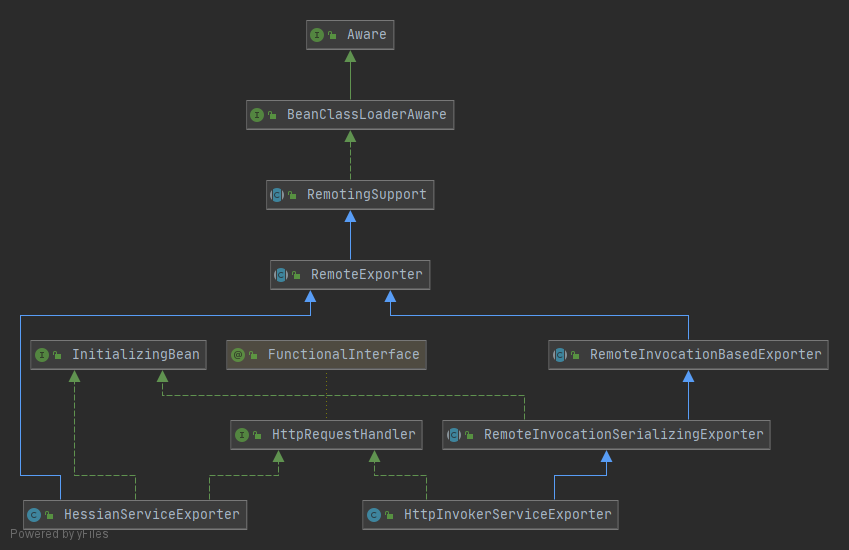    
- Spring框架自行开发的Http Invoker方案
采用标准的Java序列化机制，HttpInvokerServiceExporter

- 基于Caucho的Hessian远程方案  
采用二进制和xml文本形式进行序列化

- 基于Caucho的Burlap远程方案


###### 基于Web服务的远程方案


###### 基于JMS的远程方案
通过消息队列交互，Service Accessor发送消息到Destination ，Service Exporter从Destination接收，返回结果到指定的Destination

###### 扩展方案  
一个中心，两个基本点，RemoteInvocation为中心，RemoteInvocationFactory和RemoteInvocationExecutor为基本点
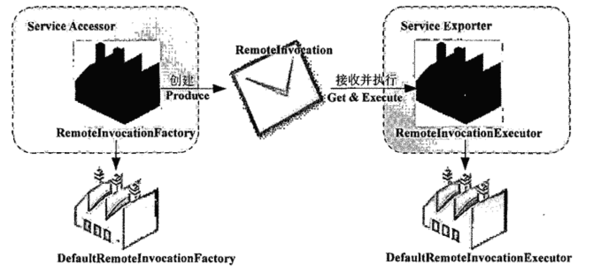   
RemoteInvocation实际是一个数据对象，包括调用方法、调用方法参数类型、调用方法的参数三项信息。  
RemoteInvocationFactory是数据来源，在基于各种远程方案的Service Accessor通过MethodInterceptor拦截对应方法，封装数据为RemoteInvocation，然后返回给Service Accessor，然后给到Service Exporter 
RemoteInvocationExecutor根据Service Exporter收到的RemoteInvocation调用对应方法，


